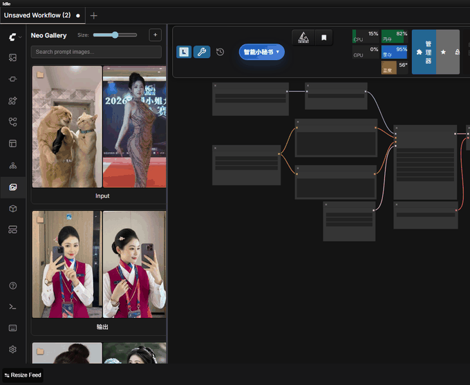
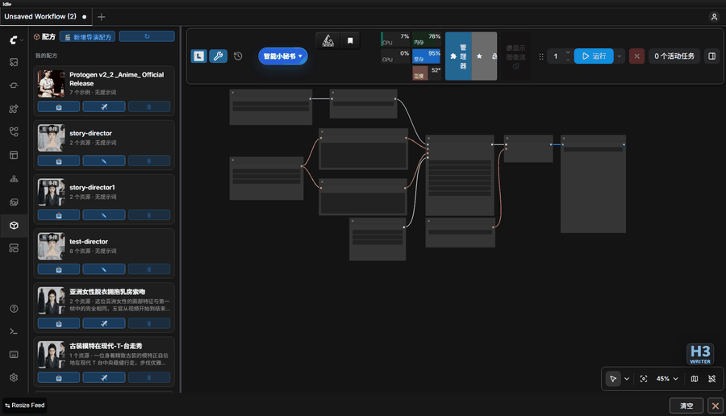

# ComfyUI-Neo-Nodes

一个 ComfyUI 自定义节点插件：提示词管理与 AI 增强（支持推理/thinking 模型），内置 Krea2 生图（文生图 / 参考图四视图）、素材浏览与图片或提示词一键发送、图片反推、配方保存和一键还原，以及工作流路径自动修复。

| 模块 | 类型 | 说明 | 文档 |
|------|------|------|------|
| 📝 Neo Prompt Encoder | 节点 | 提示词管理 + AI 增强（预设 / 搜索 / LLM 增强），输出 CLIP 编码（CONDITIONING）+ 文本，接标准 txt2img 采样器 | [prompts](docs/prompts.md) |
| ⚡ Neo Prompt Agent | 节点 | 提示词管理 + AI 生成，无需连 CLIP；输出 PROMPT 文本 + BUNDLE 运行时包（可直连 🎨 Krea2 / 🎞️ H3） | [prompts](docs/prompts.md) |
| 🖌️ 聊天生图（Krea2） | 节点内置 | 选生图 skill 后 ✨ 直接生成（文生图 / 参考图四视图），状态行实时进度/取消，结果 Markdown 预览并一键装配回 LoadImage | [image-gen](docs/image-gen.md) |
| 🎨 Krea2 Generate | 节点 | 按所选生图 skill 模板同步生成，直接输出 IMAGE 张量到下游（进程内 mini-executor，无需聊天界面） | [image-gen](docs/image-gen.md) |
| 🎞️ H3 Video Director | 节点 | MiniMax H3 视频生成：以 `video_director` 配方逐段生成（每段自带 skill/提示词/时长/首尾帧/参考素材，模式 文生/图生/首尾帧/全参考/混合）并拼接为单个含原生音频 `VIDEO`；也可连 BUNDLE 按单片段生成。编辑器支持半自动故事拆分、统一设置（改动自动应用到所有分段）、提示词批量优化与时间轴逐段微调 | [h3-video](docs/h3-video-gen.md) |
| 📦 Neo Bundle Expand | 节点 | 把 BUNDLE 展开成 `prompt` + `image_1..9`，对齐官方 H3 Reference to Video；输出槽自动增长（默认仅 prompt + image_1，上限 9 张） | [prompts](docs/prompts.md) |
| 🖼️ Neo Gallery | 侧边栏面板 | 图片/视频/音频素材浏览与管理：内置预设素材、自定义目录与 Civitai LORA 匹配；灯箱预览、一键发送到节点 | [gallery](docs/gallery.md) |
| ⭐ 收藏（书签） | 素材板块 | 本地收藏（路径记录）+ Civitai 收藏（边下边开、开关默认开启） | [gallery](docs/gallery.md) |
| 🧊 Neo Recipes | 侧边栏面板 | 配方（提示词 + 图片/视频/音频资源）管理与一键发送 | [recipes](docs/recipes.md) |
| 🔧 工作流修复 | 顶栏工具 | 换机器 / 改目录后模型路径失效时，按文件名匹配磁盘真实文件一键修复；可手动改选、记住映射、载入前自动检查 | [workflow-repair](docs/workflow-repair.md) |

## 功能演示

主要模块的交互实录（点击缩略图进入对应文档）：

| 🖼️ Neo Gallery · 灯箱 | 🧊 Neo Recipes · 一键发送 | 🎞️ H3 Video Director · 时间轴重排 |
|:---:|:---:|:---:|
| [](docs/gallery.md) | [](docs/recipes.md) | [](docs/h3-video-gen.md) |

## 目录

- [功能演示](#功能演示)
- [安装](#安装)
- [依赖](#依赖)
- [快速上手](#快速上手)
- [示例工作流](#示例工作流)
- [模块文档](#模块文档)
- [许可证](#许可证)
- [引用参考](#引用参考)
- [开发者文档](#开发者文档)

## 安装

- **ComfyUI Manager（推荐）**：在 Manager 中搜索 `Neo Nodes` 一键安装（已发布至 ComfyUI Registry）
- **手动**：将本仓库克隆到 `ComfyUI/custom_nodes/` 目录：

```bash
git clone https://github.com/neoneo-ai/ComfyUI-Neo-Nodes.git ComfyUI/custom_nodes/ComfyUI-Neo-Nodes
```

然后重启 ComfyUI

## 依赖

- `requests`, `Pillow`, `PyYAML`（随 `requirements.txt` 自动安装）
- `llama_cpp_python`（**可选**，仅本地 LLM 推理需要，见 [docs/llm.md](docs/llm.md)；只用远程 API 可跳过）

---

## 快速上手

1. **安装**：ComfyUI Manager 搜 `Neo Nodes` 一键安装（或见上方手动安装），重启 ComfyUI。
2. **配置 LLM（二选一）**
   - **远程**：节点 Settings 里选 Provider（内置 DeepSeek、阿里云百炼(通义千问 / Token Plan)、Kimi、智谱 GLM、硅基流动，以及 OpenAI 兼容 / LM Studio / Ollama / OpenRouter 等），填 API Key + 端点。各家端点与申请入口见 [docs/llm.md](docs/llm.md)。表单底部「🔌 测试连接」会用当前填写的 Provider/密钥/端点/模型发送「你好」，能正常回复即表示连通（无需先保存；留空字段沿用已存配置）。
   - **本地**：把 GGUF 模型放入 `models/LLM/`，Settings → Provider 选「Local GGUF」并选择模型后点 💾 保存（目录只有一个模型时可跳过，运行时自动使用）。安装与模型目录规范见 [docs/llm.md](docs/llm.md)。
3. **第一次提示词增强**：添加 ⚡ Neo Prompt Agent 节点 → 在底部快捷输入框写一句简短描述 → 点 ✨ → 得到 AI 生成的提示词文本（无需连 CLIP，可直接接下游如 🎨 Krea2）。
4. **第一次生图**：添加 🎨 Krea2 Generate 节点 → 选一个带 `workflow.json` 的生图 skill → prompt 接 ⚡ Neo Prompt Agent（常用）或手填，四视图类再连参考图 → 排队执行 → 直接输出 IMAGE 张量。

   > 生图需 GPU/显存，且所选 skill 必须声明 `gen_image: true` 并附 `workflow.json`。
   > 生图模型 / Text Encoder / VAE 默认「自动」按 skill 模板匹配，无需手配；未匹配到时再到节点生图设置里手动指定。

5. **素材一键入节点**：打开右侧边栏「素材」面板 → 浏览/搜索到目标图片 → 点缩略图进灯箱 → 点 ✈️ Send 选择目标节点（LoadImage 类优先）→ 图片直接写入该节点。
6. **工作流路径修复**：换机器 / 改目录后模型路径失效时，点顶栏「🔧 修复工作流」→ 确认框核对候选新路径（可手动改选、可调匹配阈值）→ 点「修复」原地更新画布。

---

## 示例工作流

`example_workflows/` 下提供可直接加载的 UI 格式模板，ComfyUI 会自动将它们暴露在顶栏 **Templates（模板）** 面板中，选择后一键载入画布：

| 文件 | 内容 |
|------|------|
| `neo-krea2-text-to-image.json` | ⚡ Neo Prompt Agent → 🎨 Krea2 Generate → SaveImage，文生图最短链路 |
| `neo-krea2-ref-image-to-image.json` | LoadImage 提供参考图 + ⚡ Neo Prompt Agent → 🎨 Krea2 Generate（image 输入），参考图生图 |
| `neo-prompt-encoder-txt2img.json` | 🧠 Neo Prompt Encoder 输出 POSITIVE，接标准 UNETLoader / CLIPLoader / KSampler / VAEDecode 文生图采样链路 |
| `neo-h3-reference-to-video.json` | ⚡ Neo Prompt Agent → 🔗 Bundle Expand → 官方 MiniMax H3 Reference to Video（prompt + 参考图），完整 H3 出片链路 |

> 模板中的模型 / skill / 参考图为占位默认值，载入后按需替换为本地实际资源即可运行。

---

## 模块文档

各功能模块的详细文档已按模块拆分到 `docs/` 目录（索引见 [docs/README.md](docs/README.md)）：

| 文档 | 内容 |
|------|------|
| [docs/prompts.md](docs/prompts.md) | 提示词节点：Neo Prompt Encoder / Agent、节点界面与按钮、模板与技能管理、图片反推与 `@` 引用、`/` 技能菜单 |
| [docs/llm.md](docs/llm.md) | LLM 模式（远程/本地）、思考模型、本地 GGUF 安装（预编译 wheel / 源码编译 / Windows 排障）、模型目录规范 |
| [docs/image-gen.md](docs/image-gen.md) | Krea2 生图：聊天生图与 Krea2 Generate 节点（IMAGE 输出） |
| [docs/recipes.md](docs/recipes.md) | 配方：保存、一键发送到工作流、示例结果、多段视频导演配方（video_director） |
| [docs/gallery.md](docs/gallery.md) | Neo Gallery：浏览、灯箱、文件管理、Civitai LORA 缓存、收藏（书签） |
| [docs/workflow-repair.md](docs/workflow-repair.md) | 工作流模型路径修复 |

---

## 许可证

SPDX-License-Identifier: Apache-2.0

---

## 引用参考

collections portrait 10000+精美提示词来源
https://civitai.com/models/2231696/sfw15000-and-qwen-and-z-image-or-15000-portrait-and-selfie-wildcards-for-qwen-and-z-image

---

## 开发者文档

开发相关内容（项目结构、后端模块、API 路由、节点注册、测试等）见 [Developer.md](Developer.md)。
