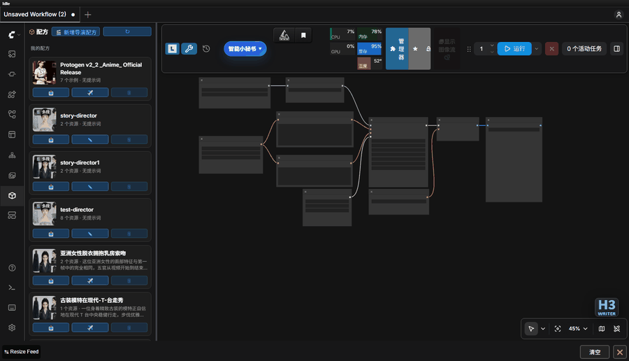
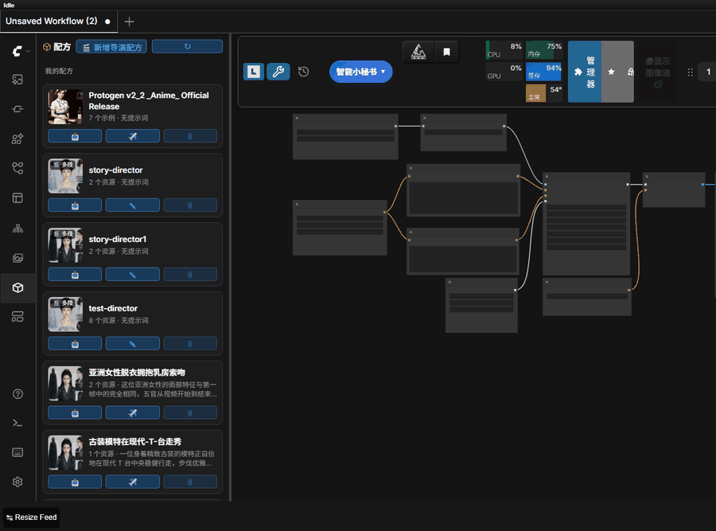

# ComfyUI-Neo-Nodes

> 📄 English: [README_EN.md](README_EN.md)

一个 ComfyUI 自定义节点插件：提示词管理与 AI 增强（支持推理 / thinking 模型），内置生图与生视频，
素材浏览与一键发送、图片反推、配方保存与还原、工作流路径自动修复。

## 模块一览

**节点**

- **📝 Neo Prompt Encoder** — 提示词管理 + AI 增强（预设 / 搜索 / LLM 增强），输出 CLIP 编码与文本
  → [prompts.md](docs/prompts.md)
- **⚡ Neo Prompt Agent** — 无需连 CLIP 的提示词生成，输出 PROMPT 文本与 BUNDLE 运行时包
  → [prompts.md](docs/prompts.md)
- **🖌️ 聊天生图** — 节点内置：选生图技能后 ✨ 直接生成（文生图 / 参考图编辑），实时进度与取消
  → [image-gen.md](docs/image-gen.md)
- **🎨 Neo Image Gen & Edit** — 按技能模板同步生成 / 参考编辑，直接输出 IMAGE 张量到下游
  → [image-gen.md](docs/image-gen.md)
- **🎞️ H3 Video Director** — MiniMax H3 视频生成：按 `video_director` 配方逐段生成并拼接为含音频 `VIDEO`
  → [h3-video-gen.md](docs/h3-video-gen.md)
- **📦 Neo Bundle Expand** — 把 BUNDLE 展开成 `prompt` + `image_1..9`，对齐官方 H3 Reference to Video
  → [prompts.md](docs/prompts.md)
- **🔲 Neo Reference Grid** — 单节点管理「提示词 + 最多 12 张参考图」，宫格参与配方保存与还原
  → [prompts.md](docs/prompts.md)
- **🧩 Neo Grid Split** — 分镜宫格图自动切格，行优先拼成 `IMAGE` 批次并带出原图内嵌提示词
  → [h3-video-gen.md](docs/h3-video-gen.md)

**面板与入口**

- **🖼️ Neo Gallery** — 侧边栏素材浏览与管理：预设 / 自定义目录 / Civitai LORA、灯箱、LoRA 打标
  → [gallery.md](docs/gallery.md)
- **⭐ 收藏（书签）** — 本地收藏（路径记录）+ Civitai 收藏（边下边开）
  → [gallery.md](docs/gallery.md)
- **🧊 Neo Recipes** — 侧边栏配方（提示词 + 图片 / 视频 / 音频资源）管理与一键发送
  → [recipes.md](docs/recipes.md)
- **🅝 顶栏菜单** — 插件统一入口（悬停约 0.3 秒或点击展开，指针离开自动收起）：新影工坊 / 生成素材 / 新建导演配方 / 创建节点（新节点落在当前可见区的空白处）/ 修复工作流 / 回写入技能 / 设置 / 模型库 / 技能管理
  → [workflow-repair.md](docs/workflow-repair.md)
- **🗂 技能管理** — 技能详情页（设置区 + 提示词 + 工作流区）：「⤒ 导入到画布」/「💾 回写入技能」/「🧩 编辑」，
  落盘前弹变更确认并记本机变更历史；预设只读，复制为自定义后可编辑
  → [skills.md](docs/skills.md)
- **🔧 工作流修复** — 模型路径失效时按文件名匹配磁盘真实文件一键修复，可手动改选与记住映射
  → [workflow-repair.md](docs/workflow-repair.md)
- **📥 模型库** — Comfy-Org 专区双源（ModelScope / Hugging Face）搜索与断点续传下载，按仓库内路径自动归类落盘
  → [model-hub.md](docs/model-hub.md)

## 功能演示

主要模块的交互实录（点击缩略图进入对应文档）：

- [](docs/recipes.md) — 🧊 Neo Recipes · 一键发送
- [](docs/h3-video-gen.md)
  — 🎞️ H3 Video Director · 时间轴重排

## 目录

- [模块一览](#模块一览)
- [功能演示](#功能演示)
- [安装](#安装)
- [依赖](#依赖)
- [快速上手](#快速上手)
- [示例工作流](#示例工作流)
- [基础概念](#基础概念)
- [模块文档](#模块文档)
- [许可证](#许可证)
- [引用参考](#引用参考)
- [开发者文档](#开发者文档)

## 安装

- **ComfyUI Manager（推荐）**：在 Manager 中搜索 `Neo Nodes` 一键安装（已发布至 ComfyUI Registry）
- **手动**：将本仓库克隆到 `ComfyUI/custom_nodes/` 目录，然后重启 ComfyUI

```bash
git clone https://github.com/neoneo-ai/ComfyUI-Neo-Nodes.git ComfyUI/custom_nodes/ComfyUI-Neo-Nodes
```

## 依赖

- `requests`、`Pillow`、`PyYAML`（随 `requirements.txt` 自动安装）
- `llama_cpp_python`（**可选**，仅 Local GGUF 本地推理需要，见 [docs/llm.md](docs/llm.md)；原生引擎与远程 API 可跳过）

---

## 快速上手

1. **安装**：ComfyUI Manager 搜 `Neo Nodes` 一键安装（或见上方手动安装），重启 ComfyUI。
2. **配置 LLM（三选一）**
   - **原生**：把 safetensors 文本生成模型（如 `qwen3.5_4b_bf16.safetensors`）放入 `models/text_encoders/`，
     Settings → Provider 选「Native (ComfyUI safetensors)」并选择模型后点 💾 保存，在 ComfyUI 进程内直接推理，
     无需额外依赖。说明见 [docs/llm.md](docs/llm.md)。
   - **远程**：节点 Settings 里选 Provider（内置 DeepSeek、阿里云百炼、Kimi、智谱 GLM、硅基流动，
     以及 OpenAI 兼容 / LM Studio / Ollama / OpenRouter 等），填 API Key 与端点；
     表单底部「🔌 测试连接」用当前填写值发送「你好」验证连通（无需先保存）。
     各家端点与申请入口见 [docs/llm.md](docs/llm.md)。
   - **本地**：把 GGUF 模型放入 `models/LLM/`，Settings → Provider 选「Local GGUF」并选择模型后点 💾 保存
     （目录只有一个模型时可跳过，运行时自动使用）。安装与目录规范见 [docs/llm.md](docs/llm.md)。
3. **第一次提示词增强**：添加 ⚡ Neo Prompt Agent 节点 → 在底部快捷输入框写一句简短描述 → 点 ✨
   → 得到 AI 生成的提示词文本（无需连 CLIP，可直接接下游如 🎨 Krea2）。
4. **第一次生图**：添加 🎨 Neo Image Gen & Edit 节点 → 选一个带 `workflow.json` 的生图技能
   → prompt 接 ⚡ Neo Prompt Agent 或手填，参考编辑类再连参考图槽位 → 排队执行 → 直接输出 IMAGE 张量。

   > 生图需 GPU / 显存，且所选技能必须声明 `gen_image: true` 并附 `workflow.json`。
   > 生图模型 / Text Encoder / VAE 默认「自动」按技能模板匹配，未匹配到时再手动指定。

5. **第一次新建导演配方**：顶栏 🅝 菜单「🎥 新建导演配方」（或侧边栏「配方」页头部 🎬 新增导演配方，
   或 🎞️ 节点时间轴区右下角 ＋）→ 「📖 故事板分镜」页选分镜来源：📝 文字故事板填主题 / 脚本 + ✨ 生成分镜分段
   （可先放 👤 角色参考图锁身份），或 🧩 宫格图故事板选一张分镜宫格图 ✂️ 拆分到各段
   → 「🎞️ 分镜时间线」页设共享分辨率与技能 → 点「保存」。
6. **第一次生视频**：添加 🎞️ Neo H3 Video Director 节点 → `recipe` 选刚保存的导演配方 → 排队执行
   → 逐段生成并拼接为单个含音频 `VIDEO`，接 SaveVideo 导出成片。悬停时间轴段块出现勾选框可只跑指定段；
   段标题行 ♻ 单段重生成后自动拼回新成片；单段调试用 Neo H3 Segment Run 节点。

   > 生视频需 MiniMax H3 模型链（视频 VAE 与音频 VAE 必须分开），所选技能必须声明 `gen_video: true` 并附 `workflow.json`。
   > 模型解析优先级：技能 `config.json` → 全局「生视频模型」设置 → 按名称线索自动挑选。
   > 逐段执行规则与宫格拆分见 [docs/h3-video-gen.md](docs/h3-video-gen.md)，编辑器操作见 [docs/recipes.md](docs/recipes.md)。

7. **素材一键入节点**：打开右侧边栏「素材」面板 → 浏览 / 搜索到目标图片 → 点缩略图进灯箱
   → 点 ✈️ Send 选择目标节点（LoadImage 类优先）→ 图片直接写入该节点。
8. **工作流路径修复**：换机器 / 改目录后模型路径失效时，点顶栏 🅝 菜单「🔧 修复工作流」
   → 确认框核对候选新路径（可手动改选、可调匹配阈值）→ 点「修复」原地更新画布。

---

## 新影工坊（Neo Studio · 独立应用）

不依赖画布的独立页面：运行插件目录下 `neo-studio.bat`（自动拉起 ComfyUI），
或手动启动后打开 `http://127.0.0.1:8188/neo-studio`。含四个页签：

- **素材**：完整 Neo Gallery（浏览 / 灯箱 / 文件管理）
- **导演**：配方列表（只列多段导演配方）+ 导演编辑器（与画布内一致）+ 整片生成面板
  （带进度 / 取消；只读时间轴上勾选段块后只生成勾选的段，采样中实时预览，成片自动记进配方「结果」区）
- **技能**：统一技能管理（与顶栏「🗂 技能管理」同组件，左列表 + 右详情直接展开）
- **设置**：生图 / 生视频 / LLM 设置

依赖画布的功能（如「发送到节点」）在 Studio 内自动降级为提示。

---

## 示例工作流

`example_workflows/` 下提供可直接加载的 UI 格式模板，ComfyUI 会自动将它们暴露在顶栏
**Templates（模板）** 面板中，选择后一键载入画布。

## 基础概念

### skill

技能不只是提示词模板，还包含内置模型配置（model / vae / clip）、内置工作流与默认基础参数。
技能列表可进入详情页查看；系统预设不可编辑，复制为自定义后即可编辑。

### bundle

包含运行时需要的参数：提示词和图片（可选）。

### recipe

- **基础配方**：把当前的提示词和图片资源保存下来，便于复用。
- **导演配方**：支持多段连续生成，由导演台编辑生成并保存，director 节点运行时选择对应配方，
  点击节点上的 timeline 可直接进入编辑。故事板分镜页支持主题 / 脚本一键 LLM 生成分段分镜
  （角色参考图锁身份），也支持宫格图自动拆分（各格作分段首帧）与逐格 LLM 描述提示词。

### model

技能内置了模型；若想常改，可直接接入外部 `model` 与 `lora`，覆盖技能内置的主模型配置。

---

## 模块文档

各功能模块的详细文档已按模块拆分到 `docs/` 目录（索引见 [docs/README.md](docs/README.md)）：

| 文档 | 内容 |
|------|------|
| [docs/prompts.md](docs/prompts.md) | 提示词节点、界面按钮、图片反推 |
| [docs/skills.md](docs/skills.md) | 技能管理：管理窗口、工作流区编辑、画布导入与回写 |
| [docs/llm.md](docs/llm.md) | LLM 模式、云供应商、原生 safetensors 引擎、本地 GGUF 安装与目录规范 |
| [docs/image-gen.md](docs/image-gen.md) | 生图：聊天生图、Image Gen & Edit、尺寸与扩图 |
| [docs/h3-video-gen.md](docs/h3-video-gen.md) | 生视频：导演配方执行、单段重生成、宫格拆分 |
| [docs/recipes.md](docs/recipes.md) | 配方：保存、发送到工作流、导演配方编辑器 |
| [docs/gallery.md](docs/gallery.md) | 素材库：浏览、灯箱、文件管理、Civitai LORA、收藏 |
| [docs/workflow-repair.md](docs/workflow-repair.md) | 工作流模型路径修复 |
| [docs/model-hub.md](docs/model-hub.md) | 模型库：双源搜索、自动归类落盘、断点续传下载 |

---

## 许可证

SPDX-License-Identifier: Apache-2.0

---

## 引用参考

collections portrait 10000+ 精美提示词来源：

[civitai.com/models/2231696](https://civitai.com/models/2231696)

---

## 开发者文档

开发相关内容（项目结构、后端模块、API 路由、节点注册、测试等）见 [Developer.md](Developer.md)。
