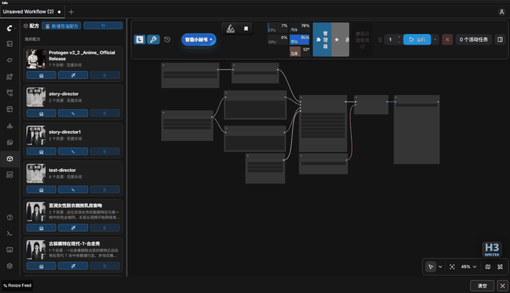
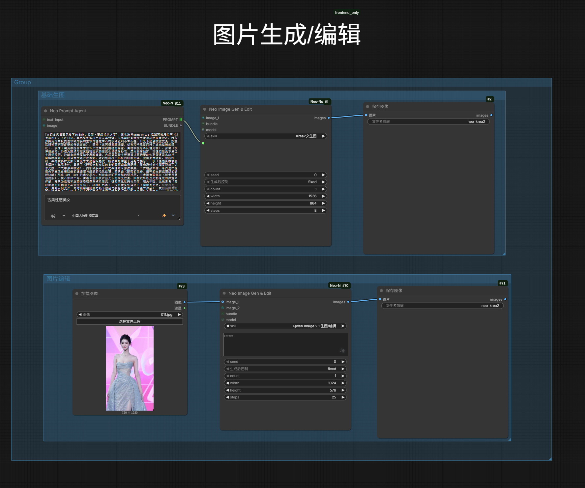
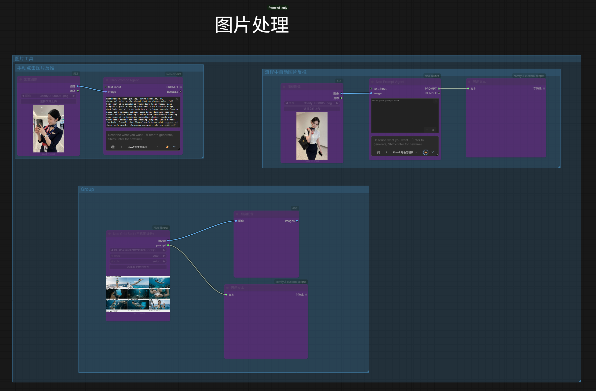
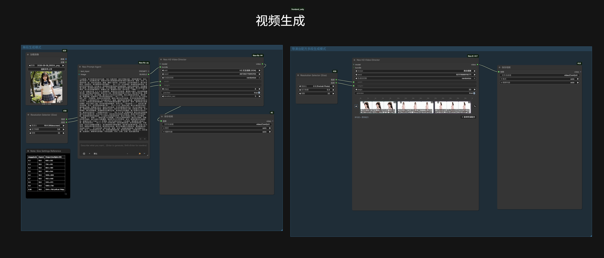
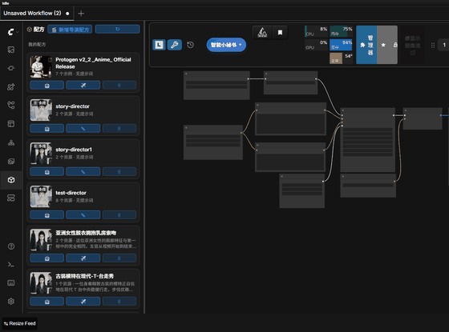

# ComfyUI-Neo-Nodes

**From one sentence to prompt, image, and film**: AI prompt enhancement, image generation and reference editing,
and MiniMax H3 multi-segment video direction — all in one plugin. The LLM can run inside the ComfyUI process
with zero extra dependencies.



**Install**: search `Neo Nodes` in ComfyUI Manager (published to the ComfyUI Registry), see [Installation](#installation).

## Why Neo Nodes

| Capability | Usual approach | Neo Nodes |
|------------|----------------|-----------|
| Local LLM | Needs `llama-cpp-python` (often fails to build on Windows) | **Native**: safetensors text-generation models run inside the ComfyUI process, no extra dependency |
| Cloud LLM | Fill endpoint and model name by hand | Built-in DeepSeek, Alibaba Cloud Bailian, Kimi, Zhipu GLM, SiliconFlow — add an API key and go; 🔌 Test Connection verifies live |
| Model downloads | Download manually, then drag files into folders | ModelScope + Hugging Face dual-source search, files land in the right model folder by repo path, resumable downloads |
| Chinese input | English / filename matching only | Chinese skill names searchable by full pinyin and initials; pinyin LoRA trigger-word suggestions |
| Image / video generation | Wire up dozens of nodes | Pick a skill and generate (skills ship a `workflow.json` template); H3 multi-segment director with drag-and-reorder timeline |
| After moving machines | Red nodes everywhere, fix paths one by one | 🅝 menu → "Repair Workflow" matches broken paths against real files on disk in one click |
| Asset reuse | Pick images one by one with LoadImage | Gallery lightbox + ✈️ one-click write into a target node; recipes send to canvas in one click |

## Works without an LLM

Available right after install and restart, with no model or API key configured:

- **🖼️ Neo Gallery** — asset browsing, lightbox, file management, ✈️ one-click send to node; Civitai LoRA matching and bookmarks; batch LoRA tagging
- **🧊 Neo Recipes** — save prompt + media as a recipe, one-click send to workflow (with director recipe editor)
- **🔧 Workflow Repair** — one-click fix for broken model paths
- **📥 Model Hub** — ModelScope / Hugging Face dual-source search with resumable downloads (ModelScope listing and search work anonymously)
- **🔲 Neo Reference Grid / 🧩 Neo Grid Split** — reference-image grid management, automatic storyboard grid splitting
- **🧊 Neo Studio** — standalone page (`neo-studio.bat` or `http://127.0.0.1:8188/neo-studio`; `neo-studio-app.bat` opens it in its own window): Assets, Director, Skills, Settings

LLM enhancement (✨ generate / image captioning / translate & classify) is the optional second step;
the three modes are documented in [docs/llm.md](docs/llm.md).

## Features

| Module | Type | Description |
|--------|------|-------------|
| Neo Prompt Encoder | Node | Prompt management + AI enhancement (presets / search / LLM enhance). Outputs CONDITIONING + text for standard txt2img samplers. |
| Neo Prompt Agent | Node | Prompt management + AI generation without CLIP. Outputs PROMPT text + BUNDLE runtime package (connects directly to Krea2 / H3 video). |
| Neo Image Gen & Edit | Node | Synchronous image generation / reference editing based on selected skill template. Outputs IMAGE tensor directly to downstream nodes. |
| H3 Video Director | Node | MiniMax H3 multi-segment video generation with native audio. Per-segment skill/prompt/duration/first-last-frame/reference control. Timeline editor for drag-reorder and batch prompt optimization. |
| Neo Bundle Expand | Node | Expands BUNDLE into `prompt` + `image_1..9` for official MiniMax H3 Reference-to-Video nodes. |
| Neo Reference Grid | Node | Prompt + up to 12 reference images in a single grid node. Auto-growing output slots. |
| Neo Grid Split | Node | Splits a storyboard grid image into individual cells (IMAGE batch) + embedded prompt text. |
| Neo Gallery | Sidebar | Image/video/audio asset browser: presets, custom directories, Civitai LoRA matching, lightbox preview, one-click send-to-node, LoRA batch tagging. |
| Bookmarks | Asset panel | Local bookmarks (path-based) + Civitai bookmarks (download-on-open). |
| Neo Recipes | Sidebar | Recipe (prompt + media assets) management with one-click send to workflow. |
| Workflow Repair | Menu item | One-click fix for broken model paths after moving machines or changing directories. |
| Model Hub | Menu item | Search Comfy-Org repos on ModelScope / Hugging Face and download models into the right model folders, with resumable downloads. |
| Skill Management | Menu item | Skill detail page (settings + prompt + workflow area): import to canvas, write back to skill, inline workflow editing — each save shows a change preview first and records a local history. Presets are read-only; copy to customize. |

Node appearance:





## Demo

Interaction recordings (click a thumbnail to open the matching doc):

- [](docs/h3-video-gen.md)
  — 🎞️ H3 Video Director · timeline reorder
- [](docs/recipes.md) — 🧊 Neo Recipes · one-click send

## Installation

- **ComfyUI Manager (recommended)**: Search `Neo Nodes` in the Manager and install.
- **Manual**: Clone into `ComfyUI/custom_nodes/`:

```bash
git clone https://github.com/neoneo-ai/ComfyUI-Neo-Nodes.git ComfyUI/custom_nodes/ComfyUI-Neo-Nodes
```

Then restart ComfyUI.

## Dependencies

- `requests`, `Pillow`, `PyYAML` (auto-installed via `requirements.txt`)
- `llama_cpp_python` (**optional**, only for local LLM inference)

## Quick Start

1. **Install** the plugin and restart ComfyUI.
2. **Use the zero-config features first** (no LLM, no model setup needed):
   - **Send asset to node**: Gallery sidebar → browse/search an image → click thumbnail for lightbox → click ✈️ Send → choose target node (LoadImage-type nodes first) → the image is written into that node.
   - **Model Hub downloads**: 🅝 menu → "Model Hub" → pick source (ModelScope / Hugging Face) → search → pick a file → category and subfolder are filled in automatically → ⬇ download, resumable.
   - **Repair workflow paths**: after moving machines, 🅝 menu → "Repair Workflow" → confirm candidate paths (editable, threshold adjustable) → apply in place.
3. **Configure LLM** (pick one; needed for ✨ enhancement, image captioning, translate/classify):
   - *Native*: Place a safetensors text-generation model (e.g. `qwen3.5_4b_bf16.safetensors`) in `models/text_encoders/`, select "Native (ComfyUI safetensors)" in Settings → Provider, pick the model and click 💾 Save. Inference runs inside the ComfyUI process, so no extra dependency is needed. Details: [docs/llm.md](docs/llm.md).
   - *Remote*: Settings → select Provider (DeepSeek, Qwen, Kimi, GLM, SiliconFlow, OpenAI-compatible, LM Studio, Ollama, OpenRouter, etc.) → enter API Key + endpoint. "🔌 Test Connection" sends "hello" with the values currently in the form (no need to save first). Endpoints and sign-up links: [docs/llm.md](docs/llm.md).
   - *Local*: Place a GGUF model in `models/LLM/`, select "Local GGUF" in Settings, pick the model and click 💾 Save (skip the selection when the folder holds a single model — it is used automatically). Install and folder rules: [docs/llm.md](docs/llm.md).
4. **First prompt**: Add a **Neo Prompt Agent** node → type a short description → click ✨ → get AI-generated prompt text (no CLIP needed).
5. **First image**: Add a **Neo Image Gen & Edit** node → select an image-gen skill → connect prompt (from Agent or manual) and optional reference images → queue → IMAGE output.

   > Image generation needs a GPU / VRAM, and the selected skill must declare `gen_image: true` and ship a `workflow.json`.
   > Generation model / Text Encoder / VAE default to "Auto", matched against the skill template; set them manually only when nothing matches.

6. **First multi-segment video**: Add a **H3 Video Director** node → pick a `video_director` recipe
   → drag to reorder segments / regenerate a single segment → segments are generated and stitched into one `VIDEO` with audio.

## Key Concepts

- **Skill**: A bundled template containing model config (model/VAE/CLIP), workflow, and default parameters. Preset skills are read-only; copy to customize.
- **Bundle**: Runtime payload — prompt text + optional reference images.
- **Recipe**: Saved prompt + media assets for reuse. *Director recipes* support multi-segment video generation with a timeline editor.

## Neo Studio (Standalone App)

A canvas-independent page at `http://127.0.0.1:8188/neo-studio` (or run `neo-studio.bat`). Tabs: Assets (full Gallery), Director (recipe list + editor + full-film generation), Skills, Settings (image / video / LLM / log).

For a standalone window, double-click `neo-studio-app.vbs`: the same page runs in a WebView2 window with
no console window, geometry is remembered, and Studio state survives restarts. Needs `pywebview`
(`pip install pywebview`); the Windows WebView2 Runtime is already installed on most systems.
ComfyUI's backend log is shown under Settings → Log, the shell's own startup trace goes to
`tmp/studio_shell.log`; `neo-studio-app.bat` is the debug entry with a console. When ComfyUI is not
running, double-clicking shows a "Starting ComfyUI" splash first, then jumps to Studio once it's
ready — no blank window to stare at. Closing this window also stops the ComfyUI the shell spawned
(a ComfyUI you started yourself is left running); that's the way to shut it down.

## Documentation

| Doc | Content |
|-----|---------|
| [docs/prompts.md](docs/prompts.md) | Prompt nodes, UI buttons, image captioning, `@` references |
| [docs/skills.md](docs/skills.md) | Skill management: manager window, workflow editing, canvas import & writeback |
| [docs/llm.md](docs/llm.md) | LLM modes (native / remote / local), thinking models, GGUF setup |
| [docs/image-gen.md](docs/image-gen.md) | Image generation & editing nodes |
| [docs/h3-video-gen.md](docs/h3-video-gen.md) | Video generation: director recipe execution, single-segment regeneration, grid split |
| [docs/recipes.md](docs/recipes.md) | Recipe management, one-click send, director recipes |
| [docs/gallery.md](docs/gallery.md) | Gallery browser, lightbox, file management, bookmarks |
| [docs/workflow-repair.md](docs/workflow-repair.md) | Workflow model path repair |
| [docs/model-hub.md](docs/model-hub.md) | Model Hub: dual-source repo search, category placement, resumable downloads |

## Changelog

Version history: [CHANGELOG.md](CHANGELOG.md).

## License

SPDX-License-Identifier: Apache-2.0
