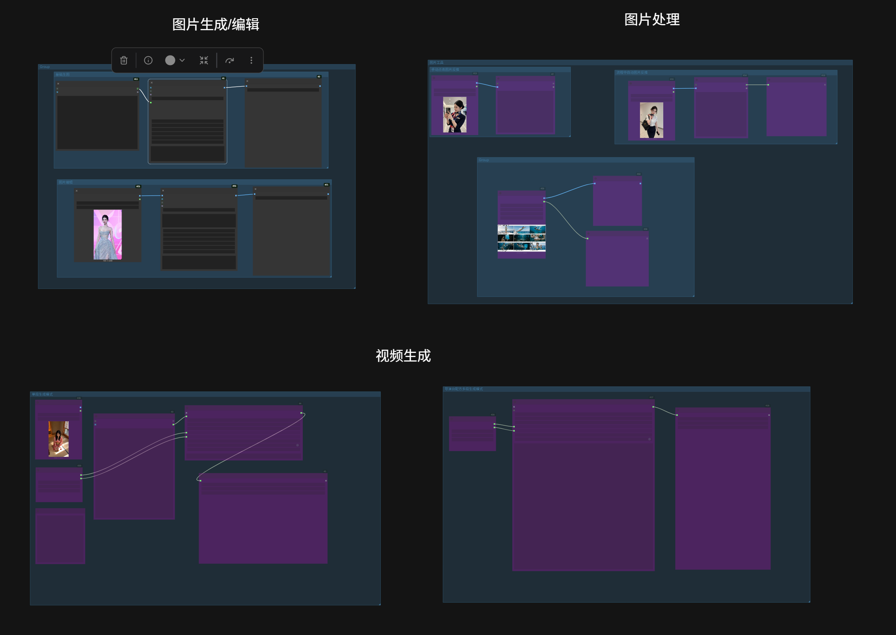

# ComfyUI-Neo-Nodes

A ComfyUI custom node pack for prompt management, AI-enhanced prompting (with reasoning/thinking model support), built-in image generation (Krea2), asset browsing, one-click send-to-node, recipe save/restore, and workflow path repair.

## Features

| Module | Type | Description |
|--------|------|-------------|
| Neo Prompt Encoder | Node | Prompt management + AI enhancement (presets / search / LLM enhance). Outputs CONDITIONING + text for standard txt2img samplers. |
| Neo Prompt Agent | Node | Prompt management + AI generation without CLIP. Outputs PROMPT text + BUNDLE runtime package (connects directly to Krea2 / H3 video). |
| Neo Image Gen & Edit | Node | Synchronous image generation / reference editing based on selected skill template. Outputs IMAGE tensor directly to downstream nodes. |
| H3 Video Director | Node | MiniMax H3 multi-segment video generation with native audio. Per-segment skill/prompt/duration/first-last-frame/reference control. Timeline editor for drag-reorder and batch prompt optimization. |
| Neo Bundle Expand | Node | Expands BUNDLE into `prompt` + `image_1..9` for official MiniMax H3 Reference-to-Video nodes. |
| Neo Reference Grid | Node | Prompt + up to 12 reference images in a single grid node. Auto-growing output slots. |
| Neo Grid Split | Node | Splits a storyboard grid image into individual cells (IMAGE batch) + embedded prompt text. |
| Neo Gallery | Sidebar | Image/video/audio asset browser: presets, custom directories, Civitai LoRA matching, lightbox preview, one-click send-to-node, LoRA batch tagging. |
| Bookmarks | Asset panel | Local bookmarks (path-based) + Civitai bookmarks (download-on-open). |
| Neo Recipes | Sidebar | Recipe (prompt + media assets) management with one-click send to workflow. |
| Workflow Repair | Menu item | One-click fix for broken model paths after moving machines or changing directories. |
| Model Hub | Menu item | Search Comfy-Org repos on ModelScope / Hugging Face and download models into the right model folders, with resumable downloads. |
| Skill Management | Menu item | Skill detail page (settings + prompt + workflow area): import to canvas, write back to skill, inline workflow editing — each save shows a change preview first and records a local history. Presets are read-only; copy to customize. |



## Installation

- **ComfyUI Manager (recommended)**: Search `Neo Nodes` in the Manager and install.
- **Manual**: Clone into `ComfyUI/custom_nodes/`:

```bash
git clone https://github.com/neoneo-ai/ComfyUI-Neo-Nodes.git ComfyUI/custom_nodes/ComfyUI-Neo-Nodes
```

Then restart ComfyUI.

## Dependencies

- `requests`, `Pillow`, `PyYAML` (auto-installed via `requirements.txt`)
- `llama_cpp_python` (**optional**, only for local LLM inference)

## Quick Start

1. **Install** the plugin and restart ComfyUI.
2. **Configure LLM** (pick one):
   - *Native*: Place a safetensors text-generation model (e.g. `qwen3.5_4b_bf16.safetensors`) in `models/text_encoders/`, select "Native (ComfyUI safetensors)" in Settings → Provider, pick the model and click 💾 Save. Inference runs inside the ComfyUI process, so no extra dependency is needed. Details: [docs/llm.md](docs/llm.md).
   - *Remote*: Settings → select Provider (DeepSeek, Qwen, Kimi, GLM, SiliconFlow, OpenAI-compatible, LM Studio, Ollama, OpenRouter, etc.) → enter API Key + endpoint. "🔌 Test Connection" sends "hello" with the values currently in the form (no need to save first). Endpoints and sign-up links: [docs/llm.md](docs/llm.md).
   - *Local*: Place a GGUF model in `models/LLM/`, select "Local GGUF" in Settings, pick the model and click 💾 Save (skip the selection when the folder holds a single model — it is used automatically). Install and folder rules: [docs/llm.md](docs/llm.md).
3. **First prompt**: Add a **Neo Prompt Agent** node → type a short description → click ✨ → get AI-generated prompt text (no CLIP needed).
4. **First image**: Add a **Neo Image Gen & Edit** node → select an image-gen skill → connect prompt (from Agent or manual) and optional reference images → queue → IMAGE output.

   > Image generation needs a GPU / VRAM, and the selected skill must declare `gen_image: true` and ship a `workflow.json`.
   > Generation model / Text Encoder / VAE default to "Auto", matched against the skill template; set them manually only when nothing matches.

5. **Send asset to node**: Open the Gallery sidebar → browse to an image → click thumbnail for lightbox → click Send → choose target node.
6. **Repair workflow paths**: After moving machines, click the 🅝 menu → "Repair Workflow" → confirm candidate paths → apply.

## Key Concepts

- **Skill**: A bundled template containing model config (model/VAE/CLIP), workflow, and default parameters. Preset skills are read-only; copy to customize.
- **Bundle**: Runtime payload — prompt text + optional reference images.
- **Recipe**: Saved prompt + media assets for reuse. *Director recipes* support multi-segment video generation with a timeline editor.

## Neo Studio (Standalone App)

A canvas-independent page at `http://127.0.0.1:8188/neo-studio` (or run `neo-studio.bat`). Tabs: Assets (full Gallery), Director (recipe list + editor + full-film generation), Skills, Settings.

## Documentation

| Doc | Content |
|-----|---------|
| [docs/prompts.md](docs/prompts.md) | Prompt nodes, UI buttons, image captioning, `@` references |
| [docs/skills.md](docs/skills.md) | Skill management: manager window, workflow editing, canvas import & writeback |
| [docs/llm.md](docs/llm.md) | LLM modes (native / remote / local), thinking models, GGUF setup |
| [docs/image-gen.md](docs/image-gen.md) | Image generation & editing nodes |
| [docs/h3-video-gen.md](docs/h3-video-gen.md) | Video generation: director recipe execution, single-segment regeneration, grid split |
| [docs/recipes.md](docs/recipes.md) | Recipe management, one-click send, director recipes |
| [docs/gallery.md](docs/gallery.md) | Gallery browser, lightbox, file management, bookmarks |
| [docs/workflow-repair.md](docs/workflow-repair.md) | Workflow model path repair |
| [docs/model-hub.md](docs/model-hub.md) | Model Hub: dual-source repo search, category placement, resumable downloads |

## License

SPDX-License-Identifier: Apache-2.0
