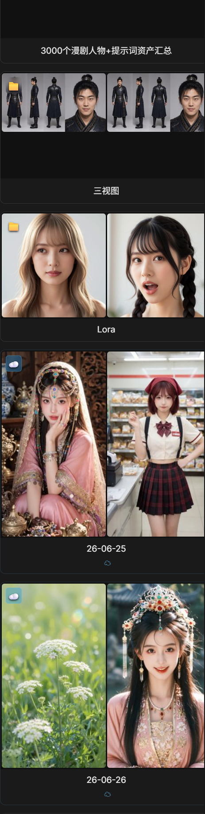
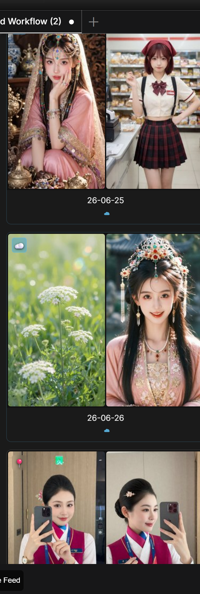
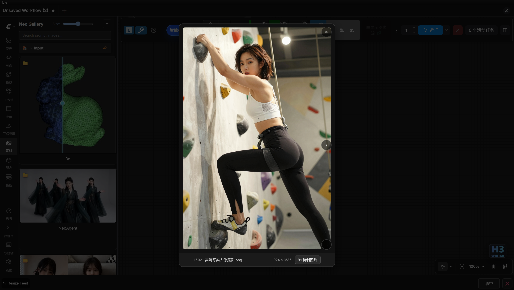

# Neo Gallery - 侧边栏素材系统

ComfyUI 右侧边栏中的图片/视频/音频浏览与管理面板：内置预设库 + 多个用户自定义目录。

## 浏览与导航

- **侧边栏集成** - 作为右侧边栏标签页打开，无需离开画布
- **卡片布局** - 目录以分类卡片呈现，封面网格直观预览各目录内容
- **面包屑导航** - 多级子目录层级清晰，随时返回上级
- **前进/后退按钮** - 顶部标题旁可沿浏览轨迹前进、后退（浏览器 Back 同样走这条轨迹；Alt+Left / Backspace 仍为返回上级目录）
- **按时间排序** - 按文件修改时间排序，可切换新旧顺序并记住偏好
- **滚动位置记忆** - 自动保存每个目录的浏览位置，切回时原地恢复
- **懒加载** - 列表分页渲染、封面滚动进入视口才加载，大图库依然流畅

## 媒体与搜索

- **图片、视频与音频** - 支持 jpg/png/webp/gif 等图片、mp4/webm 等视频以及 wav/mp3/m4a/flac/ogg 等音频的混合浏览；音频卡片显示波形，点击 ▶ 试听（首次播放解码出真实峰值）
- **缩略图缓存** - 首次访问自动生成缩略图，再次打开即秒出
- **关键词搜索** - 跨目录搜索文件名及同名 `.txt` 描述文件的内容
- **拖放到节点** - 直接把图片/视频/音频卡片拖到画布上对应的 LoadImage / Load Video / LoadAudio 节点即可写入（自动复制到输入目录），命中时节点高亮；图片卡也可直接拖到「宫格图拆分」节点写入其 filename 输入；载荷类型与目标节点不符时不写入

## 灯箱查看器

点击缩略图进入全屏查看，支持滚轮缩放与拖拽平移、相邻预加载与尺寸显示；右侧提示词侧栏展示图片的提示词与参数（无内容时不显示，进入全屏时自动隐藏）。配方详情中的示例结果与素材共用同一灯箱组件。

| 按钮 | 功能 |
|------|------|
| ⧉ Copy | 复制当前图片到剪贴板 |

侧栏内提供：提示词/参数分段复制、🔍 反推（调用 LLM 对当前图片反推提示词，处理中显示进度状态）、⤷ 导入工作流（媒体内嵌 ComfyUI 工作流时可用）。

## 文件管理与目录

- **删除** - 直接删除素材中的媒体文件；presets 内置库只读保护，防止误删
- **多选批量删除** - 素材卡左上角勾选框可多选（Ctrl+A 全选当前视图、Esc 清空），底部操作条「删除」仅删除勾选项并先弹确认；有勾选时卡片 ⋯ 菜单的删除项也变为「删除已选素材（N）」走批量删除；presets/lora/C站收藏/远程 OSS 来源不显示勾选框且不可删
- **自定义目录** - 在设置中添加本地或网络路径，支持逐条添加，也支持批量粘贴（每行一个路径）
- **多源汇总** - 所有目录统一入口浏览，互不干扰

## 素材设置

在侧边栏顶部点击"设置"按钮可管理自定义目录；以下显示设置位于 ComfyUI 设置面板：

| 设置 | 类型 | 默认值 | 说明 |
|------|------|--------|------|
| Neo Gallery Max Thumbnail Size | 滑块 (150-500) | 320 | 缩略图最大尺寸（像素） |
| Neo Gallery Display Image Labels | 开关 | true | 是否显示图片名称标签 |

## Civitai LORA 示例缓存（访问时自动抓取）

「Manage Directories」弹窗底部的 **Civitai LORA Examples** 区可把 C 站（civitai.com）的 LORA
示例图与提示词抓取进素材库。无需手动同步——打开素材面板的「Lora」目录时，未缓存的 LORA 会自动进入
后台抓取队列：

- **启用 C 站 LORA**（总开关，默认关闭）- 关闭时不会注册、展示或抓取任何 C 站 LORA 示例；勾选后
  才会按所选目录自动获取。开关状态保存在 `configs/gallery_settings.json`
- **Civitai API KEY** - 粘贴你在 civitai.com 的 API KEY 后点「Save API KEY」；KEY 仅保存在本机
  `gallery_settings.json`（不入库），保存后以脱敏形式显示。未配置 KEY 时，已选 LORA 目录仍会以
  「需要配置 API KEY」角标展示在素材面板中，但不会联网抓取
- **测试 C 站连通性** - C 站对网络有要求（多数环境需要代理）。点击后会请求 `GET /models?limit=1`
  （最长 20 秒），返回：延迟、是否可达、以及已保存的 KEY 是否被接受。区分「无法连接 Civitai
  （需要代理）」与「API KEY 被拒绝 HTTP 401/403」两类问题。抓取队列遇到无法连接时会提前中止本批，
  并在状态栏显示网络错误提示
- **Select LORA Directories** - 列出 `models/loras` 下的第一级子目录（含数量，可多选），
  选择即保存；首页 Lora 区域**只展示**所选目录下的 LORA 示例，未勾选的 lora 不会出现在素材面板中
- **访问时自动缓存** - 打开「Lora」目录或其子目录时，按文件 SHA256 查询 Civitai
  （`model-versions/by-hash`），后台下载该版本的全部示例图并写入提示词 sidecar；
  每次访问最多处理 20 个 LORA，已缓存（size/mtime 未变）的 LORA 自动跳过，
  被删除/更换的 LORA 缓存自动清理。失败项显示红色角标，可用「Retry Failed」重新入队

缓存结果落在 `gallery/lora_cache/`（只读素材源，与 presets 同机制）：**一个 LORA = 一个目录**，
目录内是多张 `example_NN` 示例图 + 同名 `.txt`（示例提示词）。素材面板中会出现「Lora」目录，
浏览、搜索、灯箱等全部能力可用；在 Lora 缩略图、灯箱或目录卡片上点 📤 会把该 LORA 的
相对路径（如 `detail/tweak.safetensors`）发送到画布上标准 `LoraLoader` 的 `lora_name` 参数
（目标菜单：选中节点优先，多目标弹下拉）。

「Lora」区域内提供**智能感知**筛选：勾选「工作流已用」后，只展示当前画布上 `LoraLoader` 节点
已使用的 LORA 目录（按 `lora_name` 匹配）。

## ⭐ 收藏（书签）

素材面板首页提供 **本地收藏** 与 **Civitai 收藏** 两个入口卡，收藏后端逻辑统一在 `bookmark.py`
（`bookmarks.json` 记录本地收藏，仅存路径信息，不复制文件）：

- **信息扩展按钮** - 任意素材缩略图右下角的「⋯」按钮弹出收藏菜单：**收藏本图**（记录素材完整路径）或
  **收藏所属目录**（把整个目录加入收藏，含自定义目录与 OSS 预设素材）。收藏卡与目录卡一致使用双图封面
  （取自收藏内容前两张缩略图）
- **生成角色图（多视图）** - 图片卡的「⋯」菜单项：弹出小窗（复用九宫格分镜图同款弹窗，参考图按卡片大小显示 + 文件名确认），点「生成」后窗口内实时显示排队/生图进度，完成后直接预览结果图（点开看原图）、可用「打开输出目录」跳转。用 Qwen Image 2.1 以该人像为参考一键生成
  （头特写/正/侧/背）四视图角色设定图，按 1920×1080 请求输出（尺寸按 16 对齐），结果存独立的
  `output/CharacterSheet/` 目录（日期在文件名前缀里），可直接拖入导演配方的 👤 角色参考图
- **直达角色输出目录** - 任意素材卡的「⋯」菜单项：在画廊里直接打开角色图输出目录
  `Output/CharacterSheet`（最新结果排在最前），省去逐级点进 Output 的时间
- **生成九宫格分镜图** - 图片卡的「⋯」菜单项：弹出小窗（参考图按卡片大小显示 + 文件名，确认用的就是这张）。小窗上方是
  **分镜故事**框（可手写），中间是**宫格数**下拉（4 / 6 / 9，默认 6），下方是**简要故事 / 想法**框（可留空）：点「✨ LLM 生成分镜故事」把简要故事（留空则仅凭参考图）
  + 参考图 + 所选宫格数交给 `storyboard_story` 任务，流式生成按 N 格逐格推进的故事**覆盖写入上方故事框**，可再编辑。
  点「生成」后小窗**不关闭**：窗内显示排队/生图进度条（可「取消任务」），完成后原地出结果预览（点开看原图）；
  用 Qwen Image 2.1 以该图为参考
  （提示词里以 `<image1>` 指代）按所选宫格数生成 N 格分镜故事板（4=2×2、6=2×3、9=3×3，每格约 16:9），
  结果落在 `output/StoryBoard/<日期>/` 下（文件名带故事 slug）；点结果区的「打开输出目录」跳到该目录。把这张宫格图
  拖进导演编辑器「🧩 宫格分镜图拆分」即按行优先切成 N 张关键帧（每格一镜、细白缝分隔、格内无文字）
- **直达分镜目录** - 任意素材卡的「⋯」菜单项：在画廊里直接打开宫格图输出目录 `Output/StoryBoard`（含按日期分的子目录）
- **本地收藏** - 打开首页「本地收藏」进入收藏板块，卡片封面同样取收藏内容前两张；点击卡片按记录的路径
  查找并打开源目录（源文件被移动/删除时给出提示），可随时 ✖ 取消收藏
- **C站收藏** - 首页「C站收藏」展示你在 civitai.com 收藏的模型（分页浏览 + 双图封面）：
  - **边下边开**：打开某个收藏模型时，示例图下载到第一张即可进入浏览，其余由后台继续缓存，完成后目录自动补齐
  - **启用 C 站收藏**（默认开启）：「Manage Directories」弹窗的 Civitai（C 站同步）区提供开关，
    关闭后首页入口与 `C站收藏` 目录不再加载（状态保存在 `gallery_settings.json` 的
    `civitai_bookmark_enabled`）
  - 与 Lora 板块一致：缩略图网格、灯箱（←/→ 翻页、缩放、全屏），以及把收藏保存为配方

## 实现细节（开发者）

### Civitai LORA 抓取与缓存
`gallery_lora.py` 负责后台抓取：打开「Lora」目录或其子目录时，按文件 SHA256 查询 Civitai（`model-versions/by-hash`），下载该版本全部示例图并写入提示词 sidecar；每次访问最多处理 20 个 LORA，已缓存（size/mtime 未变）的自动跳过，被删除/更换的缓存自动清理。缓存落在 `gallery/lora_cache/`：一个 LORA 一个目录，内含多张 `example_NN` 示例图 + 同名 `.txt` 提示词。

后端实现见 [architecture.md](architecture.md)（`gallery.py` / `gallery_lora.py` / `gallery_oss.py`），API 见 [api-routes.md](api-routes.md)。

