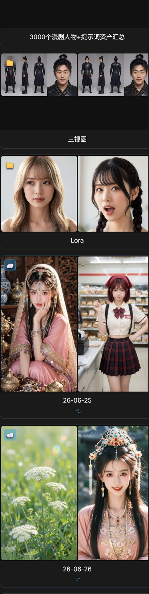
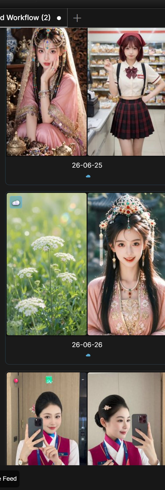
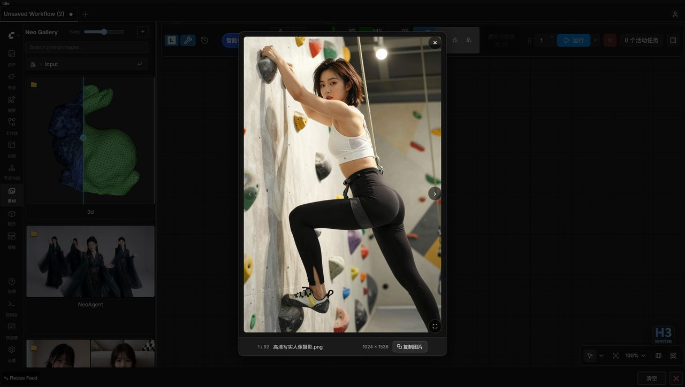

# Neo Gallery - 侧边栏素材系统

ComfyUI 右侧边栏中的图片 / 视频 / 音频浏览与管理面板：内置预设库 + 多个用户自定义目录。

## 浏览与导航

- **侧边栏集成** - 作为右侧边栏标签页打开，无需离开画布。
- **面包屑导航** - 多级子目录层级清晰，随时返回上级。
- **前进 / 后退** - 顶部标题旁可沿浏览轨迹前进、后退（浏览器 Back 同样走这条轨迹；
  Alt+Left / Backspace 为返回上级目录）。
- **按时间排序** - 按文件修改时间排序，可切换新旧顺序并记住偏好。
- **滚动位置记忆** - 自动保存每个目录的浏览位置，切回时原地恢复。
- **懒加载** - 列表分页渲染、封面滚动进入视口才加载，大图库依然流畅。

### 卡片布局

#### 排布规则

- 卡片瀑布式排布（按条目顺序逐个放进当前最矮的一列），高低混合自动填空、不留整列空白。
- 同一目录内的子目录卡与图片卡共用一个瀑布流（目录卡在前，图片卡接着装箱填空），衔接处不留空。
- 素材缩略图卡高度随图片朝向自适应：竖图 → 高卡 3:4、横图 → 矮宽卡 3:2、方图 → 方卡。
- 目录卡按封面瓦片的合成比例取高，与单图素材卡天然不同，同朝向封面恰好填满各自瓦片不裁切。

#### 封面与裁切

- 封面最多两张：竖 / 方图左右并排且顶部锚定（减少切头），横图只留一张。
- 纯音频目录显示音频瓦片，空 / 失效封面显示通用占位瓦片。
- 卡片内竖图（高 ≥ 宽）顶部锚定，裁掉底部而不是头部。

## 媒体与搜索

- **图片、视频与音频** - 支持 jpg / png / webp / gif 等图片、mp4 / webm 等视频、
  wav / mp3 / m4a / flac / ogg 等音频混合浏览；音频卡片显示波形，点 ▶ 试听（首次播放解码出真实峰值）。
- **缩略图缓存** - 首次访问自动生成缩略图，再次打开即秒出。
- **关键词搜索** - 跨目录搜索文件名及同名 `.txt` 描述文件的内容。
- **拖放到节点** - 把卡片拖到画布上对应的 LoadImage / Load Video / LoadAudio 节点即可写入
  （自动复制到输入目录），命中时节点高亮；图片卡也可直接拖到「宫格图拆分」节点写入其 filename 输入。
  载荷类型与目标节点不符时不写入。

### 生成素材

搜索框旁「🖼️ 生成素材」打开小窗（同导演配方窗口：不加背景遮罩、标题栏可拖窗口），纯提示词一键生成新素材。

#### 技能与参数

- **技能** - 默认 Krea2 文生图，可切换其他纯文生图技能并记住上次选择。
- **自定参数** - 临时选主模型 / LoRA / 宽高比 / 最长边（类似节点上接模型，不写回全局设置）。
  满意的组合可一键「保存为新技能」：名称自动生成 = 主模型名 + LoRA 名，比例 / 最长边随所选值保存，
  其余设置沿用当前技能。

#### 增强与历史

- **✨ 增强** - agent 式增强区（output 上 + quick input 下双框，仿 NeoPromptAgent 节点）：
  quick input 输描述或修改指令，选增强技能（只列图像增强类技能、默认自动路由、记住上次选择）后点 ✨ 流式增强。
  复用节点 agent 逻辑（所选技能的 skill.md 作系统提示词 + 按需读引用文件），正文写入 output 框，
  思考过程 / 流程状态实时显示在 output 上方临时面板。成功后 quick input 清空，有已有提示词时新指令按分隔线拼接。
- **历史** - quick input 与 output 各有独立的命令终端式 ↑/↓ 历史（localStorage 持久化）：
  快捷输入记之前用过的快捷输入，output 记生成实际用过的最终提示词。

#### 生成与产物

- **生成** - 用 output 内容作最终提示词（为空回退 quick input）；产物落 `Output/NeoAgent/<日期>/`，
  成功后可一键跳到落盘目录，不满意可一键删除结果图。
- **辅助按钮** - 🎲 随机填入一条（混合池抽样）；▾ 运行时随机设置（启用后「生成」改为随机抽 N 张批量逐张生成、
  取消保留已生成的，配方不入池）；☰ 预设列表（搜索 + 点击填入 output 框，无配方条目）。
- quick input 占位符随聚焦轮播使用提示。

## 灯箱查看器

点击缩略图进入全屏查看，支持滚轮缩放与拖拽平移、相邻预加载与尺寸显示；
右侧提示词侧栏展示图片的提示词与参数（无内容时不显示，进入全屏时自动隐藏）。
配方详情中的示例结果与素材共用同一灯箱组件。

| 按钮 | 功能 |
|------|------|
| ⧉ Copy | 复制当前图片到剪贴板 |

侧栏内提供：提示词 / 参数分段复制、🔍 反推（调用 LLM 对当前图片反推提示词，处理中显示进度状态）、
⤷ 导入工作流（媒体内嵌 ComfyUI 工作流时可用）。

## 文件管理

### 文件操作

- **删除** - 直接删除素材中的媒体文件；presets 内置库只读保护，防止误删。
- **多选批量删除** - 素材卡左上角勾选框可多选（Ctrl+A 全选当前视图、Esc 清空），
  底部操作条「删除」仅删除勾选项并先弹确认；presets / lora / C 站收藏 / 远程 OSS 来源不显示勾选框且不可删。
  操作条另有「新建导演配方」：把选中图片逐张设为各段首帧建 f2v 配方。
- **LoRA 打标** - 可写的叶子图片目录（Input / 自定义目录）卡片右上角 ⋯ 按钮打开打标弹窗，
  整目录逐张生成标签 `.txt`；弹窗参数与执行流程见「🏷️ LoRA 打标」。

### 目录管理

- **自定义目录** - 在设置中添加本地或网络路径；「Manage Directories」弹窗内每行支持 ↑↓ 排序、
  👁 隐藏 / 恢复、✕ 删除。
- **多源汇总** - 所有目录统一入口浏览，互不干扰。

### 输出主目录

- **StoryBoard / CharacterSheet 主目录** - 可浏览的 output 子目录 `output/StoryBoard/` 与 `output/CharacterSheet/`。
  首页不显示卡片，经生成结果区 / 素材卡菜单的「直达」入口或深链进入；
  生成的角色图 / 分镜图按日期落在 `<日期>/` 子目录。
  - 每一层卡片用该层自己的前两张媒体作封面（图片 > 视频 > 音频优先）。
  - 目录内另有只读的 **Cloud Presets** 入口（远端预设缓存落 `presets/<远端目录>/`），
    `Grid/presets/**`、`Character/presets/**` 与 Cloud Presets 一样不可删除。
- **最近更新优先** - 插件自己写入的三个目录（生成结果 `Output`、归档的 `Grid` / `Character`）内，
  各层子目录卡都是最新写在前的，封面在同类型内也取最新的两张（图片 > 视频 > 音频优先）；
  其余目录保持原有顺序与封面选取。

## 图片卡「⋯」菜单动作

### 角色图与分镜

- **生成角色图（多视图）** - 弹出小窗（复用九宫格分镜图同款弹窗，参考图按卡片大小显示 + 文件名确认），
  点「生成」后窗口内实时显示排队 / 生图进度，完成后直接预览结果图（点开看原图）、可「打开输出目录」跳转。
  用 Qwen Image 2.1 以该人像为参考一键生成（头特写 / 正 / 侧 / 背）四视图角色设定图，按 1920×1080 请求输出
  （尺寸按 16 对齐），结果落 `output/CharacterSheet/<日期>/`，同名文件跳过，可直接拖入导演配方的 👤 角色参考图。
- **新建导演配方** - 以该图为首帧新建 f2v 导演配方并打开编辑器（每段默认 5 秒）。
  子文件夹里的图先落到 `input/` 根目录（按内容哈希去重）。
- **生成九宫格分镜图** - 弹出小窗：上方**分镜故事**框（可手写），中间**宫格技能**下拉
  （默认 `storyboard_grid_6`），下方**简要故事 / 想法**框（可留空）。
  - 点「✨ LLM 生成分镜故事」只把简要故事（留空则只给格数）交给所选宫格技能，
    流式生成按 N 格逐格推进的故事并覆盖写入上方故事框，可再编辑。
    这一步不把参考图交给 LLM，而是先把参考图的人物外形 + 服装提取成文字随简要故事一起交给编剧。
  - 点「生成」后小窗不关闭：窗内显示排队 / 生图进度条（可「取消任务」），完成后原地出结果预览。
    生图前先用参考图跑一次受限视觉调用（只出人物外形 + 服装 1~2 句）注入提示词做文字锚定，
    再用 Qwen Image 2.1 以该图为参考按所选宫格技能生成 N 格分镜故事板
    （4=2×2、6=2×3、9=3×3，每格约 16:9），结果落 `output/StoryBoard/<日期>/`。
  - 把这张宫格图拖进导演编辑器「🧩 宫格分镜图拆分」即按行优先切成 N 张关键帧（每格一镜、细白缝分隔、格内无文字）。

### 图片编辑

弹出小窗（图片在上、操作在下：原图 / 编辑结果对比区 + 编辑技能下拉 + 编辑指令输入框）。
默认使用 Qwen Image 2.1，可切换其他 `image_gen` 类技能；原图作为参考图传入，填写编辑指令后点「生成」出图。

- **窗帘对比** - 结果在原位显示「原图 | 编辑结果」窗帘对比（分割线默认贴左边界、整幅先看结果图）。
  按下后拖过一小段（6px）才算拖窗帘：在原图 / 分割线把手上按下拖动即沿指针移动分割线，
  拖不到阈值的原地按下即抬起不算拖动。
- **看大图** - 点原图 / 点分割线把手（按下即抬起、没拖动）用灯箱打开原图与参考图（←/→ 翻页）；
  对比区标签右侧「🔍 看大图」按钮各模式通用，扩图模式点拖框空白处同样进灯箱。
  局部 / 点选模式点图是涂抹 / 打点，只走按钮。
- **目标分辨率** - 默认取原图尺寸并对齐到 32 的倍数，超过「模型工作分辨率」时按它等比封顶（默认 1.5MP），
  出图后对比窗左侧也换成这张缩放图，两侧同尺寸才能逐像素对齐。尺寸细节见 [image-gen.md](image-gen.md)。
- **扩图** - 窗内开关，自动切到「Qwen Image 2.1 扩图」技能。在原图上拖框定四边留白量
  （拖动框体可平移、重分配四边留白；只向外扩，可选自由 / 1:1 / 16:9 / 2.35:1 等比例预设；
  画布超出可视区时整体自动等比缩小，边长上限为原图 4 倍）。留白忠实按拖动算，不在没拖的轴上凑数。
  目标像素数（MP）默认 1.5，标签显示出图尺寸；提示词为空时预填默认触发词。
- **点选删除** - 窗内开关，走 Qwen Image 2.1 编辑原图，在原图上直接点击标记要删除的物体
  （最多 5 个点；点已有标记取消该点，「清空标记」全部重置）。标记后 SAM3 自动做点提示分割
  （需 `models/checkpoints` 里有 sam3 checkpoint，如 `sam3.1_multiplex_fp16.safetensors`），
  并把遮罩红色叠加到原图上预览；确认后走高分局部编辑管线移除，出图同原图尺寸。
  提示词框预填默认删除指令（可见可改，留空时后端兜底补同一默认指令）。
- **姿势编辑** - 窗内开关，自动切到「Qwen Image 2.1 姿势编辑」技能，提示词预填默认姿势触发词（把方括号里的姿势描述换成要做的动作）。
  只挂原图时按提示词改原图人物的姿势；在参考图区拖入第 2 张图（人物图或骨架图均可）即把它的姿势搬到原图人物上，
  此时提示词自动换成姿势迁移触发词（删掉该参考图又换回原触发词；自己写过的提示词不会被覆盖）。
  两种用法都保留原图的长相、发型、服装、光线与背景，出图尺寸同常规编辑（目标分辨率取原图尺寸）。
- **ControlNet 结构锁定** - 编辑技能下拉里的「Qwen Image 2.1 ControlNet」（无专用开关，选技能即用）：
  原图进 `<image1>` 出内容与长相，在参考图区拖入第 2 张图（人物照片或骨架图）只进 ControlNet 模型补丁出 Openpose 骨架，
  锁住姿势与构图（这张图不进编码器，不会被当内容参考复刻）；`<image3>` 起作服装 / 风格等附加内容参考。
  少于 2 张参考图时后端报「该技能需要至少 2 张参考图」。
  细节见 [image-gen.md](image-gen.md)。

### LoRA 卡元数据

Lora 目录示例卡的「⋯」菜单在「📤 发送 Lora」下方展示该 LORA 的 safetensors 头部元数据：
`base_model` / `dtype` 各一枚徽章（有值才显示），以及触发词区（非空才显示）——逐词 chip 点击复制该词，
「复制全部」按「, 」拼接全部触发词写入剪贴板。元数据取自缓存目录的 `_meta.json`（见「Civitai LORA 示例缓存」）。

## 素材设置

侧边栏顶部「设置」按钮管理自定义目录；以下显示设置位于 ComfyUI 设置面板：

| 设置 | 类型 | 默认值 | 说明 |
|------|------|--------|------|
| Neo Gallery Max Thumbnail Size | 滑块 (150-500) | 320 | 缩略图最大尺寸（像素） |
| Neo Gallery Display Image Labels | 开关 | true | 是否显示图片名称标签 |

## Civitai LORA 示例缓存（访问时自动抓取）

「Manage Directories」弹窗底部的 **Civitai LORA Examples** 区可把 C 站（civitai.com）的 LORA
示例图与提示词抓取进素材库。无需手动同步——打开素材面板的「Lora」目录时，未缓存的 LORA 会自动进入后台抓取队列。

### 抓取设置

- **启用 C 站 LORA**（总开关，默认关闭）- 关闭时不会注册、展示或抓取任何 C 站 LORA 示例；
  勾选后才会按所选目录自动获取。开关状态保存在 `configs/gallery_settings.json`。
- **Civitai API KEY** - 粘贴你在 civitai.com 的 API KEY 后点「Save API KEY」；KEY 仅保存在本机
  `gallery_settings.json`（不入库），保存后以脱敏形式显示。未配置 KEY 时，已选 LORA 目录仍会以
  「需要配置 API KEY」角标展示在素材面板中，但不会联网抓取。
- **测试 C 站连通性** - C 站对网络有要求（多数环境需要代理）。点击后请求 `GET /me`（最长 20 秒），
  返回是否可达、已保存的 KEY 是否被接受（成功时显示 C 站用户名）；区分「无法连接 Civitai（需要代理）」与
  「API KEY 被拒绝 HTTP 401/403」两类问题。抓取队列遇到无法连接时会提前中止本批并在状态栏提示。
- **代理** - 设置里「代理」留空时，插件自动使用 Windows 系统代理（浏览器能上 C 站即可，代理端口未在监听时退回直连）；
  代理客户端不在系统代理模式（如 TUN）或需要指定别的代理时，在「代理」里填 `127.0.0.1:7890` 这类地址保存即可。
- **Select LORA Directories** - 列出 `models/loras` 下的第一级子目录（含数量，可多选），选择即保存；
  首页 Lora 区域**只展示**所选目录下的 LORA 示例，未勾选的 lora 不会出现在素材面板中。
  所选目录在 `models/loras` 里已不存在时直接忽略、不生成状态卡。

### 缓存与使用

- **访问时自动缓存** - 打开「Lora」目录或其子目录时按文件 SHA256 查询 Civitai（`model-versions/by-hash`），
  后台下载该版本的全部示例图并写入提示词 sidecar；每次访问最多处理 20 个 LORA，
  已缓存（size/mtime 未变）的自动跳过，被删除 / 更换的 LORA 缓存自动清理。
  失败项显示红色角标，可用「Retry Failed」重新入队。
- **缓存目录** - 缓存结果落在 `gallery/lora_cache/`（只读素材源，与 presets 同机制）：**一个 LORA = 一个目录**，
  目录内是多张 `example_NN` 示例图 + 同名 `.txt`（示例提示词）。
- **头部元数据** - 抓取时顺带读取 safetensors 头部（不加载权重），把基座型号、触发词、精度写入该目录的
  `_meta.json`，并把紧凑字段回填进 `_index.json`；列表页据此显示徽标，无需逐个打开缓存目录。头部字符串仅作展示，
  不作为路径或网络地址使用。Civitai 的 `trainedWords` 会与头部触发词合并去重。
- **目录刷新元数据** - Lora 目录卡右上角「⋯」菜单的「🔄 刷新元数据」针对该目录内每个 LORA 重读 safetensors
  头部并更新 `_meta.json` 与 `_index.json` 徽标字段；纯本地操作，不联网、不重新下载示例图，已合并的 Civitai
  触发词会保留。
- **发送到画布** - 素材面板中会出现「Lora」目录，浏览、搜索、灯箱等全部能力可用；在 Lora 缩略图、灯箱或
  目录卡片上点 📤 会把该 LORA 的相对路径（如 `detail/tweak.safetensors`）发送到画布上标准 `LoraLoader`
  的 `lora_name` 参数（目标菜单：选中节点优先，多目标弹下拉）。
- **智能感知筛选** - 「Lora」区域内提供筛选：勾选「工作流已用」后，只展示当前画布上 `LoraLoader` 节点
  已使用的 LORA 目录（按 `lora_name` 匹配）。

## ⭐ 收藏（书签）

素材面板首页提供 **本地收藏** 与 **Civitai 收藏** 两个入口卡，收藏后端逻辑统一在 `bookmark.py`
（`bookmarks.json` 记录本地收藏，仅存路径信息，不复制文件）。

### 收藏入口

- **信息扩展按钮** - 任意素材缩略图右下角「⋯」弹出收藏菜单：**收藏本图**（记录素材完整路径）或
  **收藏所属目录**（把整个目录加入收藏，含自定义目录与 OSS 预设素材）。
  收藏卡与目录卡共用同一封面渲染（最多两张，取自收藏内容前两张缩略图，纯音频显示音频瓦片）。

### 本地收藏

- 打开首页「本地收藏」进入收藏板块，点卡片按记录的路径查找并打开源目录
  （源文件被移动 / 删除时给出提示），可随时 ✖ 取消收藏。

### C 站收藏

- 首页「C 站收藏」展示你在 civitai.com 收藏的模型（分页浏览 + 原比例封面，最多两张）。
- **边下边开**：打开某个收藏模型时，示例图下载到第一张即可进入浏览，其余由后台继续缓存，完成后目录自动补齐。
- **启用 C 站收藏**（默认开启）：「Manage Directories」弹窗的 Civitai（C 站同步）区提供开关，
  关闭后首页入口与 `C站收藏` 目录不再加载。
- 与 Lora 板块一致：缩略图网格、灯箱（←/→ 翻页、缩放、全屏），以及把收藏保存为配方。

## 🏷️ LoRA 打标（目录批量打标）

目录卡片「⋯」菜单的 **🏷️ LoRA 打标** 把整个目录的图片批量送视觉 LLM 打标，逐张写同名 `.txt`
（LoRA 训练用）。

### 弹窗与参数

- **触发词** - 弹窗预填按目录名生成的建议触发词（ASCII 部分清洗，中文目录名回退目录名），可改；
  触发词强制写在标签最前，标签之间统一以「, 」分隔。
- **复用 LLM 配置** - 走「LLM 设置」里的视觉模型与提示词模板（`configs/llm.json` 的 `tagging`
  模板，占位符 `{trigger_word}` / `{standardize}`）；未配置视觉模型时弹窗直接报错。
- **自动标准化** - 可选先整目录备份到 `<目录>.bak`，再 HEIC→PNG + `001.png`… 顺序编号，同名 `.txt`
  跟随移动（HEIC 转换依赖可选的 `pillow-heif`）。
- **跳过已打标** - 已有同名 `.txt` 的图片自动跳过，只补空缺。
- **标准描述开关** - 勾选后要求模型输出标准化标签描述。

### 执行与中止

- **不遮罩、可拖动** - 打标窗与导演编辑器一样不带遮罩，标题栏可拖动、双击最大化/还原，
  打标期间可继续浏览画廊、操作画布。
- **随时中止** - 打标中「取消」变成「中止打标」，点 ✕ / Esc / 中止都会断开请求；后端在当前这张
  图跑完后停止，已写入的 `.txt` 保留，未打标的不再处理。
- **结果汇总** - 打标走 SSE 实时进度（本地 GGUF / 远程 API 复用现有 LLM），完成后显示成功数与失败张的
  文件名，单张失败不影响其余图片。

## 实现细节（开发者）

后端打标实现见 `lora_tag.py`。已生成好的旧标签可用离线脚本统一格式化：
`python tools/format_tags.py <目录> [--trigger 触发词] [--dry-run]`，按「, 」重排每个 tag、
把触发词从首个标签里拆出独立置顶，原 `.txt` 备份到 `<目录>.txtbak`。

后端实现见 [architecture.md](architecture.md)（`gallery.py` / `gallery_lora.py` / `gallery_oss.py` /
`lora_tag.py`），API 见 [api-routes.md](api-routes.md)。
