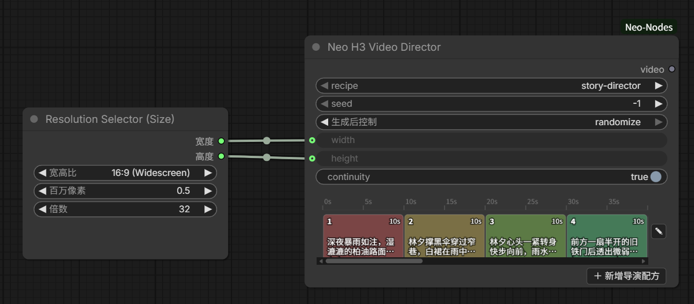

# H3 Video（MiniMax H3 视频生成）

`NeoH3VideoDirector` 节点：MiniMax H3 视频生成的唯一入口，直接输出含原生音频的 `VIDEO`（可接 SaveVideo）到下游。复用 Krea2 Generate 的进程内 mini-executor（已支持 V3 API 节点），无需聊天界面、不嵌套官方 PromptExecutor。两种用法：**配方多段**（以 `video_director` 配方逐段生成并拼接成单个长视频）与 **BUNDLE 单段**（连 ⚡ Neo Prompt Agent 的 BUNDLE，按单片段生成）。

## 用法
### 配方多段（video_director）
1. 添加 🎞️ H3 Video Director 节点，`recipe` 选一个 `video_director` 配方（下拉自动列出；编辑器可增删/重排段、半自动故事生成）。
2. 配方的每段自带 `skill_id` + prompt + 时长 + 首/尾帧 + 参考素材。视频 skill 需带 `gen_video: true` + `workflow.json`（内置：`H3 文生视频`(t2v)、`H3 图生视频`(i2v)、`首尾帧生视频`(fl2v)、`H3参考生视频`(r2v：最多 9 张参考图 / 3 个参考视频 / 3 个参考音频)；另有同名带 `(VDN)` 的 4 个加速变体，依赖 ComfyUI-VDN-H3 插件、8 步，见「VDN 加速」节）。
3. 可选覆盖 `seed`（-1 = 用配方 `shared.seed`）/ `width` / `height`（-1 = 用各段 skill config 默认）/ `continuity`（跨段连续性总开关，默认开）/ `context_frames`（跨段上下文窗口帧数，默认 22，0 = 关闭）/ `model`（MODEL，外部加速模型）/ `steps`（INT，-1 = 用 preset/config 值），见「运行时加速」节。
4. 执行后输出单个拼接好的 `VIDEO`（含音频），接 SaveVideo 等节点导出。

### BUNDLE 单段
把 ⚡ Neo Prompt Agent 的 **BUNDLE** 输出连到 `bundle` 输入（纯连线槽，无文本框）：提示词 / 参考图（data URI）取自 bundle，视频 skill 用节点上**隐藏的视频 skill 选择器**（连上 BUNDLE 时自动显示、同时隐藏 `recipe`），按单个片段生成、**忽略 `recipe`**。需在节点上选择一个有效视频 skill（含 workflow.json），否则报错；`seed`/`width`/`height` 仍可用节点入参覆盖（-1 = 随机 / 用 skill config 默认）。参考图 data URI 原样透传，按 media 分图/视频/音频三组并各按上限裁剪（槽位语义见「模板占位符」节）。

## NeoH3VideoDirector（多段导演）

`NeoH3VideoDirector` 的多段模式：以 **video_director 配方**为参数，把多段 H3 视频按序逐段生成并拼接成单个含音频 `VIDEO`。每段复用共享的单段解析/执行链 `_run_segment_graph`（`resolve_video_params` + `render_template` + `execute_graph_inprocess`），参数来自配方。

- **输入**：`recipe`（video_director 配方名，下拉自动列出；点击弹出居中可搜索选择窗，仅搜索、无管理入口）+ 可选覆盖 `seed`（-1 = 用配方 `shared.seed`）/ `width` / `height`（-1 = 用各段 skill config 默认值）/ `continuity`（默认开）/ `context_frames`（跨段上下文窗口帧数，默认 22，0 = 关闭上下文窗口、退回 Tier A）/ `model`（MODEL，外部加速模型）/ `steps`（INT，-1 = 用 preset/config 值）/ `preview`（BOOLEAN，默认开，见下）。`model` / `steps` 与单段节点同款「运行时加速」语义、**逐段生效**：提供 `model` 时每段跳过内部主模型解析、剪掉该段纯模型链并注入外部模型（无需 VDN 插件）；`steps > 0` 覆盖每段采样步数。选中配方后节点会自动把 `width` / `height` / `steps` 填成该配方**首段** skill config 的默认值（仅当当前值为 -1 时，尊重已保存/手动设置）。
- **实时预览**：节点内时间轴左侧的「👁」开关（对应节点输入 `preview`，随工作流保存）控制采样期间的实时预览——**开**（默认）时每步沿潜空间时间轴均匀抽 8 帧，用 `models/vae_approx/taeh3.safetensors` 解成真彩 JPEG 序列（最长边 512px，替代核心对 H3 只能给的 Latent2RGB 粗色预览），经插件自有 WS 事件 `rs.h3.preview` 推给节点底部的**动画面板**：按 4 fps 自动循环播放该步的动作（8 帧一圈 2 秒；想调快慢改后端 `h3_preview.PREVIEW_FPS`，前端跟载荷里的 `fps` 走），可暂停/继续（点画面同样切换）、`⏪/⏩` 逐帧（自动暂停）、`◀/▶` 回看之前的采样步（回看时不被新载荷拽走）。面板只在采样期间占用节点加高的 300px，换段或运行结束即收起复位（每段的采样步各自从第 1 步计数）。缺文件或加载失败时自动回退 Latent2RGB（走核心通道），不影响出片。**关**则本次生成完全不出预览。该开关是最终决定：开就一定有预览，关就一定没有，与 ComfyUI 全局预览设置无关。代价：每步多解码/编码 8 帧，实测约 +0.2s/步（GPU fp16、8 帧 512px）。
- **逐段执行**：第 i 段用其 `skill_id` 解析模板与 config，提示词/时长/首帧取该段字段；`seed = base_seed + i`（base 优先节点覆盖、否则配方 `shared.seed`），保证可复现且各段不同。
- **生成模式**：配方可选 `shared.mode`（`t2v` / `i2v` / `fl2v` / `r2v` / `v2v` / `rv2v` / `mixed`，与 ComfyUI_MiniMaxH3_Director 的任务模式对齐）决定各段携带哪些帧与参考：具体模式全体统一，`mixed` 时逐段 `seg.mode` 生效；缺省（旧配方）按该段是否有尾帧/首帧/参考推断（尾帧→`fl2v`、首帧→`i2v`、仅有视频/音频参考→`r2v`、否则 `t2v`）。段级语义与编辑器显隐：

  | 模式 | 携带 | 编辑器显示 |
  | --- | --- | --- |
  | `t2v` 文生视频 | 无 | — |
  | `i2v` 图生视频 | 首帧（额外参考素材**不会生效**，保存时提示） | 首帧区 + 参考素材区 |
  | `fl2v` 首尾帧生视频 | 首帧 + 尾帧（额外参考素材**不会生效**，保存时提示） | 首帧区 + 尾帧区 + 参考素材区 |
  | `r2v` 全参考生视频 | 参考图 ≤9 / 参考视频 ≤3 / 参考音频 ≤3 | 参考素材区 |
  | `v2v` 视频编辑 | 源视频（自动作为 `<Video 1>`，提示词自动加标签） | 源视频区 |
  | `rv2v` 视频+参考图编辑 | 源视频 + 参考图 ≤9（源视频为 `<Video 1>`，参考图为 `<Picture N>`） | 源视频区 + 参考素材区 |

  校验：`i2v` 需首帧（或可链入上段尾帧）、`fl2v` 需尾帧、`r2v` 需至少一条参考素材、`v2v`/`rv2v` 需源视频；**保存前仅提示、不阻止**（可先存草稿再补），执行时仍给明确报错。新增段、拆分、切换全局/段级模式后即时刷新各分区显隐。
  - **统一参考素材（常驻身份）**：「🎯 统一设置」页的参考素材区在 `r2v` 和 `mixed` 模式下可见，改动即覆盖式应用到所有分段（仅 r2v 段执行时生效）。混合模式下用它铺角色身份图可保证各 r2v 段的 `<Picture N>` 编号一致；i2v/fl2v 段保存时若携带额外参考素材会收到提示。
- **跨段上下文窗口（连续性的主路径）**：`continuity` 开时（默认），上段**交付帧**的尾部 `context_frames` 帧（节点入参，默认 22；0 = 关闭）作为下一段开头的**视频参考**注入，下一段先重生成这 22 帧、再在拼接时**丢掉头部 22 帧**——接缝不再有重复帧，新段带着上段的真实像素开场（与 H3-Continuum 的 context window 同思路）。窗口帧数就近对齐到模型要求的 `17k+5` 网格（22 / 39 正在网格上），目标总帧数 = 该段时长帧数 + 窗口帧数后再就近对齐（124+22=146 → 141，交付 119 帧），裁剪与音频丢弃同一帧数保 A/V 对齐。`t2v` 段也链入窗口（那是它唯一的连续性来源）。
- **身份继承**：配方里**第一个带参考素材的段**的参考图（上限 4 张）领养到之后所有段——r2v 段转成自己的参考图进 conditioning，i2v/fl2v/t2v 段（模板没有多路参考槽位）直接注入参考图片块。本段已经送出的图不重复注入；`continuity` 关时不继承。
- **注入实现（`NeoH3AddContext`）**：注入节点串在 H3 conditioning 节点与采样器之间（采样器的 `model` / `positive` / `negative` 改由注入链提供），每加一条参考 append 一次 `minimax_refs`：先身份图、后窗口。窗口帧用虚拟 `LoadImage` + mini-executor override 直接喂张量（不写临时文件），身份图用 input 目录里的真实 `LoadImage`。**i2v/fl2v 段有窗口时首帧取窗口的第 0 帧**（与窗口行同内容，锚点时间线由 wrapper 修正到目标原点），不再用上段尾帧；该段自己挂的素材仍照常写进 `references`（i2v/fl2v 模板只有首帧槽位，额外素材不生效）。窗口的 `latent_t` 与帧数在节点里校验（对不上说明 vae 不是 H3 视频 VAE，直接报错）。
- **Tier A 回退（`context_frames=0`）**：上段尾帧作为下段 **i2v/fl2v** 段首帧（data-URI 走单段同款参考路径），并丢该段第一帧避免边界重复；`t2v` 段不链入、不丢帧。r2v 段在 Tier A 下不再注入任何连续性锚点（旧的首帧 keyframe 锚点已由窗口取代），要 r2v 连续性请把 `context_frames` 设为 ≥5。
- **锚点与窗口的时间轴对齐**：`PackedLayout` 把 keyframe 锚点行与 ref 行的时间坐标一律从 `text_len` 起算，而目标视频的 t 原点在所有 ref 之后，于是只要本段带 refs，锚点就整体早一个「refs 推进量」、窗口行则整段错开一个窗口。连续性 wrapper（`WrappersMP.APPLY_MODEL`，key `neo_h3_continuity.apply_model.v1`，同 key 先清再挂）在模型调用前一次性修正：keyframes 与 refs 并存时把两者合回一条 `cond_video_latents`（core 只留 refs），就地平移锚点行，并把窗口行拷到目标视频开头的行上（保持 `position_ids` 张量本体，Sol-Attn 的 span 注册认它）。不改 core、不与其它插件的 `extra_conds` 补丁抢所有权。手动搭图时把 `NeoH3AddContext`（或做单帧锚点的 `NeoH3AddKeyframe`）串在 `MiniMaxH3*ToVideo` 与采样器之间即可；`tools/check_h3_context_layout.py` 用真机 core 的 `PackedLayout` 复核这套对齐。
- **音频对齐**：各段 `AudioInput`（`{waveform:[B,C,T], sample_rate}`）按序拼接，每个接缝丢弃被丢帧对应的采样数（`round(sample_rate/fps)`），使总音频长度恰好等于拼接后帧数对应的时长（A/V 对齐）。
- **输出**：`InputImpl.VideoFromComponents(VideoComponents(images, audio, frame_rate=24))`，单个 `VIDEO` 接 SaveVideo。
- **交互**：节点内嵌只读时间轴（`web/director-timeline.js` 复用）显示各段块；**点击某块**直接打开该配方的导演编辑器并**定位到该段**（窗口已打开时再点别的块只切换当前段、不重建窗口），右上角 **✎** 打开编辑器（不带段索引，保持当前段）。工作流还原后时间轴按还原出的 `recipe` 值自动重拉更新（LiteGraph configure 直写 widget 值、不触发下拉回调，onConfigure 里补一次拉取），分段块始终与选中的配方对应。**任意入口**（节点「＋/✎」或侧栏新建/编辑）保存导演配方后广播 `neo-director-recipe-saved`，所有 Director 节点的 `recipe` 下拉即时刷新候选并重载时间轴：新建配方自动选中，当前值失效（如重命名）时回落到第一个有效项。
- **参考素材区（r2v）**：编辑器内每段「参考素材」是**已用素材列表**（非候选池）——只显示当前挂上的图/视频/音频；从左侧素材库**拖入**或点「本地」上传即**直接插入**。瓷砖按画面比例自适应宽度、紧密平铺不留空白（与时间轴一致），不显示文件名、✕ 于 hover 时显示，可**鼠标拖放调整顺序**，数量受上限约束（图 ≤9 / 视频 ≤3 / 音频 ≤3，达上限提示并拒绝）。**列表顺序即参考槽位编号**（对应模板 `{{REF_IMAGE_1..n}}` 与提示词 `<Picture i>` / `<Video k>` / `<Audio j>`），保存按此顺序写入段 `refs`。时间轴块内把参考图**逐张横排平铺满块高**（能放几张放几张、顺序即槽位编号，画在首帧同区域之上），视频/音频无缩略图、右上角以数量徽标显示，增删改即时刷新。
- **运行时进度**：正在生成的段顶部为琥珀色条、已完成段为绿色条、待处理段无条（条画在**块顶部**：块底紧邻横向滚动条，画底部会被滚动条盖住）；段切换时时间轴**自动把当前段横向滚动到可视区**（段数多/放大过、内容宽于可视区时才滚动；已整体可见则不动）。前端每 500ms 轮询 `/neo_video_gen/director_progress`（返回 `{active, segment_index, total_segments}`），后端在 `generate()` 逐段推进时更新该状态，并在结束/异常时复位为 inactive。
- **参考范围**：每段可挂首帧、尾帧（各一张）与参考图（≤9）/ 参考视频（≤3）/ 参考音频（≤3），后三者写入段 `refs.images/videos/audios`。执行时首帧（或 continuity 链入的上段尾帧）作为第一个图像参考，尾帧单独走 `body["last_frame"]`，其余参考按 `media` 分流交给技能模板。首尾帧技能据此填 `first_frame`/`last_frame`（只给一边即退化为 I2VA/L2VA），参考生视频技能据此填 `ref_images`/`ref_videos`/`ref_audios`；文生段不带任何参考。

## 模板与配置
- 每个视频 skill 目录含：`skill.md`（frontmatter 带 `gen_video: true`）、`workflow.json`（H3 采样链模板）、`config.json`（尺寸/时长/步数默认值）。
- 模型解析优先级：**skill `config.json` 的 `model` / `text_encoder` / `vae` → 「出图设置」页面的『生视频模型』区（全局 `video_model` / `video_text_encoder` / `video_vae`）→ 仍缺则报错**。音频 VAE 单独解析：skill `config.json` 的 `audio_vae` → 「生视频模型」设置的 `video_audio_vae`（VAE(音频) 下拉）→ 按文件名线索（同时含 `h3` 与 `audio`）自动挑选，找不到才报错。内置 preset 不写死模型名：请在「自动增强 → 出图设置」的生视频模型区选本地实际安装的 H3 模型；音频 VAE 一般无需手填（自动挑 `minimax_h3_audio_vae_fp32.safetensors` 之类）。`config.json` 的 `width` / `height` / `length`(帧) 为默认值（`duration`=-1 时按此帧数），可被节点入参覆盖。
- **每技能覆盖（同生图）**：在技能详情弹窗里，视频技能（`gen_video: true`）显示「🎬 生视频设置」区，可对该 skill 单独设 生视频模型 / Text Encoder / VAE(视频) / VAE(音频)，写入其 `config.json`（键 `model`/`text_encoder`/`vae`/`audio_vae`），优先于全局「生视频模型」设置；留空则回落全局。预设技能只读，需「⧉ Copy as custom」复制后可编辑（复制保留 `gen_video` 与 `category: video_gen`）。
- **LoRA（同生图，无「依赖参考图」）**：在「🎬 生视频设置」区可对该 skill 添加多个 LoRA（模型 + 强度），写入其 `config.json` 的 `loras`；生成时经 `image_gen._resolve_loras` 校验后由 `render_template` 动态串入主链——模板无 LoRA 槽位时在 `UNETLoader → MiniMaxH3SigmaShift` 之间插入 `LoraLoaderModelOnly`。视频无参考图依赖概念，故不设生图区那样的「依赖参考图」复选框，配置的 LoRA 全部无条件加载；LoRA 下拉由 `/neo_video_gen/models` 的 `loras` 提供。
- 模板链：`UNETLoader + CLIPLoader(type=minimax) + VAELoader(视频) + VAELoader(音频) → MiniMaxH3ImageToVideo → [cond, AV latent] → MiniMaxH3SigmaShift + KSampler(cfg=1.0) → LTXVSeparateAVLatent → {VAEDecode(视频 VAE)→帧, VAEDecodeAudio(音频 VAE)→音频} → CreateVideo(fps=24) → VIDEO`。**H3 音频是独立 VAE（MiniMaxH3AudioVAE），`VAEDecodeAudio` 必须接单独的音频 `VAELoader`，不能复用视频 VAE**（否则视频 VAE 按 5D 解码 4D 音频 latent 会报 `IndexError`）。i2v 额外 `LoadImage({{REF_IMAGE}}) → first_frame`；r2v 用 `MiniMaxH3ReferenceToVideo`（取代 ImageToVideo）并接下面三组参考槽位。
- 占位符：`{{PROMPT}} {{MODEL}} {{TEXT_ENCODER}} {{VAE}} {{AUDIO_VAE}} {{WIDTH}} {{HEIGHT}} {{LENGTH}} {{SEED}} {{STEPS}}`；单帧：`{{REF_IMAGE}}`（首帧）、`{{REF_IMAGE_LAST}}`（尾帧，fl2v 用）。**单帧占位符未挂时，所在 `LoadImage` 节点连同连线一并裁掉**——首尾帧模板因此可只给一边（仅首帧=I2VA、仅尾帧=L2VA），都不给则报「该技能需要参考图」。
- **多路参考槽位（r2v）**：`{{REF_IMAGE_1..9}}` / `{{REF_VIDEO_1..3}}` / `{{REF_AUDIO_1..3}}`，序号按类型各自 1 基编号，与官方 `MiniMaxH3ReferenceToVideo` 的 autogrow 槽位一致：

  | 类型 | 上限 | 模板占位符 | 加载链 |
  | --- | --- | --- | --- |
  | 参考图 | 9 | `{{REF_IMAGE_1..9}}` | `LoadImage → ref_images.ref_image_0..8` |
  | 参考视频 | 3 | `{{REF_VIDEO_1..3}}` | `LoadVideo → GetVideoComponents → ref_videos.ref_video_0..2` |
  | 参考音频 | 3 | `{{REF_AUDIO_1..3}}` | `LoadAudio → ref_audios.ref_audio_0..2` |

  参考以 `references` 列表传入，每项可用 `media` 标类型（`image` 缺省 / `video` / `audio`）；`resolve_video_params` 按类型分流并各自按上限截断，`render_template` 把**未挂的槽位连同加载节点一并裁掉**（模板可同时声明全部上限槽位，只挂 1 张图也能跑）。mini-executor 会把 `ref_images.ref_image_0` 这类点号输入收成嵌套 dict（与 ComfyUI 主循环的 `build_nested_inputs` 一致）后再调节点。提示词用 `<Picture i>` / `<Video k>` / `<Audio j>` 指代对应序号的参考（写法见 `minimax_h3_full_ref` 技能正文）。
- **从画布导出（📋 From Canvas）**：技能下拉底部「📋 From Canvas」把当前画布 API prompt 导出为技能。检测到 H3 视频工作流（含 `MiniMaxH3*ToVideo` 入口，或 `CreateVideo`+`VAEDecodeAudio`）时自动存为 `gen_video: true` / `category: video_gen` 的视频 skill，并按上表占位符模板化（模型/编码器/视频 VAE/音频 VAE/prompt/尺寸/时长/seed/主链 LoRA；I2V 的 `LoadImage` → `{{REF_IMAGE}}`、首帧连线保留），否则仍存为出图 skill。只弹一个标题对话框输入名称（不再问描述/标签），成功/失败用 toast 提示。导出的模板会保留画布上的 `SaveVideo`/`ResolutionSelector`/数学表达式等旁支节点，改用内置 preset 风格（`{{WIDTH}}`/`{{HEIGHT}}`/`{{LENGTH}}`/`{{SEED}}`/`{{STEPS}}`）才能让节点入参与逐段 seed 真正生效。

## VDN 加速（可选插件 ComfyUI-VDN-H3）
内置 4 个 VDN 变体 preset：`H3 文生视频 (VDN)` / `H3 图生视频 (VDN)` / `首尾帧生视频 (VDN)` / `H3参考生视频 (VDN)`（id `minimax_h3_vdn_t2v` / `_i2v` / `_fl2v` / `minimax-h3-vdn-r2v`）。它们与对应非 VDN preset **完全同构**，只在 `UNETLoader → MiniMaxH3SigmaShift` 之间多插一个 `ApplyVDNH3Advanced` 节点（来自可选插件 **ComfyUI-VDN-H3**），并把 `config.json` 的 `steps` 设为 **8**（对齐 8 步 DMD 蒸馏 checkpoint）。
- **参数默认值**（按发布模型原样，模板里写死）：`vdn_checkpoint: stage-dmd-step-250`、`apply_turbo_adapter: true`、`stage_b_strength/turbo_strength: 1.0`、`lora_mode: merge`、`branch_weights: auto`、`retain_buffers: auto`、`attention_backend: grouped`、`window_radius: 1` / `window_chunk: 5` / `anchor_frames: both`、`text_state/linear_branch: true`、`fast_kernels: false`。
- **依赖插件**：VDN preset 需要安装 `ComfyUI-VDN-H3`（提供 `ApplyVDNH3Advanced`）并把 8 步 stage 放到 `models/vdn/stage-dmd-step-250/`。**未安装该插件时**，执行会在渲染后、采样前抛出明确报错「需要 VDN 加速插件 ComfyUI-VDN-H3（节点 ApplyVDNH3Advanced 未注册）」，提示安装并重启、或改用非 VDN 的 H3 skill——而不是通用的「未知节点」错误。
- 模型/编码器/视频 VAE/音频 VAE 解析与非 VDN preset 一致（见上）；`vdn_checkpoint` 目前写死为 `stage-dmd-step-250`，需要其它 stage 时请「⧉ Copy as custom」后改模板里的 `vdn_checkpoint`。

## 运行时加速：外部 `MODEL` / `steps`（可选）
`NeoKrea2Generate` 与 `NeoH3VideoDirector`（视频，**逐段/单段**应用下述规则）都有两个**可选**输入，用于不改 skill 模板就临时换模型 / 调步数：
- **`model`（MODEL，连线槽）**：提供时把外部加速模型注入到最终消费扩散模型的位置——视频为 `MiniMaxH3SigmaShift.model` 的来源、生图为 `KSampler`/`KSamplerAdvanced.model` 的来源。节点**只沿 `model` 输入边向上剪掉纯模型链**（UNETLoader / LoRA / VDN 等只出 MODEL 的节点），保留文本编码器 / 视频 VAE / 音频 VAE / 采样器等共享节点，并把注入点输出直接替换为外部模型（mini-executor 跳过该节点执行）。
- **`steps`（INT，默认 -1）**：`-1` = 用 preset/config 值；`>0` = 覆盖渲染后的 `{{STEPS}}`。生图模板可能硬编码步数（非 `{{STEPS}}`），故生图侧直接改写采样器节点的 `steps` 字段，两种情况都生效。

典型用法：把 ComfyUI-VDN-H3 的 `ApplyVDNH3Advanced`（或量化/蒸馏后的模型）输出连到本节点 `model`，即可**不依赖 VDN preset、甚至无需安装该插件**跑加速——因为内部 UNETLoader 与 VDN 节点都被剪掉、注入点被外部模型覆盖，此时不再触发「需要 ComfyUI-VDN-H3」的校验（该校验只在未提供 `model` 时执行）。

## 说明
- 末端 `CreateVideo` 把视频帧 + 音频打包成原生 `VIDEO`（fps=24），不直接落盘；接 SaveVideo 即可导出带声音的视频。
- 采样步数 `steps` 由 skill `config.json` 的 `steps` 配置（模板占位符 `{{STEPS}}`），缺省默认 **20**——在技能详情「🎬 生视频设置」区的「步数」输入框填写；cfg/sampler/scheduler 仍写在各 skill 的 `workflow.json` 中，按需调整。
- 「出图设置 → 生视频模型」区的模型下拉由 `/neo_video_gen/models` 提供：H3 相关（文件名含 `h3`）排前面、其余按名称排序（与生图的 krea2-first 独立），方便快速定位 H3 模型。