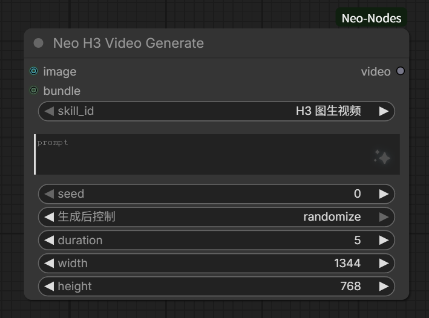

# H3 Video Generate（MiniMax H3 视频生成）

`NeoH3VideoGenerate` 节点：按所选**视频 skill** 的 `workflow.json` 模板同步生成 MiniMax H3 视频，直接输出含原生音频的 `VIDEO`（可接 SaveVideo）到下游节点。复用 Krea2 Generate 的进程内 mini-executor（已支持 V3 API 节点），无需聊天界面、不嵌套官方 PromptExecutor。

## 用法
1. 添加 🎬 H3 Video Generate 节点。
2. `skill_id` 选一个带 `gen_video: true` + `workflow.json` 的视频 skill（内置：`H3 文生视频`(t2v)、`H3 图生视频`(i2v)、`首尾帧生视频`(fl2v)、`H3参考生视频`(r2v：最多 9 张参考图 / 3 个参考视频 / 3 个参考音频)）。
3. 接 prompt（可来自 ⚡ Neo Prompt Agent 或手填）；i2v 再连首帧 IMAGE，首尾帧（fl2v）再连 `last_frame` IMAGE（尾帧可选：只给首帧=I2VA、只给尾帧=L2VA、两边都给=FL2VA；其它技能模板没有该槽位会自然忽略）。
4. 可选覆盖 `seed`（默认 0，固定；要随机把「生成后控制」设为 randomize）/ `duration`(秒) / `width` / `height`（-1 = 用 skill config.json 默认；`duration` 按 24fps 向上对齐到模型 17k+5 帧网格后作为 H3 `length`）。
5. 执行后输出 `VIDEO`（含音频），接 SaveVideo 等节点导出。

> **bundle 直连**：也可把 ⚡ Neo Prompt Agent 的 BUNDLE 输出连到本节点 `bundle` 输入，一次性带上 prompt/连接图/skill——prompt 留空时取 bundle、连接图优先于首帧 IMAGE、bundle 携带的视频 skill 有效时覆盖 `skill_id`；bundle 缺失/过期则回退本地。连上 BUNDLE 后 `prompt`/`skill_id` 控件会被禁用（以 bundle 为准）；`bundle` 输入前端渲染为纯连线槽（同 image，无文本框）。多 prompt 逐项循环需同时连 PROMPT 与 BUNDLE（只连 BUNDLE 仅用第一条）。

## NeoH3VideoDirector（多段导演）

`NeoH3VideoDirector` 节点：以 **video_director 配方**为参数，把多段 H3 视频按序逐段生成并拼接成单个含音频 `VIDEO`。每段复用上面单段节点的解析/执行链（`resolve_video_params` + `render_template` + `execute_graph_inprocess`），只是参数来自配方而非节点入参。

- **输入**：`recipe`（video_director 配方名，下拉自动列出）+ 可选覆盖 `seed` / `width` / `height`（-1 = 用配方 `shared`）/ `continuity`（默认开）。
- **逐段执行**：第 i 段用其 `skill_id` 解析模板与 config，提示词/时长/首帧取该段字段；`seed = base_seed + i`（base 优先节点覆盖、否则配方 `shared.seed`），保证可复现且各段不同。
- **生成模式**：配方可选 `shared.mode`（`t2v` / `i2v` / `fl2v` / `r2v` / `mixed`，与 ComfyUI_MiniMaxH3_Director 的任务模式对齐）决定各段携带哪些帧与参考：具体模式全体统一，`mixed` 时逐段 `seg.mode` 生效；缺省（旧配方）按该段是否有尾帧/首帧/参考推断（尾帧→`fl2v`、首帧→`i2v`、仅有视频/音频参考→`r2v`、否则 `t2v`）。段级语义与编辑器显隐：

  | 模式 | 携带 | 编辑器显示 |
  | --- | --- | --- |
  | `t2v` 文生视频 | 无 | — |
  | `i2v` 图生视频 | 首帧（+ 段上挂的参考素材） | 首帧区 + 参考素材区 |
  | `fl2v` 首尾帧生视频 | 首帧 + 尾帧（+ 参考素材） | 首帧区 + 尾帧区 + 参考素材区 |
  | `r2v` 全参考生视频 | 参考图 ≤9 / 参考视频 ≤3 / 参考音频 ≤3 | 参考素材区 |

  校验：`i2v` 需首帧（或可链入上段尾帧）、`fl2v` 需尾帧、`r2v` 需至少一条参考素材；**保存前仅提示、不阻止**（可先存草稿再补），执行时仍给明确报错。新增段、拆分、切换全局/段级模式后即时刷新各分区显隐。
- **连续性（Tier A）**：`continuity` 开时，上一段的**尾帧**作为下一个 **i2v** 段的首帧（data-URI 走单段同款参考路径），并**丢该段第一帧**避免边界重复；`t2v` 段不链入、不丢帧；关则各段独立、不丢帧。
- **音频对齐**：各段 `AudioInput`（`{waveform:[B,C,T], sample_rate}`）按序拼接，每个接缝丢弃被丢帧对应的采样数（`round(sample_rate/fps)`），使总音频长度恰好等于拼接后帧数对应的时长（A/V 对齐）。
- **输出**：`InputImpl.VideoFromComponents(VideoComponents(images, audio, frame_rate=24))`，单个 `VIDEO` 接 SaveVideo。
- **交互**：节点内嵌只读时间轴（`web/director-timeline.js` 复用）显示各段块；**点击某块**直接打开该配方的导演编辑器并**定位到该段**（窗口已打开时再点别的块只切换当前段、不重建窗口），右上角 **✎** 打开编辑器（不带段索引，保持当前段）。
- **参考素材区（r2v）**：编辑器内每段「参考素材」是**已用素材列表**（非候选池）——只显示当前挂上的图/视频/音频；从左侧素材库**拖入**或点「本地」上传即**直接插入**。瓷砖按画面比例自适应宽度、紧密平铺不留空白（与时间轴一致），不显示文件名、✕ 于 hover 时显示，可**鼠标拖放调整顺序**，数量受上限约束（图 ≤9 / 视频 ≤3 / 音频 ≤3，达上限提示并拒绝）。**列表顺序即参考槽位编号**（对应模板 `{{REF_IMAGE_1..n}}` 与提示词 `<Picture i>` / `<Video k>` / `<Audio j>`），保存按此顺序写入段 `refs`。时间轴块内把参考图**逐张横排平铺满块高**（能放几张放几张、顺序即槽位编号，画在首帧同区域之上），视频/音频无缩略图、右上角以数量徽标显示，增删改即时刷新。
- **运行时进度**：正在生成的段顶部为琥珀色条、已完成段为绿色条、待处理段无条（条画在**块顶部**：块底紧邻横向滚动条，画底部会被滚动条盖住）；段切换时时间轴**自动把当前段横向滚动到可视区**（段数多/放大过、内容宽于可视区时才滚动；已整体可见则不动）。前端每 500ms 轮询 `/neo_video_gen/director_progress`（返回 `{active, segment_index, total_segments}`），后端在 `generate()` 逐段推进时更新该状态，并在结束/异常时复位为 inactive。
- **参考范围**：每段可挂首帧、尾帧（各一张）与参考图（≤9）/ 参考视频（≤3）/ 参考音频（≤3），后三者写入段 `refs.images/videos/audios`。执行时首帧（或 continuity 链入的上段尾帧）作为第一个图像参考，尾帧单独走 `body["last_frame"]`，其余参考按 `media` 分流交给技能模板。首尾帧技能据此填 `first_frame`/`last_frame`（只给一边即退化为 I2VA/L2VA），参考生视频技能据此填 `ref_images`/`ref_videos`/`ref_audios`；文生段不带任何参考。

## 模板与配置
- 每个视频 skill 目录含：`skill.md`（frontmatter 带 `gen_video: true`）、`workflow.json`（H3 采样链模板）、`config.json`（尺寸/时长/步数默认值）。
- 模型解析优先级：**skill `config.json` 的 `model` / `text_encoder` / `vae` → 「出图设置」页面的『生视频模型』区（全局 `video_model` / `video_text_encoder` / `video_vae`）→ 仍缺则报错**。音频 VAE 单独解析：skill `config.json` 的 `audio_vae` → 「生视频模型」设置的 `video_audio_vae`（VAE(音频) 下拉）→ 按文件名线索（同时含 `h3` 与 `audio`）自动挑选，找不到才报错。内置 preset 不写死模型名：请在「自动增强 → 出图设置」的生视频模型区选本地实际安装的 H3 模型；音频 VAE 一般无需手填（自动挑 `minimax_h3_audio_vae_fp32.safetensors` 之类）。`config.json` 的 `width` / `height` / `length`(帧) 为默认值（`duration`=-1 时按此帧数），可被节点入参覆盖。
- **每技能覆盖（同生图）**：在技能详情弹窗里，视频技能（`gen_video: true`）显示「🎬 生视频设置」区，可对该 skill 单独设 生视频模型 / Text Encoder / VAE(视频) / VAE(音频)，写入其 `config.json`（键 `model`/`text_encoder`/`vae`/`audio_vae`），优先于全局「生视频模型」设置；留空则回落全局。预设技能只读，需「⧉ Copy as custom」复制后可编辑（复制保留 `gen_video` 与 `category: video_gen`）。
- **LoRA（同生图，无「依赖参考图」）**：在「🎬 生视频设置」区可对该 skill 添加多个 LoRA（模型 + 强度），写入其 `config.json` 的 `loras`；生成时经 `image_gen._resolve_loras` 校验后由 `render_template` 动态串入主链——模板无 LoRA 槽位时在 `UNETLoader → MiniMaxH3SigmaShift` 之间插入 `LoraLoaderModelOnly`。视频无参考图依赖概念，故不设生图区那样的「依赖参考图」复选框，配置的 LoRA 全部无条件加载；LoRA 下拉由 `/neo_video_gen/models` 的 `loras` 提供。
- 模板链：`UNETLoader + CLIPLoader(type=minimax) + VAELoader(视频) + VAELoader(音频) → MiniMaxH3ImageToVideo → [cond, AV latent] → MiniMaxH3SigmaShift + KSampler(cfg=1.0) → LTXVSeparateAVLatent → {VAEDecode(视频 VAE)→帧, VAEDecodeAudio(音频 VAE)→音频} → CreateVideo(fps=24) → VIDEO`。**H3 音频是独立 VAE（MiniMaxH3AudioVAE），`VAEDecodeAudio` 必须接单独的音频 `VAELoader`，不能复用视频 VAE**（否则视频 VAE 按 5D 解码 4D 音频 latent 会报 `IndexError`）。i2v 额外 `LoadImage({{REF_IMAGE}}) → first_frame`；r2v 用 `MiniMaxH3ReferenceToVideo`（取代 ImageToVideo）并接下面三组参考槽位。
- 占位符：`{{PROMPT}} {{MODEL}} {{TEXT_ENCODER}} {{VAE}} {{AUDIO_VAE}} {{WIDTH}} {{HEIGHT}} {{LENGTH}} {{SEED}} {{STEPS}}`；单帧：`{{REF_IMAGE}}`（首帧）、`{{REF_IMAGE_LAST}}`（尾帧，fl2v 用）。**单帧占位符未挂时，所在 `LoadImage` 节点连同连线一并裁掉**——首尾帧模板因此可只给一边（仅首帧=I2VA、仅尾帧=L2VA），都不给则报「该技能需要参考图」。
- **多路参考槽位（r2v）**：`{{REF_IMAGE_1..9}}` / `{{REF_VIDEO_1..3}}` / `{{REF_AUDIO_1..3}}`，序号按类型各自 1 基编号，与官方 `MiniMaxH3ReferenceToVideo` 的 autogrow 槽位一致：

  | 类型 | 上限 | 模板占位符 | 加载链 |
  | --- | --- | --- | --- |
  | 参考图 | 9 | `{{REF_IMAGE_1..9}}` | `LoadImage → ref_images.ref_image_0..8` |
  | 参考视频 | 3 | `{{REF_VIDEO_1..3}}` | `LoadVideo → GetVideoComponents → ref_videos.ref_video_0..2` |
  | 参考音频 | 3 | `{{REF_AUDIO_1..3}}` | `LoadAudio → ref_audios.ref_audio_0..2` |

  参考以 `references` 列表传入，每项可用 `media` 标类型（`image` 缺省 / `video` / `audio`）；`resolve_video_params` 按类型分流并各自按上限截断，`render_template` 把**未挂的槽位连同加载节点一并裁掉**（模板可同时声明全部上限槽位，只挂 1 张图也能跑）。mini-executor 会把 `ref_images.ref_image_0` 这类点号输入收成嵌套 dict（与 ComfyUI 主循环的 `build_nested_inputs` 一致）后再调节点。提示词用 `<Picture i>` / `<Video k>` / `<Audio j>` 指代对应序号的参考（写法见 `minimax_h3_full_ref` 技能正文）。
- **从画布导出（📋 From Canvas）**：技能下拉底部「📋 From Canvas」把当前画布 API prompt 导出为技能。检测到 H3 视频工作流（含 `MiniMaxH3*ToVideo` 入口，或 `CreateVideo`+`VAEDecodeAudio`）时自动存为 `gen_video: true` / `category: video_gen` 的视频 skill，并按上表占位符模板化（模型/编码器/视频 VAE/音频 VAE/prompt/尺寸/时长/seed/主链 LoRA；I2V 的 `LoadImage` → `{{REF_IMAGE}}`、首帧连线保留），否则仍存为出图 skill。只弹一个标题对话框输入名称（不再问描述/标签），成功/失败用 toast 提示。导出的模板会保留画布上的 `SaveVideo`/`ResolutionSelector`/数学表达式等旁支节点，改用内置 preset 风格（`{{WIDTH}}`/`{{HEIGHT}}`/`{{LENGTH}}`/`{{SEED}}`/`{{STEPS}}`）才能让节点入参与逐段 seed 真正生效。

## 说明
- 末端 `CreateVideo` 把视频帧 + 音频打包成原生 `VIDEO`（fps=24），不直接落盘；接 SaveVideo 即可导出带声音的视频。
- 采样步数 `steps` 由 skill `config.json` 的 `steps` 配置（模板占位符 `{{STEPS}}`），缺省默认 **20**——在技能详情「🎬 生视频设置」区的「步数」输入框填写；cfg/sampler/scheduler 仍写在各 skill 的 `workflow.json` 中，按需调整。
- 「出图设置 → 生视频模型」区的模型下拉由 `/neo_video_gen/models` 提供：H3 相关（文件名含 `h3`）排前面、其余按名称排序（与生图的 krea2-first 独立），方便快速定位 H3 模型。