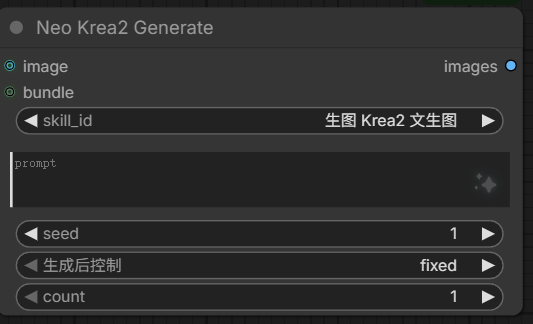

# Krea2 生图

Krea2 生图有两个入口：提示词节点内置的**聊天生图**，以及独立的 **🎨 Krea2 Generate** 节点。

## 聊天生图（节点内置）

选生图 skill 后 ✨ 直接生成：文生图 / 参考图四视图角色板，LoRA 可选（依赖参考图模式），底部状态行实时显示进度/取消，结果 Markdown 预览并一键装配回 LoadImage。

> 生图需 GPU/显存，且所选 skill 必须声明 `gen_image: true` 并附 `workflow.json`。
> 生图模型 / Text Encoder / VAE 默认「自动」按 skill 模板匹配，无需手配；未匹配到时再到节点生图设置里手动指定。

## 🎨 Krea2 Generate - 一体化生图节点（IMAGE 输出）

按所选生图 skill 的 `workflow.json` 模板**同步生成图像并直接输出 IMAGE 张量**，供下游节点（SaveImage / 其它图像节点）连线使用。与「聊天生图」不同：它不经过聊天界面、不落盘到 output 目录，而是把生成的图像作为张量返回给工作流。

**常用搭配 ⚡ Neo Prompt Agent**：由它生成 prompt 文本接入本节点。生图模型 / Text Encoder / VAE 默认「自动」按 skill 模板匹配，一般无需手配；未匹配到时再到生图设置里手动指定。

- **进程内 mini-executor** - 在节点 forward 内拓扑执行所选 skill 的 workflow 模板（复用 `image_gen.render_template`），跳过 SaveImage/Preview 等落盘节点，取末端 IMAGE 输出
- **skill_id 下拉** - 按生图 skill 的**名称**（frontmatter `name`，缺省回退 id）列出，仅含带 `workflow.json` 的生图 skill（`gen_image: true`）；节点内部把所选名称解析回 skill id 再取模板，旧工作流里存的 id 也能兼容；skill 增删/改名后需刷新 `/object_info`。**点击下拉弹出居中可搜索选择窗**（按 category 分组、📷 标记需图技能，底部 + New Skill / ⬆ ZIP / ⬆ Folder / 📋 From Canvas 管理入口、行内 ✎ Edit / 👁 查看），替代原生 combo 列表
- **prompt 可连线** - STRING 输入既可手填，也可连 Neo Prompt 节点的 PROMPT 输出
- **参考图可选** - IMAGE 输入供 `requires_ref`（四视图）skill 使用，文生图 skill 忽略
- **bundle 输入（可选）** - 连 ⚡ Neo Prompt Agent 的 BUNDLE 输出：prompt 留空时取 bundle 里的、连接图作为参考图优先于 `image` 输入；生图 skill 始终用节点本地选择（bundle 只带 prompt/参考图，不携带 skill）；bundle 缺失/过期则回退本地。**前端渲染为纯连线槽**（与 `image` 一致，节点体内不显示文本框，只留左侧 slot）。连上 BUNDLE 后仅 `prompt` 控件被禁用（以 bundle 为准），`skill_id` 保持可选
- **需 GPU/显存** - forward 内加载 UNET+CLIP+VAE 并采样，执行期间阻塞主工作流

### 输入/输出

| 输入 | 类型 | 说明 |
|------|------|------|
| skill_id | COMBO | 生图 skill 名称（仅含 workflow.json 的 gen_image skill；显示 name，内部解析为 id） |
| prompt | STRING | 提示词（可手填或连 Neo Prompt 的 PROMPT） |
| image | IMAGE (可选) | 参考图；四视图等 requires_ref skill 需要 |
| bundle | STRING (可选) | Neo Prompt Agent 的 BUNDLE id；前端为纯连线槽（同 image，无文本框）。连上后仅 `prompt` 控件禁用，参考图以 bundle 为准、prompt 留空时取 bundle；生图 skill 仍用节点本地选择 |
| seed | INT (可选) | 随机种子，默认 0（固定）；要随机把「生成后控制」设为 randomize |
| count | INT (可选) | 生成张数（1–8），默认 1 |
| width | INT (可选) | 输出宽度，默认 -1 = 用 skill/preset 比例算尺寸；>0 覆盖模板分辨率。前端选中/切换 skill 时自动填入该 skill 预设宽高（`/neo_image_gen/skill_dims`），手改后生效 |
| height | INT (可选) | 输出高度，默认 -1 = 用 skill/preset 比例算尺寸；>0 覆盖模板分辨率。前端选中/切换 skill 时自动填入该 skill 预设宽高（`/neo_image_gen/skill_dims`），手改后生效 |
| model | MODEL (可选) | 外部加速模型连线槽；提供时覆盖内部主模型链（UNETLoader/LoRA 等，只沿 `model` 边剪枝），注入到 `KSampler.model` 来源处 |

| 输出 | 类型 | 说明 |
|------|------|------|
| images | IMAGE | 生成的图像张量 `[B,H,W,C]` |

### 行为

- **旧工作流 / 复制粘贴串位自动修复**：本节点 `seed` 之后会自动追加「生成后控制」（`control_after_generate`）下拉，占一个 `widgets_values` 位置。widget 集合变化（新增 width/height）后，载入旧工作流或复制粘贴可能按位置错一位、把数字写进该下拉或 `seed`。前端在 `onConfigure` 检测到「生成后控制」不是模式串时，自动复位为 `fixed`、`count` 归 1，并按所选 skill 预设强制重填 width/height；同时若 `seed` 落到非有限数或负数（如 `-1`/NaN），一并复位为默认 `0`（串位块无法可靠恢复原值）。旧格式（`widgets_values` 少于当前控件数）载入也会强制按预设重填宽高。
