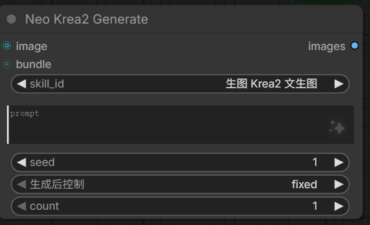

# Krea2 生图

生图有两个入口：提示词节点内置的**聊天生图**，以及独立的 **🎨 Neo Image Gen & Edit** 节点
（文生图 + 参考图编辑，模型由所选技能决定，如 Krea2 / Qwen Image 2.1）。

## 聊天生图（节点内置）

- 选生图技能后点 ✨ 直接生成：文生图 / 参考图编辑，LoRA 可选。
- 底部状态行实时显示进度与取消，结果以 Markdown 预览，可一键装配回 LoadImage。
- 生图需 GPU / 显存，且所选技能必须声明 `gen_image: true` 并附 `workflow.json`。
- 生图模型 / Text Encoder / VAE 默认「自动」按技能模板匹配，无需手配；未匹配到时再到生图设置里手动指定。

## 🎨 Neo Image Gen & Edit - 一体化生图/编辑节点（IMAGE 输出）

按所选生图技能的 `workflow.json` 模板**同步生成图像并直接输出 IMAGE 张量**，供下游节点连线使用。

- 不挂参考图 = 文生图；挂上参考图则按技能模板进入参考 / 编辑模式（如 Qwen Image 2.1 编辑，最多 10 张）。
- 与「聊天生图」不同：不经过聊天界面、不落盘到 output 目录，而是把图像作为张量返回给工作流。
- 在节点 execute 内拓扑执行技能模板，跳过 SaveImage / Preview 等落盘节点，取末端 IMAGE 输出。
- 需 GPU / 显存：execute 内加载 UNET + CLIP + VAE 并采样，执行期间阻塞主工作流。



**常用搭配 ⚡ Neo Prompt Agent**：由它生成 prompt 文本接入本节点。

### 技能下拉

- 按生图技能的**中文名**（frontmatter `cn_name`，缺省回退 `name`）列出，仅含带 `workflow.json` 的生图技能。
- 节点内部把所选名称解析回技能 id 再取模板，旧工作流里存的 id / 名称同样兼容；技能增删改名后需刷新 `/object_info`。
- 点击下拉弹出居中可搜索选择窗（按 category 分组、📷 标记需图技能，底部含技能管理入口），替代原生 combo 列表。

### 输入/输出

| 输入 | 类型 | 说明 |
|------|------|------|
| `skill` | COMBO | 生图技能中文名（显示 `cn_name`，内部解析为 id） |
| `prompt` | STRING | 提示词（可手填或连 Neo Prompt 的 PROMPT） |
| `refs.image_1 … image_10` | IMAGE（Autogrow，可选） | 参考图槽位：不挂 = 文生图，挂上 = 参考/编辑 |
| `bundle` | STRING（可选） | Neo Prompt Agent 的 BUNDLE id，前端为纯连线槽 |
| `seed` | INT（可选） | 随机种子，默认 0（固定） |
| `count` | INT（可选） | 生成张数（1–8），默认 1 |
| `width` / `height` | INT（可选） | 输出宽高，`-1` = 用技能预设比例算尺寸 |
| `steps` | INT（可选） | 采样步数，`-1` = 用技能 `config.json` 的 `steps`（缺省 20） |
| `model` | MODEL（可选） | 外部加速模型，提供时覆盖内部主模型链 |

| 输出 | 类型 | 说明 |
|------|------|------|
| `images` | IMAGE | 生成的图像张量 `[B,H,W,C]` |

- 参考图槽位顺序就是语义顺序；保留张数按技能 `config.json` 的 `max_refs`（缺省回退模板
  `{{REF_IMAGE_n}}` 槽位数），运行时超出模板槽位的参考按最高已有槽的链自动补齐
  （Krea2 单路模板只取第一张并提示）。
- 连上 `bundle` 后：`prompt` 留空时取 bundle 里的，bundle 里的参考图优先于节点挂的参考图，
  仅 `prompt` 控件被禁用、`skill` 保持可选；bundle 缺失或过期则回退本地输入。
- 生图技能始终用节点本地选择（bundle 只带 prompt / 参考图，不携带技能）。
- 选中 / 切换技能时前端自动填入该技能预设宽高与步数，手改后生效。
- 要随机种子把「生成后控制」设为 randomize。

### 行为

- **旧工作流串位自动修复**：`seed` 之后会自动追加「生成后控制」下拉，占一个 `widgets_values` 位置。
  widget 集合变化后载入旧工作流或复制粘贴可能按位置错一位；前端检测到「生成后控制」不是模式串时
  自动复位为 `fixed`、`count` 归 1，并按所选技能预设强制重填宽高；`seed` 落到非有限数或负数时复位为 0。
- **技能有效性状态条**：节点底部按所选技能后台校验其 `workflow.json`（对照 `/object_info` 与 `/models/*`），
  缺模型 / 缺节点时显示「⚠️ N 个模型缺失 · M 个节点未安装 → 查看详情/修复」，点按钮打开该技能详情弹窗修复。
  无缺失、无 `workflow.json` 或校验接口不可用时整条隐藏；同一技能的检测结果会话内缓存 60s。

## 尺寸（Qwen Image 2.1）

Qwen Image 2.1 的 latent 一格 = 32px（VAE 16x 下采样 + 2x2 patchify）。

- **目标尺寸强制 32 对齐**：走 Qwen 2.1 模板的请求，显式宽高先对齐到 32，比例 / 默认值那条路再兜一次。
  画廊图片编辑窗的目标分辨率默认取原图尺寸并对齐到 32。
- **模型工作分辨率** = 设置项 `target_megapixels`（默认 1.5，在「⚙️ 设置 → 🖼️ 生图默认设置 → 目标像素数 (MP)」里改，
  技能 `config.json` 可覆盖）：扩图补边画布归一化到它，编辑目标超过它时按它等比封顶（只封顶不放大）。
- **常规编辑**（带参考图、非扩图 / 非局部编辑）：参考图与 latent 同尺寸、同在 32 网格上，画面位置才不偏：

```
LoadImage → ImageScale(画布宽高) → TextEncodeQwenImage21(resolution=0) → KSampler
空 latent：EmptyLatentImage(目标宽高)
```

- **画布尺寸**：比例与原图一致时就是目标分辨率；差超过半格（换画幅重画）时只把原图对齐到 32，不拉伸变形参考图。
  无参考图（文生图）时该节点连同 `LoadImage` 一起被裁掉，latent 走模板里的 `EmptyLatentImage`。
- 画廊对比窗左侧会换成这张缩放图（后端随任务返回 `canvas`），两侧同尺寸才能逐像素对齐。

## 扩图（Qwen Image 2.1）

画廊「图片编辑」弹窗的扩图开关（见 [gallery.md](gallery.md)）向 `/neo_image_gen/generate` 发
`outpaint: {left, top, right, bottom, total_pixels}`。扩图请求只能发给带扩图链的技能
（模板含 `ImagePadForOutpaint`），否则报「该技能不支持扩图」。

```
LoadImage → ImageScaleToTotalPixels(参考 1MP, 32) → ImagePadForOutpaint(四边留白, feathering=0)
          → ImageScaleToTotalPixels(目标 MP, 32) → TextEncodeQwenImage21(resolution=0) → KSampler
```

- 参考图固定按 1MP 归一化；目标 MP 取请求的 `total_pixels`，为 0 或缺失时用设置项 `target_megapixels`（默认 1.5）。
- 四边留白以「原图按 1MP 归一化后」那一层的像素计，前端按同一比例换算，拖出来的比例不变。
- 两次缩放都带 32 步进：编码器按 `round(尺寸/32)*32` 重建参考图并据此建空 latent，
  尺寸不整就会缩放参考图、出图尺寸与内容一起错位。
- 没开扩图 / 没参考图时这些占位符判「未填」，整条扩图链被裁掉。
- 提示词为空时预填默认扩图触发词。
- 预设技能 `qwen_image_21_outpaint` 在 `config.json` 固定扩图 LoRA（文件缺失时跳过并警告，不阻断生成）。

后端实现见 [architecture.md](architecture.md)（`image_gen.py` / `image_gen_edit.py`），
API 见 [api-routes.md](api-routes.md)。
