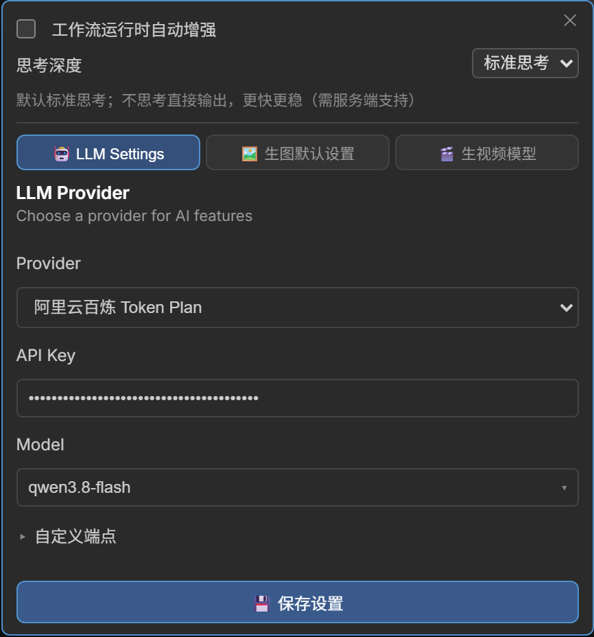

# LLM 配置与本地推理

两个提示词节点共用同一套 LLM 运行模式。

## LLM 模式

| 模式 | 说明 | 要求 |
|------|------|------|
| Remote (远程) | 通过 API 调用云端大模型 | 在节点 Settings 配置 API Key 与端点 |
| Native (原生) | ComfyUI 进程内直接跑 safetensors 文本生成模型 | 模型放入 `models/text_encoders/`，Provider 选「Native」 |
| Local (本地) | 使用 llama.cpp 在本地推理 | GGUF 模型放入目录并选「Local GGUF」 |



- 远程与本地共用同一份端点配置，采样温度统一用服务端默认。
- **思考模型**：接入会输出推理过程的模型（推理内容放在 `reasoning_content`）时，
  生成期间会在提示词框上方实时显示「💭 思考中…」面板，正文出现或结束时自动清除，
  最终只保留正文结果（思考文本不写入提示词）。
- 流式生成（远程 / 本地 / 原生）会自动为推理预留 token 预算，避免推理耗尽预算导致没有正文。
- ✨ 按钮旁的 ▾ 菜单提供「关闭思考」开关：勾选后让服务端跳过推理直接输出（更快更稳，
  适合 Krea2 等只需最终提示词的场景）；不支持该字段的服务端会忽略此参数，无副作用。

## 原生引擎（Native：ComfyUI safetensors）

Settings → Provider 选 **`Native (ComfyUI safetensors)`**（下拉默认项）：复用 ComfyUI 原生文本生成路径
（`clip.tokenize` → `clip.generate` → `clip.decode`），在 ComfyUI 进程内直接跑 `models/text_encoders/`
下的 safetensors 文本生成模型（如 `qwen3.5_4b_bf16.safetensors`）。**无需安装 `llama-cpp-python`**，
该 Provider 下 API Key / Base URL / Models Dir 各行隐藏。

### 模型与连接测试

- **模型列表** - 下拉扫描 `models/text_encoders/` 下所有 `.safetensors`（`GET /rs_prompts/native_models`），
  排序为 qwen3.5 系列 → qwen3 系列 → 其余；无已存选择时自动选中第一项，目录为空时下拉提示放模型文件。
- **连接测试** - 「🔌 测试连接」不打 HTTP，而是用当前表单模型实跑一次短推理（发「你好」），
  成功返回回复摘要，可验证模型能加载、能出字。
- 模型类型由权重形状自动识别（`detect_te_model`），无需指定 clip 类型；纯编码器（如 `clip_l`）
  不具备文本生成能力，加载会失败。

### 生成行为

- **默认贪心** - `do_sample=False`，结果确定可复现；采样参数（temperature / top_k / top_p / min_p /
  repetition_penalty / presence_penalty / seed）由后端调用传入，界面不暴露。
- **思考模式** - 走原生 `tokenize(thinking=...)`；非流式返回前剥离思考块只留正文，思考文本不写入提示词。
- **伪流式** - 原生引擎整段生成、无法逐 token。流式请求跑完整段后按思考 / 正文拆块透传，
  前端「💭 思考中…」面板与正文照常工作，只是没有逐字打字动画。
- **图片输入** - 图片反推只取第一张图转成 IMAGE 张量喂给编码器，模型需自带视觉能力。
- **工具对话回退** - 多轮 / 工具调用（`chat_turn` + `tools`）原生路径解析不了 `tool_calls`，
  该路径自动回退 llama.cpp 本地后端。

### 显存与自动卸载

- 模型加载后按文件名缓存为进程内 CLIP 单例并驻留，首次调用会有一次加载耗时。
- **自动卸载** - 勾选「本节点执行完自动卸载原生模型」（配置项 `auto_unload_native`）后，
  工作流运行时该节点执行完即卸载模型并释放显存。
- 保存时切到其它 Provider、或在 Native 槽位换模型，旧模型都会自动卸载释放显存。
- 原生 clip 单例不可并发（`generate` 会改写共享 clip options 与 KV 缓冲）：引擎内串行执行，
  队列外调用自带锁串行化。

## 国产云供应商（开箱可选）

Settings → Provider 下拉里已内置以下云端入口，选好后填 API Key（**云厂商必填**，留空会 401）即可用
（模型名能自动列出就直接选，列不出可手输）：

### 内置供应商

- **`DeepSeek 深度求索`** — `https://api.deepseek.com/v1`
  申请：[platform.deepseek.com](https://platform.deepseek.com)，示例模型 `deepseek-flash`
- **`阿里云百炼 (通义千问)`** — `https://dashscope.aliyuncs.com/compatible-mode/v1`
  申请：[百炼控制台](https://bailian.console.aliyun.com)，示例模型 `qwen-plus`
- **`阿里云百炼 Token Plan`** — `https://token-plan.cn-beijing.maas.aliyuncs.com/compatible-mode/v1`
  申请：百炼控制台 → Token Plan，示例模型 `qwen3.8-max`
- **`月之暗面 Kimi`** — `https://api.moonshot.cn/v1`
  申请：[platform.moonshot.cn](https://platform.moonshot.cn)，示例模型 `kimi-k3`
- **`智谱 GLM`** — `https://open.bigmodel.cn/api/paas/v4`
  申请：[open.bigmodel.cn](https://open.bigmodel.cn)，示例模型 `glm-5.3`
- **`硅基流动 SiliconFlow`** — `https://api.siliconflow.cn/v1`
  申请：[cloud.siliconflow.cn](https://cloud.siliconflow.cn)，示例模型 `deepseek-ai/DeepSeek-V3`

### 端点与密钥

- 模型名以各家控制台当前列表为准（上表只是示例）：下拉会自动请求模型列表端点，
  鉴权厂商在 API Key 输入框留空时复用已存密钥，填入 / 修改密钥后自动重拉；拉不到时回退为手动输入。
- 智谱端点是 `/api/paas/v4`，所以 `configs/llm_providers.json` 里该家 `append_v1: false`；
  其余以 `/v1` 结尾，保持 `true`（已接入 `/v1` 时不会重复追加）。
- 百炼可改用业务空间专属域名：展开「自定义端点」把 Base URL 改过去即可；
  其 API Key 与地域绑定，跨地域会返回 401。
- 有预设 Base URL 的供应商默认把 Base URL 收进「自定义端点」折叠区，改端点时点标题展开，空着就用预设值；
  已保存的端点与预设不一致时折叠区会**自动展开**。无预设端点的 OpenAI Compatible 该行保持常显。
- 采样温度已从界面移除：请求体不再发送 `temperature`，统一使用服务端 / 模型默认值。
- API Key：标记 `requires_api_key` 的云厂商为**必填**（留空保存会告警 401）；
  已存过密钥时输入框以星号显示，未改动 / 清空都沿用旧值。LM Studio / Ollama / vLLM / Unsloth
  与 OpenAI Compatible 可留空。

### 阿里云三套通道

- 阿里云三套通道互相隔离，API Key 与 Base URL 必须配套，混用会产生意外扣费或返回 401/403：
  按量付费（`sk-` + `dashscope.aliyuncs.com/compatible-mode/v1`）、
  Token Plan（`sk-sp-` + `token-plan.cn-beijing.maas.aliyuncs.com/compatible-mode/v1`，目前仅华北 2（北京））、
  Coding Plan（`sk-sp-` + `coding.dashscope.aliyuncs.com/v1`）。
- 下拉里**没有** Coding Plan：其条款仅允许在编程工具内交互使用，禁止以 API 形式用于自动化脚本 /
  应用后端 / 非交互式批量调用，违规可能导致订阅暂停或 Key 被封。
供应商清单定义在 `configs/llm_providers.json`，增删改（含接入自建服务）直接编辑该文件，
重启 ComfyUI 后下拉即生效。

## 本地 LLM 推理服务（LM Studio / Ollama / vLLM / Unsloth）

本地 / 局域网端点大多在收到请求时按需加载模型，插件对它们只做两件事：

- **模型列表** - 本地端点先依次尝试原生端点（LM Studio `/api/v1/models`、Ollama `/api/tags` + `/api/ps`），
  没有结果再退回 OpenAI 兼容 `/v1/models`。下拉显示大小、视觉能力与 `loaded` 状态，**未加载的模型同样可选**。
- **超时** - 本地端点的有效超时抬高到至少 300s（大模型冷加载常超过默认 60s）；公网端点不受影响。

**Unsloth Studio 例外**：它的 `/v1/chat/completions` 在未加载模型时直接回 400，不会自己加载；
而且只让**带 API Key 的调用者**触发加载，免鉴权请求即使开了 Model auto-switch 也会被跳过。所以要在插件里填 Key：

1. 在 Studio 的 **Settings → API** 建一个 API Key（`sk-unsloth-` 开头），填进插件 Unsloth 的 API Key 输入框。
2. 之后插件遇到上述 400 会带该 Key 调 `POST /api/inference/load`，加载完自动重试一次；
   若同时打开了 Model auto-switch，服务端在首个请求里就自己冷加载了。
   没填 Key 时不发这个请求（免鉴权调用会被拒），错误信息里会提示去建 Key。

只有服务不可达时下拉才显示 `❌ 无法连接服务`；列表为空只显示「无可用模型」。

## 本地 LLM 推理安装（可选）

本地 GGUF 模式依赖 `llama-cpp-python`（原生引擎与远程 API 不需要）。它默认从源码编译（需要 C 编译器 / CUDA 工具链），
Windows 上很容易失败，**推荐直接安装预编译 wheel**。

### 方式一：预编译 wheel（推荐）

到 [JamePeng/llama-cpp-python releases](https://github.com/JamePeng/llama-cpp-python/releases)
下载与你的 **Python 版本 + 系统 + CUDA 版本** 匹配的 wheel 并安装：

```bash

# 示例：Python 3.12 + Windows + CUDA 12.4（文件名以 releases 页实际资产为准）
python -m pip install llama_cpp_python-<版本>+cu124-cp312-cp312-win_amd64.whl
```

纯 CPU 也可用官方预编译索引：

```bash
python -m pip install llama-cpp-python --extra-index-url https://abetlen.github.io/llama-cpp-python/whl/cpu
```

### 方式二：源码编译

```bash

# CPU
python -m pip install llama-cpp-python

# NVIDIA GPU（需要先装好 CUDA Toolkit 与 C/C++ 编译器）
$env:CMAKE_ARGS = "-DGGML_CUDA=ON"
python -m pip install llama-cpp-python --no-cache-dir
```

### 验证与模型

```bash
python -c "from llama_cpp import Llama; print('ok')"
```

通过后把 GGUF 模型放入模型目录（见下方目录规范），在 Settings → Provider 选「Local GGUF」，
选择模型后点 💾 保存；目录里只有一个模型时无需手动切换，运行时会自动使用该模型。

### Windows 运行时注意

启动报 `Could not find module '...ggml.dll'` 时，是缺少 VC++ 运行库：
安装 [Microsoft Visual C++ 2015-2022 Redistributable (x64)](https://aka.ms/vs/17/release/vc_redist.x64.exe)
后重启 ComfyUI。

## 本地模型目录规范

路径按 `供应商(可选)/模型名称/模型文件(.gguf)` 组织，例如：

```
models/LLM/
├── mradermacher/Qwen3-4B-AWQ-I4_K_M/GGUF-Q4_0-int4-v2-scratch.gguf   # 单文件直接放根目录即可
├── stablelm/stablelm2-1.6B.gguf                                      # 平铺布局同样支持
└── mradermacher/Huihui-gemma-4-E4B-it-abliterated-GGUF/
    ├── Huihui-gemma-4-E4B-it-abliterated-Q4_K_M.gguf                 # 主模型文件（任意量化）
    └── Huihui-gemma-...mmproj-f16.gguf                               # 投影文件（自动匹配）
```

- **目录位置** - Settings → Provider 选 `Local GGUF` 后出现的 **Models Dir**；
  留空默认扫描 `models/LLM/`，也可填任意本地路径（如 LM Studio 的 `<用户>/.lmstudio/models`）。
- **模型列表** - 递归扫描该目录下所有 `.gguf`，下拉框只显示**模型名称**（文件名去掉 `.gguf`），
  不同供应商同名文件各自成项。
- **多模态标识** - 某模型同目录中存在 `mmproj-*.gguf`（或 `<模型名>.mmproj-f16.gguf`）时，
  该模型名称前会出现 🖼️ 徽标，表示可用于图片反推；多个候选时不猜测、留空待匹配。

后端实现见 [architecture.md](architecture.md)（`llm.py` / `llm_providers.py`），
API 见 [api-routes.md](api-routes.md)。
