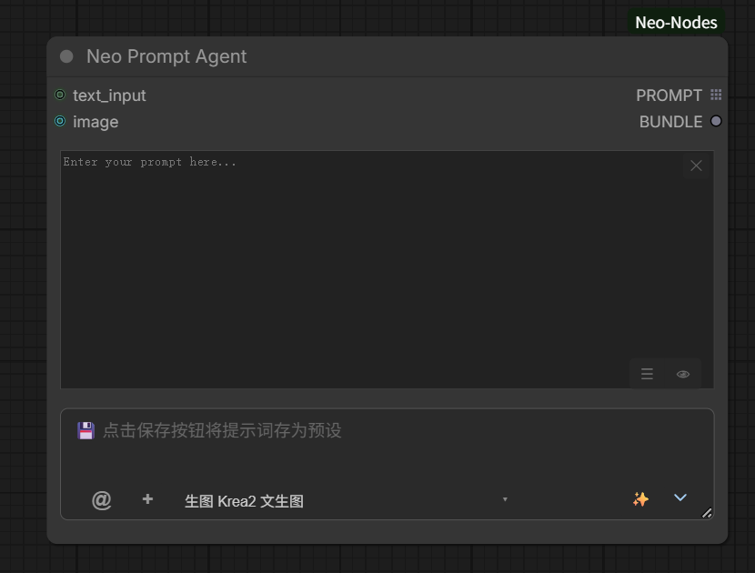

# 提示词节点

覆盖 Neo Prompt Encoder / Neo Prompt Agent 两个提示词节点、共享界面与按钮、模板与技能管理、图片反推输入。
LLM 模式与本地安装见 [llm.md](llm.md)。

## 📝 Neo Prompt Encoder - AI 驱动的提示词编码器

完整的提示词管理 + CLIP 编码节点：

- **提示词保存 / 选择** - 保存和加载预设提示词，支持 presets 和自定义目录。
- **LLM 提示词增强** - 使用远程 API 或本地 LLM 模型增强提示词质量，技能模板管理与快速切换。
- **快捷生成 / 随机生成** - 输入简短描述快速生成，或一键随机生成创意提示词。
- **图片转提示词** - 附加参考图（支持粘贴、拖拽、@ 引用工作流图片），AI 反推生成描述性提示词。
- **分类 / 标题提取** - 保存预设时 AI 自动分类内容并提取标题，一键保存提示词或配方。
- **技能系统** - 通过技能选择器调用不同能力，按组分类：图像提示词增强、视频提示词增强
  （generator / 全能参考）排最前，其后为图像 / 反推、直接生图或编辑、自定义；
  生视频（H3）与任务为内部使用技能，不在列表显示。

### 输入/输出

| 输入 | 类型 | 说明 |
|------|------|------|
| `clip` | CLIP | 文本编码器（必需） |
| `text_input` | STRING (forceInput) | 外部文本输入 |
| `image` | IMAGE | 参考图（用于图片转提示词） |

| 输出 | 类型 | 说明 |
|------|------|------|
| `POSITIVE` | CONDITIONING | 正向编码条件 |
| `PROMPT` | STRING | 最终提示词文本 |

## ⚡ Neo Prompt Agent - 简洁版提示词代理

轻量级提示词生成节点，专为仅使用生成的提示词文本、不需要 CLIP 编码的场景设计：

- **无需 CLIP 输入** - 不绑定文本编码器。
- **无状态栏 / 切换开关** - 界面更简洁。
- **输出 PROMPT + BUNDLE** - PROMPT 为提示词文本；BUNDLE 为本次生成的运行时包 id，
  供 🎨 Krea2 / 🎬 H3 按 id 消费（只携带 prompt 与参考图，不携带技能）。

### 输入/输出

| 输入 | 类型 | 说明 |
|------|------|------|
| `prompt` | STRING (hidden) | 提示词文本（隐藏） |
| `instance_uid` | STRING (hidden) | 实例 ID（隐藏） |

| 输出 | 类型 | 说明 |
|------|------|------|
| `PROMPT` | STRING | 提示词字符串（多结果技能按条目循环消费） |
| `BUNDLE` | STRING | 运行时 bundle id（`bnd_*`），见下方说明 |

- `BUNDLE` 连到 🎨 Krea2 / 🎬 H3 的 `bundle` 输入，可一次性带上 prompt 与参考图
  （连线 / @ 引用 / 本地上传），不含技能。
- bundle 仅存内存，过期后下游安全回退本地输入。

## 📦 Neo Bundle Expand - BUNDLE 展开节点

把 ⚡ Neo Prompt Agent 的 **BUNDLE** 展开成标准输入槽，对齐官方 MiniMax H3 Reference to Video
的 `ref_images`（最多 9 张）：

- **输出槽自动增长** - 默认只显示 `prompt` + `image_1`；连上最后一个可见图片槽后露出下一个，上限 9 张。
- 执行后节点内只读展示提示词与参考图缩略图网格（按输出顺序）。视频 / 音频参考暂不展开。

| 输入 | 类型 | 说明 |
|------|------|------|
| `bundle` | STRING (forceInput) | ⚡ Neo Prompt Agent 的 BUNDLE 输出 |

| 输出 | 类型 | 说明 |
|------|------|------|
| `prompt` | STRING | bundle 内的提示词文本 |
| `image_1..image_9` | IMAGE | 参考图（最多 9 张，自动增长露出） |

## 🔲 Neo Reference Grid - 参考图宫格节点

单节点搞定「提示词 + 最多 12 张参考图」：

- **宫格槽位（1~12）** - 工具条 −/+ 运行时调整槽位数（默认 9，不随工作流保存；加载更多图时自动扩）。
  从左侧素材面板拖入 / 本地批量添加（可多选）/ OS 文件直接拖到宫格；瓷砖可拖放重排、✕ 移除、点击预览。
- **加载配方** - 工具条 ☰ 弹出选择窗，只列普通含图片的配方（排除多段导演与无图配方）；
  点击把图片（≤12）与提示词载入宫格。
- **宽度流式布局** - 列数按节点宽度排布（最小卡片宽 84px），卡片宽高跟随图片真实比例（整图可见不裁剪）；
  节点高度自动跟随内容。
- **输出槽自动增长** - 默认显示 `prompt` / `BUNDLE` / `image_1`，连线后逐槽露出到 `image_12`；
  执行后节点内显示本次实际用到的参考图数与来源顺序（格N）。
- **与配方联动** - 保存配方时宫格图作为**主图片资产**收集（排在连线 LoadImage 之前）；
  还原时优先填回宫格（≤12），其余再进 LoadImage，子图无 Neo Prompt 时提示词兜底写入宫格提示词框。

无可见输入（仅隐藏 `refs` / `prompt_text`）。

| 输出 | 类型 | 说明 |
|------|------|------|
| `prompt` | STRING | 节点内提示词框内容 |
| `BUNDLE` | STRING | 运行时包 id，可直连 🎨 Krea2 / 🎬 H3 或经 📦 Neo Bundle Expand 展开 |
| `image_1..image_12` | IMAGE | 按宫格槽位顺序的参考图；坏文件保留槽位空缺不补位 |

## 节点界面与按钮

两个节点共享同一套界面布局（Agent 不显示状态栏）：

| 控件 | 位置 | 功能 |
|------|------|------|
| LOCAL / EXTERNAL | 顶部状态栏 | 切换本地提示词 / 外部 text_input（连接后自动显示） |
| 🎲 | 文本区右下角 | 随机生成创意提示词 |
| ☰ | 文本区右下角 | 打开预设列表（支持搜索、删除、分类便签筛选） |
| 💾 | 文本区右下角 | 保存当前提示词或配方为预设，AI 自动提取标题与分类标签 |
| 👁 | 文本区右下角 | Markdown 预览开关（详见下） |
| ✕ | 文本区右上角 | 一键清空当前提示词，同步到控件与本地存储 |
| ＋ | 底部输入栏 | 附加参考图片（反推 / 多模态技能），支持粘贴、拖拽与 @ 引用 |
| 技能选择器 | 底部输入栏 | 选择本次生成使用的技能（详见下） |
| 自动生成 ☐ | 底部输入栏 | 勾选后运行工作流时自动执行生成并实时回填结果 |
| ✨ | 底部输入栏 | 根据快捷输入描述生成提示词 |

- **Markdown 预览（👁）** - 生成结果识别为 Markdown（含标题 / 代码块 / 列表等）时自动切换为排版预览，
  点 👁 手动切换 / 切回原始编辑；流式生成时实时渲染；任务列表复选框（`- [ ]`）可直接点击勾选，
  选择会写回文本并带入下一次生成。清空提示词时预览一并清空。
- **分类便签** - 预设列表搜索框下方的图像 / 视频 / 配方三个便签：图像为除 `presets/video/` 外的提示词与集合，
  视频为 `presets/video/` 下的提示词，配方为普通配方。默认选中图像，选择记在前端本地存储，下次打开沿用。
- **技能选择器** - 选择本次生成使用的技能：图像 / 反推、任务、风格模板、自定义；
  悬停行时右侧显示浮动预览卡（生成技能 = 配置摘要，其余 = skill.md 正文摘录），点击卡片打开详情窗口；
  下拉底部 + New Skill / ⬆ ZIP / ⬆ Folder 为技能管理入口。
- **多轮交互技能** - 选中声明了 `multi_turn` 的技能时，节点最底部按需显示一行小字提示
  （切换或取消该技能后自动隐藏）：每次生成仅推进一个阶段，需把返回的问询补充完整后再次点击 ✨ 继续下一阶段。
- **快捷输入历史** - 底部快捷输入栏支持命令终端式 ↑/↓ 召回之前用过的输入
  （本地持久化、去重、最新在前、上限 20 条）；编辑内容即退出导航态，两类节点共用同一份历史。

## 模板与技能管理

技能管理有两个入口：顶栏 🅝 菜单「🗂 技能管理」打开统一窗口（左侧按分类分组的可折叠列表 + 右侧详情，
含搜索 / 新建 / 上传 / 从画布导出；分类为手风琴，默认展开「生图」，搜索时全部分类临时展开），
或节点底部技能选择器下拉内的内嵌入口：

- **新建技能** - 点击下拉底部 "+ New Skill"，在弹出的详情窗口中填写技能名称与系统提示词内容后保存。
- **上传导入** - 点击下拉底部 "⬆ ZIP" 或 "⬆ Folder"，将 `.zip` 包或整个文件夹（含多个 `.md`）导入为新技能。
- **搜索过滤** - 在下拉输入框中实时过滤技能（按名称 / 标签，中文技能支持拼音全拼与首字母缩写匹配）。
- **查看 / 编辑** - 悬停技能行时右侧显示浮动预览卡，点击卡片打开单技能详情窗口，默认以 Markdown 渲染预览正文；
  点「✎ 编辑」切换到原始文本编辑、「👁 预览」切回预览（新建技能直接进入编辑模式）。
- **多文件** - 一个技能可含多个 `.md` 文件，正文按文件名升序拼接；详情窗口提供下拉切换查看 / 编辑各个 `.md`
  （主文件 `skill.md` 只编辑其正文、保留 frontmatter 元数据），可新增或删除附属文件。
- **多轮开关** - 详情窗口名称行下方的 `Multi-turn (multi_turn)` 勾选框读写 frontmatter 的 `multi_turn` 字段
  （取消勾选即移除该字段）；勾选后节点底部显示多轮提示，「⧉ 复制为自定义」会连同该设置一并复制。
- **复制为副本** - 内置模板与任务技能不可删除，可一键「⧉ 复制为自定义」复制为自定义副本并立即切换到该副本详情。
- **删除** - 仅用户自定义（USR）技能可删除（删除前确认），内置（SYS / TASK）受保护。
- **详情窗口布局** - 主区分两栏：左「生图 / 生视频设置」、右「系统提示词内容」（面板够宽时并排等高，
  窄面板自动堆叠）；带 `workflow.json` 的技能「系统提示词内容」默认收起（标题旁标注「工作流驱动」，
  点标题展开——正文仅在使用「提示词增强」或参考图模式时生效）；底部「💾 保存 / 🗑 删除」操作条吸顶；
  工作流区默认折叠，点头部展开。
- **左栏宽度** - 拖动左右面板之间的分隔条调整左侧列表宽度，松手记忆宽度、下次开窗沿用；双击恢复默认。
- **自动同步** - 保存、上传、复制、删除后广播更新事件，所有节点上的技能选择器立即刷新。
- **独立窗口控制** - 统一窗口无遮罩（背景画布可继续操作）：标题栏拖动移动、双击标题栏放大/还原、
  标题栏「⛶」放大铺满（留 8px 边距）/还原、右下角把手拖拽改尺寸；关闭只走「✕」与 Esc。
- **工作流内嵌编辑** - 工作流区在只读流程图与内嵌画布之间切换（「👁 流程图」/「🧩 编辑」）：编辑模式把
  `workflow.json` 的 API 格式按节点类型注册表转成 LiteGraph 图挂进内嵌画布，连线按槽位名还原、widget 值按名对齐，
  可直接改连线与参数；工具条提供「适配视图」「重新载入」，自定义技能另有「💾 保存工作流」写回该技能的
  `workflow.json`（预设技能只读，不显示保存按钮）。技能含未注册节点类型时拒绝进编辑（保存会丢节点），
  保持只读预览。画布后备缓冲按系统显示缩放（DPR）铺满盒子，widget 输入弹窗贴着鼠标落点。

一个技能是一个或多个 Markdown 文件（主文件 `skill.md`），头部为 YAML frontmatter
（含 `name`、`tags`、`max_tokens`、`multi_turn`、`audit` 等字段），正文即 System Prompt 内容：

| 来源徽章 | 存储目录 | 说明 |
|----------|----------|------|
| SYS（内置） | `skills/presets/<id>/skill.md` | 随插件分发，只读 |
| TASK（任务） | `skills/tasks/<id>/skill.md` | 内置任务技能（反推、中英互译等），只读，不在选择器显示 |
| USR（自定义） | `skills/custom/<id>/skill.md` | 用户创建，可编辑、删除 |

### 语言版与按需读取

- 生成提示词时按语言只加载一版主文件（`skill.md` 英文 / `skill.cn.md` 中文，二者互斥），
  默认依据输入语言自动判断，也可在远程配置里固定为 `en` / `cn`。
- 子目录中的引用文件（如 `references/*.md`、`*.txt`）不预先并入提示词，
  而由模型通过工具按需读取；工作流参考图像素同样按需取回，以匹配渐进式披露设计并降低 token 消耗。
  本地与远程模式行为一致，仅在无引用且无工作流上下文时回退为单轮生成。
- 正文可包含 `<!-- @if TOKENS -->…<!-- @end -->` 条件段落（逗号分隔可多选）：
  token 为生成模式（T2VA / I2VA / FL2VA / L2VA / Reference）或参考媒体类型（PICTURES / VIDEOS / AUDIOS）。
  工作流上下文含 H3 节点时只注入命中 token 的段落并剥掉标记；无 H3 上下文、正文无标记或无交集时原样保留全文。
  `minimax_h3_base` 按模式裁剪约省 33%~40% token，`minimax_h3_full_ref` 按参考类型裁剪约省 20%。

### H3 格式自检

frontmatter 声明 `audit: h3` 的技能（`minimax_h3_base`、`minimax_h3_full_ref`、`minimax_h3_image_ref`）
在生成完成后先经过一次纯规则的结构审计（不花 token）：六段 / 三字段结构顺序、时间戳格式与时长上限、
参考标签与工作流连线一致性、对白说话人 ID、内部表示术语泄漏。

- 发现违规时发起一次「窄修复」LLM 调用，只修列出的违规项；
  修复结果须通过复审且参考标签集合、对白逐行不变才采纳，否则保留原输出（至多修复一轮）。
- 界面全程可见：正文照旧实时透传，生成结束后提示词框上方「📋 H3 流程」面板累计显示各阶段
  （自检中 / 通过 / 发现 N 处问题 / 自动修复中 / 已修复 / 修复未通过校验保留原输出），流结束后面板保留供回看。
- 走工具循环（技能带引用文件、或工作流 H3 节点连有参考图）的路径先显示
  「⏳ 生成中（按需读取技能引用文件 / 查看 N 张已连参考图）…」再逐字输出最终结果。
- 工作流上下文末尾会追加按模式判定的最终 grounding 约束，从源头降低结构错误率。

节点底部的技能选择器按用途分组展示可选技能：🖼️ 图像 / 反推、🎨 风格模板、📝 自定义
（生视频 H3 与任务为内部使用，不在下拉显示）。选项前缀 📷 表示该技能需要图片输入。

## 图片反推与图片输入

选用 📷 图像 / 反推类技能时，可通过以下方式提供参考图片：

| 方式 | 操作 | 说明 |
|------|------|------|
| ＋ 按钮 | 点击输入框旁的 ＋ | 打开文件选择器选取本地图片 |
| 剪贴板粘贴 | `Ctrl+V` | 自动转 base64 并生成缩略 chip |
| 拖拽导入 | 将本地图片拖入快捷输入框 | 自动读取并生成缩略 chip |
| `@` 引用 | 在输入框中键入 `@` | 列出当前工作流所有可用 Load Image 节点图片 |

素材联动：素材中「复制到 Input」会把图片放入 ComfyUI 的 input 目录，之后可在工作流 Load Image 节点中选用，
并通过 `@` 选择器引用到反推输入；素材灯箱的发送按钮也可直接把图片附带的信息回填到 Neo Prompt 节点。

### `@` 图片引用

在快捷输入框的任意位置键入 `@` 唤起图片选择器，弹层自动定位到光标附近：

- **图片来源** - 自动扫描当前工作流中所有 Load Image 类节点（含变体），跳过 BYPASS / 已禁用的节点。
- **条目徽章** -
  `#N`：该图片已连线到本节点的 IMAGE 输入槽，`N` 为参数位编号，插入后在 `@` 处生成 `<Picture N>` 标记；
  `✓`：无连线但已附加为反推附件；无徽章：未连线图片，点击仅作为反推附件附加，不占用 `<Picture N>` 编号。
- **键盘操作** - `↑`/`↓` 移动高亮，`Home`/`End` 跳转首尾，`Enter` 插入选中项，`Esc` 关闭；
  删除 `@` 字符时弹层自动关闭。
- **判重与编号** - 同一图片不会被重复附加；编号由工作流 Load Image 节点的参数顺序决定，
  与缩略 chip 上的编号徽章保持一致。

**缩略 chip 与图片标记**

- 附加的图片以缩略 chip 形式显示在快捷输入框上方，悬停可放大预览原图，点 ✕ 移除。
- 带 `N` 编号徽章的 chip 对应正文中的 `<Picture N>` 标记，用于描述多张图片之间的交互。
- 无编号 chip 仅作为反推附件随请求发送。

### `/` 技能快捷菜单

在快捷输入框键入 `/` 唤起技能快捷菜单，弹层定位到输入框下方，随后续输入实时过滤
（按技能名称 / id / 标签，忽略大小写；中文技能支持拼音全拼与首字母缩写匹配）：

- **过滤** - 每敲一个字符即重新过滤；空 query 列出全部技能并按分类排序；query 含空白或删掉 `/` 时自动关闭。
  中文技能可输拼音（如 `dmfg` / `dongman` 命中「动漫风格」）。
- **列表项** - 每行显示技能名（需图带 📷 徽标）与所属类别名称，不显示内部 id。
- **键盘操作** - `↑`/`↓` 移动高亮，`Home`/`End` 跳转首尾，`Enter` 或 `Tab` 提交当前高亮项，`Esc` 关闭；
  只过滤不自动提交，始终需要按一次键确认。
- **提交效果** - 将选中技能写入节点底部的技能下拉（与手动选择等价），并清除输入框中的 `/xxx` 前缀，
  焦点留在输入框继续输入。

适合纯键盘快速切换技能：打 `/` + 名称片段，方向键定位后回车即可。

后端实现见 [architecture.md](architecture.md)（`prompt_agent.py` / `prompt_encoder.py` / `skills.py`），
API 见 [api-routes.md](api-routes.md)。
