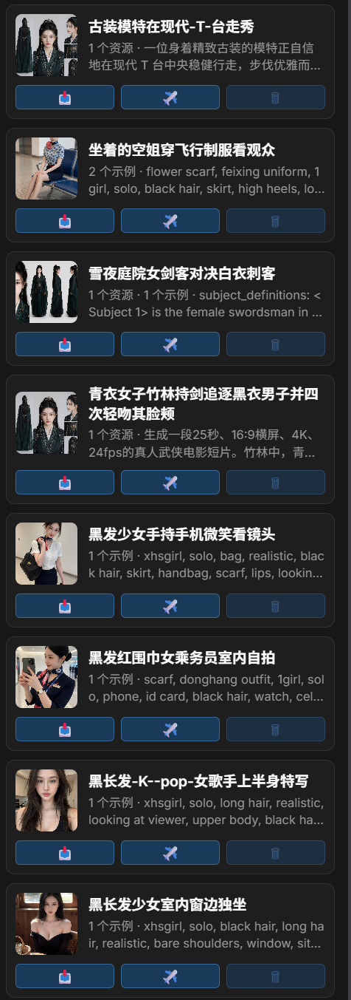
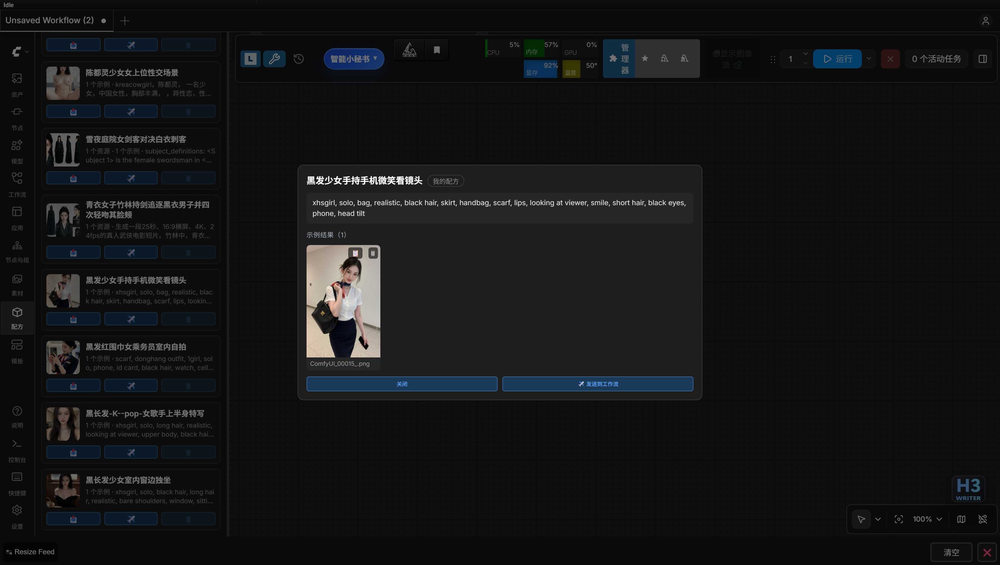
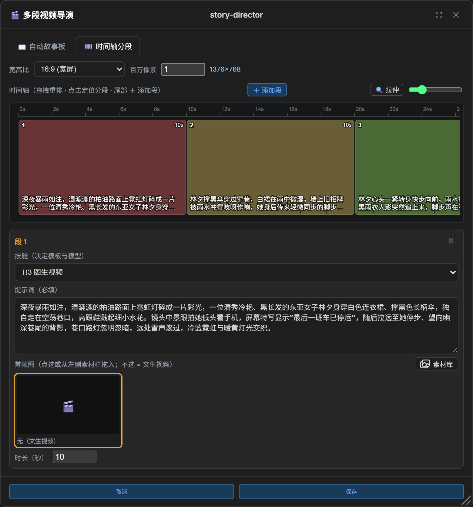
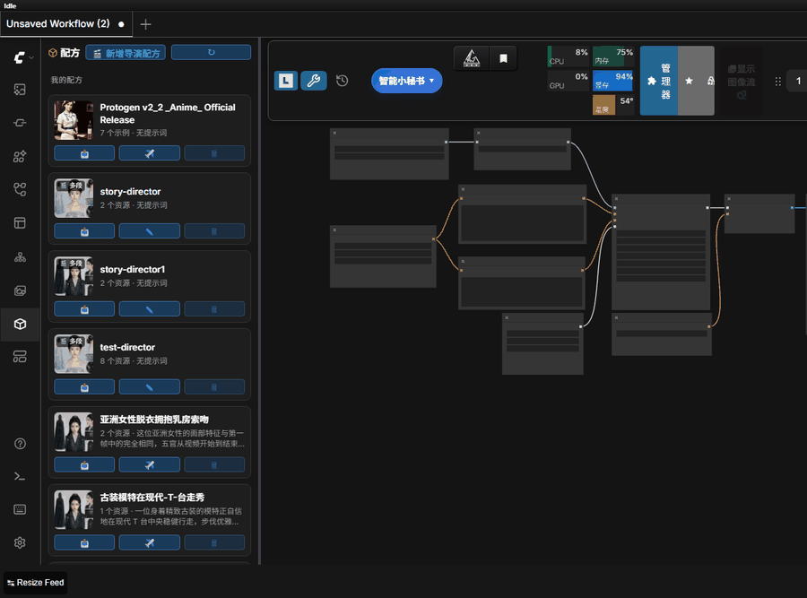

# 配方 (Recipes)

提示词 + 多输入资源（一个或多个图片/视频/音频）的组合配方，供多参考工作流复用。配方分为 **custom（用户保存）** 与 **presets（内置预设，只读）** 两个目录，每个配方是一个文件夹 + `assets/` 资源夹：

```
recipes/
├── custom/                      # 用户保存的配方（💾 保存写入这里，可删除）
│   └── <配方名>/
│       ├── recipe.json          # 元数据：name / prompt / created_at / assets / kinds / samples / sample_kinds / sample_workflows
│       ├── assets/              # 多输入资源（图片/视频/音频，文生图配方可空）
│       ├── samples/             # 示例结果（「同时保存结果」/「追加结果」累积，用于封面与预览）
│       └── workflows/           # 示例结果对应的工作流备份（与示例一一对应）
└── presets/                     # 内置预设配方（只读，不可删除）
    └── <配方名>/
        ├── recipe.json
        └── assets/
```

## 保存配方

在 **Neo Prompt** 节点上点击 💾，弹窗底部提供「保存提示词」与「🧊 保存配方」两个确认按钮（两个 Neo Prompt 节点均可用）。命名确认后，配方会收集**当前节点所在连通子图**内已连线的 `LoadImage` / `LoadVideo` / `LoadAudio` 资源与该节点的提示词，保存到 `recipes/custom/`（与内置预设同名会被拒绝），弹窗内实时显示将收集的资源数量。

勾选「**同时保存结果**」（默认勾选）时，配方会把当前工作流最近一次执行的输出存为**示例结果**到 `samples/` 目录——输出类型由输出节点判定（SaveImage / SaveVideo / VHS_VideoCombine / SaveAudio 等），按内容去重，**多次保存与追加自动累积**；同时自动备份一份完整工作流快照到 `workflows/`（与示例结果一一对应），可在详情浮层一键复制回画布；示例结果优先用作卡片封面与详情预览。

侧边栏配方页按「我的配方 / 内置预设」分组展示，🗑 仅可删除自定义配方，⧉ 复制生成新副本（自动命名 `<原名>-copy`、冲突递增 `-2/-3`；preset 也可复制成 custom）；节点上的预设列表同样并入配方条目，点击回填提示词并还原资源到所在子图。点击缩略图或标题打开详情浮层，可查看完整提示词、全部资源（视频可预览、音频可试听）与示例结果，并直接发送到工作流。



## 一键发送到工作流

在右侧边栏 **配方** 标签页中点击配方的 ✈️（或详情浮层内的发送），会依序把各资源复制进 Comfy `input/`，并把提示词与资源还原到匹配的**连通子图**内：

- 目标子图按「资源数与连线加载节点数按类型逐一相等」精确匹配自动选中；画布仅一张子图时直接使用，多个候选或无匹配时弹下拉由用户指定（取消则不做任何改动）。
- 资产数与启用连线节点数不一致时自动对齐（偏多则启用 Bypass/Never 节点补齐、偏少则把多余启用节点设为 Bypass），无法容纳的部分提示「仅还原了部分」。

自定义配方卡片上的 **📥** 可把当前工作流最近一次执行的输出**追加**为该配方的示例结果（内容去重、跨次累积，并同时备份对应工作流）；示例结果在详情浮层中可逐个删除，删除最后一个引用该工作流的示例时会一并清理孤儿工作流备份；每个示例的 **📋** 可将其对应的工作流快照复制回当前画布。



在 **Neo Prompt** 节点上直接选择配方发送时，以该节点所在子图为目标，同样执行自动对齐，全程不弹窗。

## 多段视频导演配方（video_director）

普通配方是「一个提示词 + 一组资源」；`video_director` 配方是**多段结构化容器**：一段 = 一个 H3 视频生成任务（各自的 skill / 提示词 / 时长 / 首帧），由 `NeoH3VideoDirector` 节点按序逐段生成并拼接成单个含音频 `VIDEO`。





- **入口**：
  - 侧边栏「配方」页头部 **🎬 新增导演配方** 按钮新建；
  - 已存在的 director 配方可直接点配方列表卡片的**缩略图**进入编辑器（跳过详情），或在 `NeoH3VideoDirector` 节点上**点击时间轴分段块 / 右上角 ✎** 编辑（点某块进入时编辑器**直接定位到该段**、编辑器时间轴同步滚到该段；窗口已打开时再点别的块只切换当前段，不重建窗口）（节点内打开，保存后自动刷新节点时间轴预览）；
  - 节点**时间轴显示区外右下角**另有 **＋ 新增导演配方** 按钮，直接打开新建编辑器（保存后把新配方加入 `recipe` 下拉并选中、重载节点时间轴）。

- **编辑器界面**：
  - 居中面板设共享分辨率：**宽高比 + 百万像素（0.1–2，一位小数）→ 宽/高**（按 32 对齐，算法移植自 MiniMax H3 Director 的 ResolutionSelector；选「自定义」改手输 W/H；新建配方初始 16:9 @ 0.5 百万像素 = 960×544），种子不在编辑器设置（后端默认 0，可用节点 `seed` 输入覆盖）。
  - 逐段填 **技能（skill_id，必填；下拉按该段有效模式过滤——`skill.mode` 由技能 frontmatter 提供，无匹配时回退全部视频技能）** 与**时长(秒)**（二者并排在段标题行）/ 提示词。**生成模式**决定该段携带哪些帧与参考：顶部全局下拉（文生视频 / 图生视频 / 首尾帧生视频 / 全参考生视频 / 混合模式，写入 `shared.mode`）下，具体模式全体统一并隐藏逐段模式，`mixed` 时每段在段标题行、技能之前显示**本段模式**下拉（`seg.mode`，四选一）。分区显隐：**首帧区**（i2v/fl2v；单选缩略图网格，点选当前画布已连线的 LoadImage 或从左侧 Neo Gallery 拖入，**再点一次已选中的图即取消**）、**尾帧区**（fl2v；同构的独立网格，锁该段收尾画面；fl2v 下首/尾帧两区并排同一行、各占一半宽）、**参考素材区**（i2v/fl2v/r2v；三组「已用列表」——参考图 ≤9 / 参考视频 ≤3 / 参考音频 ≤3，从左侧素材库拖入或**点击黑色空区**上传即插入、鼠标拖放调整顺序、✕ 移除，标题右侧显示已用/上限计数，达上限提示并拒绝）。**参考素材区标题行（与「素材库」按钮同排）另有「📋 同步到所有分段」按钮：把当前段三组参考素材（图/视频/音频）一键覆盖式复制到其余各段（目标段多出的素材会被清空）**。参考素材区标题行右侧另有「🖼 素材库」按钮（打开/收起左侧 Neo Gallery 面板，与首帧/尾帧行一致）。**首帧/尾帧区标题行有「📤 本地」按钮**（点击弹出文件选择器，按类型过滤 accept，选择后上传到 `input/` 并自动加入候选、选中）；**参考素材区三组网格去掉「本地」按钮，改为点击黑色空区弹出文件选择器上传**（同样按类型过滤 accept、上传后插入该组）。左侧 Neo Gallery 素材栏的图/视频/音频素材均可直接拖入任意网格。保存校验（**仅提示、不阻止保存**，可先存草稿再补）：图生段需首帧或参考素材、首尾帧段需尾帧、全参考段需至少一条参考素材，缺失时弹警告但仍按当前内容保存；文生段隐藏各分区、不写 `first_frame`/`last_frame`/`refs`。旧配方无 `shared.mode` 时按各段是否已带首帧推断初始全局模式（全有=图生、全无=文生、部分=混合）。
  - 编辑面板**不加遮罩、不 dim 背景**（浮层完全穿透），便于边编辑边从左侧 Neo Gallery 素材栏把图直接拖入指定段落。
  - 窗口默认 **1280×840**（矮屏高度跟随 88vh）；标题栏可按住拖动以调整位置，右下角手柄可拖拽缩放窗口大小（拉宽时时间轴随面板宽度自动重排；**拉高时「自动故事板」的故事脚本区、以及当前段的提示词区随之撑满可用高度**、首帧资产区钉在卡片底部不被挤出）。
  - 标题栏右侧 **⛶** 按钮可一键**放大到最大**（铺满视口、留 8px 边距，高度受 88vh 上限约束），再点一次或**双击标题栏**即还原到放大前尺寸。
  - 标题栏**中间**直接显示当前**配方名称**（纯文本、超出加省略号；新建未命名时显示灰色「未命名配方」占位）：**点击**即切换为行内输入框并自动全选聚焦，**Enter 或失焦**提交回文本显示（保存取该名称），**Esc** 还原为打开时的名称；**新建配方时标题随「主题/想法」输入实时同步（超过 20 字截断加省略号），手动命名后不再覆盖**；名称区上的按下/双击不触发窗口拖动与最大化。
  - **编辑器为单例**：同一时刻只允许一个导演编辑器窗口；已打开时点击**同一配方**会被忽略（不叠加第二个），点击**另一配方**则关闭旧窗口并**重新加载为该配方**（各入口——配方列表缩略图 / 节点 ✎ / 时间轴块——行为一致）；关闭（✕ / 取消 / 保存成功）后方可再次打开。
  - **未保存修改保护**：打开后任何会改变落盘内容的操作（名称 / 提示词 / 时长 / 模式 / 分辨率 / 分段增删重排 / 素材与首尾帧选择、故事生成拆分、提示词优化等；仅动时间轴拉伸滑块不算）都会标记「有未保存修改」。此时点 **✕ 或「取消」**不直接关，而是在底部按钮上方弹出确认条，三选一：**💾 保存并关闭**（走完整保存路径，失败则留在窗口内重试）/ **放弃修改**（不保存直接关）/ **继续编辑**（收起确认条）；无修改时 ✕ / 取消仍直接关闭。有未保存修改时点击**另一配方**同样被拦截（只弹确认条、不重载），处理后再点才切换。
- **时间轴总览**：
  - 面板顶部有一条 canvas 时间轴（可复用组件 `web/director-timeline.js`），按各段 `duration_sec` 比例绘制分段块 + 秒刻度尺，块内顶部一行显示序号（左上）/ 时长（右上），**底部显示提示词摘要——去掉 `integrated_multimodal_description` / `overall_soundscape` 等固定字段标签、只留画面描述正文（基础模式取 `integrated_multimodal_description`，Ref2VA 取 `detailed_description`），最多两行、超出加省略号**，有首帧参考图则平铺满块；参考生视频段的多张参考图同样逐张平铺、一轮放完后整组循环重复以铺满块宽（不留空白）。
  - **点击**某块定位并聚焦对应段落卡片（切换当前段时时间轴自动把该段块滚进可视区——段多或放大过、内容宽于可视区时才滚动）；**拖拽**某块重排段落顺序（保存顺序即卡片 DOM 顺序）；**拖块右缘**调时长；时间轴尾部 **＋** 按钮直接追加新段。
  - 导演编辑器在**时间轴说明行最右侧**提供 **↔ 拉伸** 控制条（按钮快速切换 + 滑块 0.25–4×，参考 MiniMax H3 Director）：缩放以**当前内容宽度为基数**放大/缩小（可缩到 0.25× 看更多段、放到 4× 看细节）、超出可视区出现**可见横向滚动条**，并支持**鼠标滚轮**驱动横向滚动（均参考 MiniMax H3 Director），便于查看/精调长配方；缩回 1× 时铺满并回到时间 0。
  - 时间轴**默认总内容宽度 = 段数 ×（块净高以 16:9 计算的每段默认宽；块净高 = 画布高 − 顶部刻度尺(18) − 间距(4) − 底部区(6)，如编辑器高度 184 → 块净高 156 → ≈277px/段，单段默认正好是 16:9 视频帧）**：每段约一个视频帧宽、段内仍按时长比例分配相对宽（长段更宽、短段更窄）；默认总宽超过可视区时内容加宽并横向滚动（同样显示可见滚动条、支持滚轮横滚），不足时拉伸铺满可视区。
  - 组件数据完全由宿主 `getSegments()` 提供、经 `onSelect` / `onReorder` / `onResize` / `onAdd` 回调驱动（`onAdd` 仅非只读且提供时显示），因此同样可挂到 `NeoH3VideoDirector` 节点内复用（节点内为只读预览，无 ＋）。
- **半自动故事生成（「📖 自动故事板」页签）**：
  - 编辑器**标题栏内**（🎬 标签之后、配方名之前）提供三个可切换页签——**📖 自动故事板**（半自动流程）、**🎯 统一设置**（拆分后的中间步骤：模式 / 按模式的统一素材 / 提示词批量优化）与 **🎞️ 时间轴分段**（含共享分辨率 + 时间轴 + 逐段卡片），三者互不叠加、随时切换，点击即切换下方内容区；**新建配方默认落在「📖 自动故事板」页，编辑已有配方默认落在「🎞️ 时间轴分段」页**。
  - 故事板页**左右两栏**：左栏是**分段前故事**（① 填主题/想法，点 **✨ 自动生成故事**，后端 `/rs_recipes/director_generate_story` 用 LLM 产出完整故事脚本、可编辑；② 选分段粒度 5 / 10 / 15 秒），右栏是**分段后的故事**。点 **✅ 确认并拆分到时间轴**，后端 `/rs_recipes/director_split_segments` 把故事切成约目标秒数的若干场景，前端据此**替换**时间轴现有段落（技能取首个可用视频技能、每段 `mode` 为 `t2v`），并把各段（序号 + 时长 + 提示词）**填入右栏**供左右对照，随后编辑器**自动切到「🎯 统一设置」页**做全局准备（模式 / 参考素材 / 提示词优化），需要逐段微调时再切到「🎞️ 时间轴分段」页。**打开旧配方时右栏回显优化前原文**（优先用落盘的 `setup.orig_prompts` 快照，未存过则用段内当前提示词；优化结果不覆盖右栏）。
  - **故事板内容随配方保存**：主题 / 故事脚本 / 分段粒度在保存时一并写入 `recipe.json`（归档于可选字段 `story`），重新打开该配方时原样回显；全新配方且未用过故事板时不写入该字段。
- **「🎯 统一设置」页签（拆分后的中间步骤）**：拆分成功后编辑器自动切到本页，先做全局准备、再到时间轴逐段微调：
  - **生成模式**：与时间轴页的全局模式下拉双向同步（改哪边都生效），决定各段携带哪些帧与参考。
  - **统一素材区（按生成模式显示，与每段的素材要求一致）**：**全参考 r2v** → 图 / 视频 / 音频三组多选网格（与每段同一组件、同样上限 ≤9 / ≤3 / ≤3，支持本地上传与素材库拖入）；**图生 i2v** → 统一首帧单选网格；**首尾帧 fl2v** → 统一首帧 + 尾帧网格（并排两列，与时间轴分段页同构）；**文生 t2v / 混合 mixed** → 显示说明文字（文生无需素材；混合模式各段素材要求不同，需到时间轴页逐段设置）。统一素材区任何改动（添加 / 移除 / 排序 / 换选）**自动覆盖式应用到所有分段**的对应区域（参考区或首帧/尾帧，取消选择则清空各段对应帧），无需手动点应用；各段已有的「同步到所有分段」按钮保留，供后续逐段微调后反向统一。
  - **提示词批量优化**：点 **✨ 优化所有分段提示词（H3 官方格式）**，后端 `/rs_recipes/director_optimize_prompts` 把各段优化前原文（首次优化时为现有提示词）+ 模式 + 统一参考清单交给 LLM（任务 `director_optimize`；参考清单仅全参考模式携带，附参考图走多模态），按 MiniMax H3 审计规范（`h3_prompt_audit.py`：r2v 六段结构 / t2v·i2v·fl2v 三字段、`<Picture N>`/`<Video N>`/`<Audio N>` 参考标签、`MM:SS.mmm` 时间戳，画面描述按时间换行便于阅读）逐段重写，返回数量与分段数一致的提示词数组并**写回各段编辑器**（统一设置页下方「各段提示词对照」两栏列表即时刷新；故事板页右栏保持优化前原文不变），结果只覆盖提示词文本，其余字段不动。该列表为类表格两栏：**左 = 优化前原文，右 = 最近一次优化结果**（未优化时右栏占位）；首次点优化前快照原文，**重新点优化始终基于该原文再试**（不叠加上一轮结果），打开旧配方 / 切到本页时回显更新，核对各段提示词不用切页。
  - **统一设置区状态随配方保存**：已选中的统一参考素材 / 首帧 / 尾帧，以及优化前后提示词对照（`orig_prompts` / `opt_prompts`）在保存时写入可选字段 `setup`（仅用于回显，执行读各段自己的字段），重新打开该配方时原样回显、随时可再编辑；全空时不写入。
- **schema**：
  - `recipe.json` 在扁平字段之外多出 `type: "video_director"`、`shared {width,height,aspect_ratio,megapixels?,mode?}`（预设比例存 `aspect_ratio` + `megapixels`；自定义模式存 `aspect_ratio:"自定义"` + 手输 W/H；`mode` 为全局生成模式 `t2v`/`i2v`/`mixed`，缺省时按各段是否带首帧推断；旧配方的 `seed` 仍被后端读取，但编辑器不再写入）、`segments[]`、可选 `story {idea?, story?, segment_seconds?}`（自动故事板内容：主题 / 脚本 / 分段粒度）、可选 `setup {refs? {images?[≤9], videos?[≤3], audios?[≤3]}, first_frame?, last_frame?, orig_prompts?[string], opt_prompts?[string]}`（「🎯 统一设置」区已选中的统一素材状态 + 优化前后提示词对照，仅回显用）。
  - 每段 `{skill_id, prompt, duration_sec, first_frame?, last_frame?, mode?, refs?}`（`first_frame` / `last_frame` 为已落盘 `assets/` 的文件名；`mode` 仅混合模式下逐段写入，取值 `t2v`/`i2v`/`fl2v`/`r2v`；`refs` 为 `{images?[≤9], videos?[≤3], audios?[≤3]}`，仅在挂了参考素材时写入，参考生视频技能据此填参考节点槽位）。**缺省 `type` 的旧扁平配方行为完全不变。**
- **参考素材引用**：段 `refs.*` 与首帧同样以原始文件名引用、保存时回写为落盘最终名；前端保存时把用到的参考视频/音频并入配方 `assets`（`kind` 记 `video`/`audio`），执行前由 `load_director_spec` 复制进 `input/` 再交给模板。
- **首帧引用**：前端以原始文件名引用，保存时后端把原始名映射到落盘 `assets/` 的最终名并回写（同名不同内容被重命名也不失效）；`first_frame` / `refs.*` 引用了未保存的资产会被拒绝。
- **执行**见 [h3-video-gen.md](h3-video-gen.md) 的「NeoH3VideoDirector」。

## 实现细节（开发者）

### 资源收集与编码
保存配方以**连通子图**为单位收集：只收集输出已连线的 `LoadImage` / `LoadVideo` / `LoadAudio` 节点，按参数序号排列（图片组在前、视频、音频组在后）；未连线节点、其他子图的节点以及禁用（BYPASS / NEVER）状态的节点不参与。资源类型按**加载节点类型**判定（LoadImage → 图片、LoadVideo → 视频、LoadAudio → 音频），记录在 `recipe.json` 的 `kinds` 映射中；同一 mp4 既可作视频也可作音频输入（LoadAudio 加载时按音频处理），不按后缀反推，手动放入 `assets/` 的文件才按后缀兜底识别。旧版直接放在 `recipes/` 根下的配方会在启动时自动迁移到 `recipes/custom/`。

### 一键发送与子图对齐
「✈️ 发送到工作流」以**连通子图**为单位还原，资产与提示词只写入同一个子图：
- 目标子图选择：资源数与连线加载节点数**按类型逐一相等**（需要提示词时含 Neo Prompt）的子图精确匹配自动选中；画布仅一张子图时直接使用；多子图并列或无匹配时弹下拉由用户指定，取消则不做任何改动。
- 自动对齐：资产数与启用连线加载节点数不一致时——资产偏多则按参数位自动启用 Bypass/Never 的连线节点补齐（不足部分提示「仅还原了部分」）；资产偏少且同类启用节点全部连到同一下游目标时，把多余启用节点设为 Bypass（保留参数位靠前的参与还原）。
- 按**保存时的参数位**反解：连线节点按参数序号与配方资产逐一配对。

后端实现见 [architecture.md](architecture.md)（`recipes.py`），API 见 [api-routes.md](api-routes.md)。
