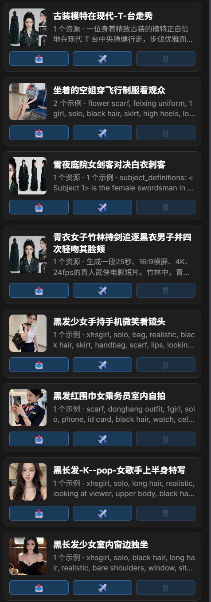
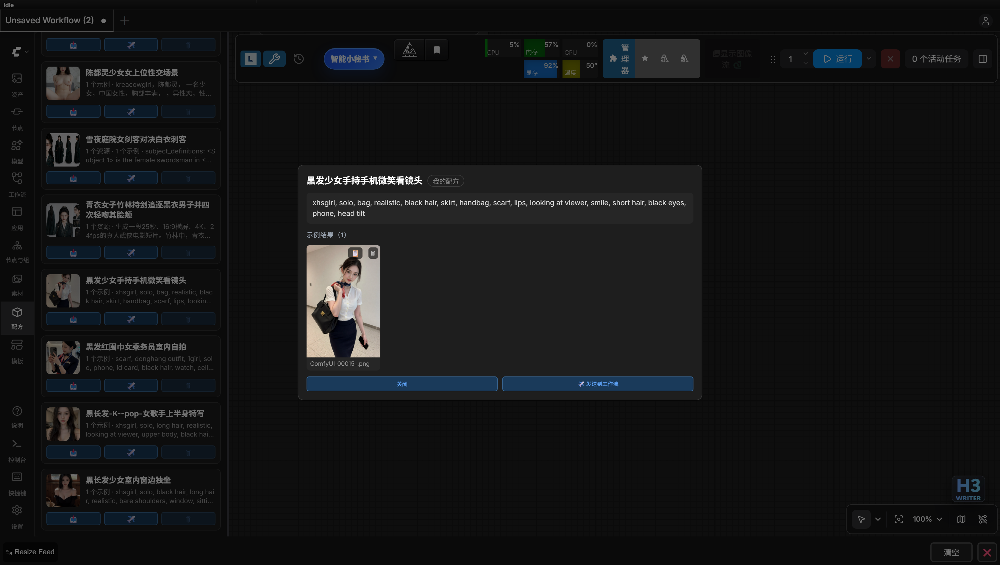
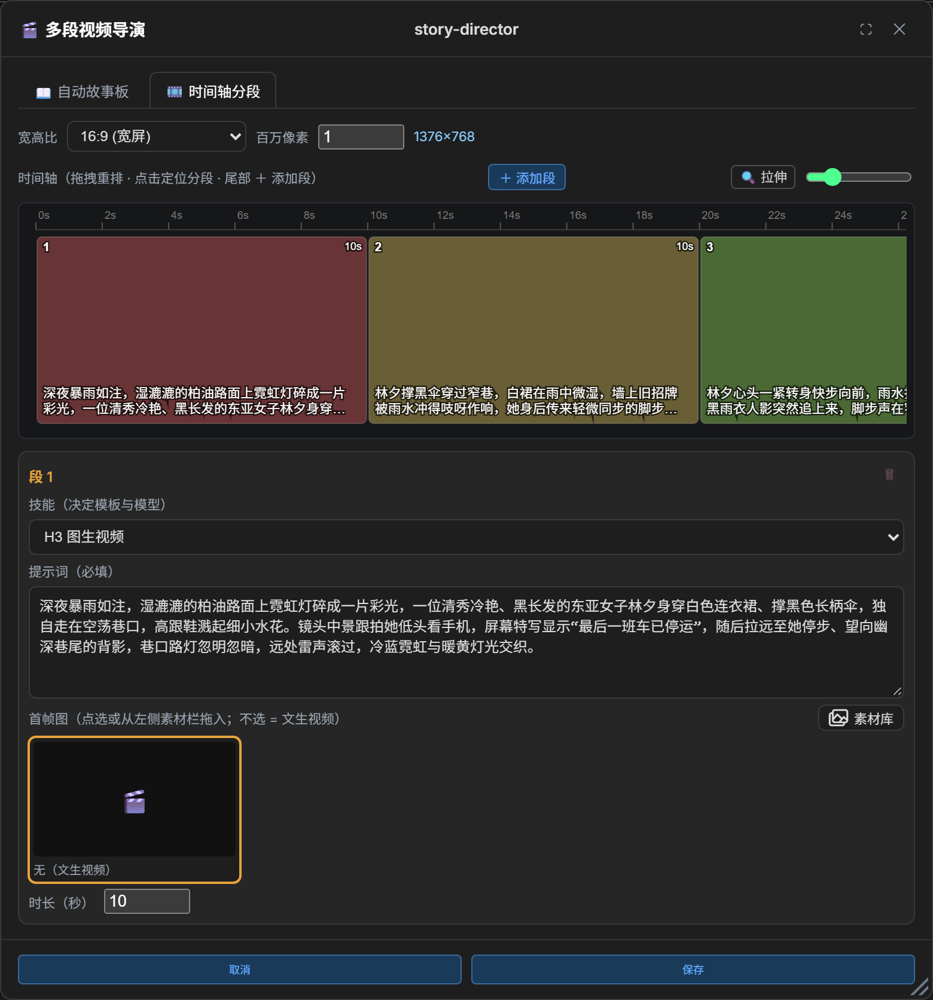
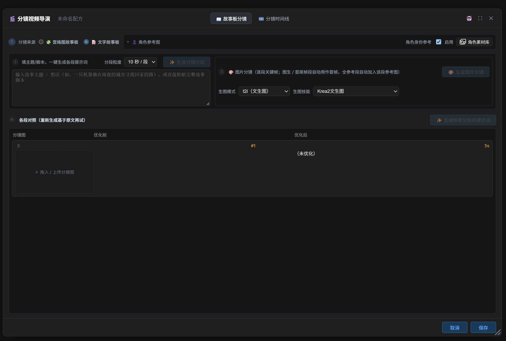
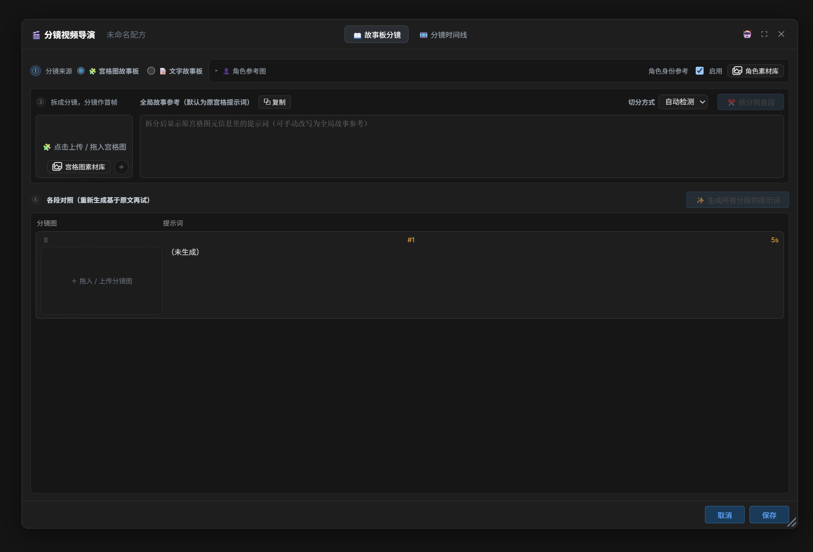

# 配方 (Recipes)

提示词 + 多输入资源（图片 / 视频 / 音频）的组合配方，供多参考工作流复用。
配方分 **custom（用户保存）** 与 **presets（内置预设，只读）** 两个目录，每个配方是一个文件夹：

```
recipes/
├── custom/                  # 用户保存的配方（可删除）
│   └── <配方名>/
│       ├── recipe.json      # 元数据：name / prompt / assets / kinds / results 等
│       ├── assets/          # 多输入资源（文生图配方可空）
│       ├── samples/         # 示例结果（用于封面与预览）
│       └── workflows/       # 示例结果对应的工作流备份
└── presets/                 # 内置预设配方（只读）
    └── <配方名>/
        ├── recipe.json
        └── assets/
```

## 保存配方

- 在 Neo Prompt 节点点 💾，弹窗底部提供「保存提示词」与「🧊 保存配方」。
- 命名确认后收集**当前节点所在连通子图**内已连线的 `LoadImage` / `LoadVideo` / `LoadAudio` 与该节点提示词，
  保存到 `recipes/custom/`（与内置预设同名会被拒绝），弹窗实时显示将收集的资源数量。
- 🔲 NeoRefGrid 宫格内的图片作为**主图片资产**一并收集（排在连线 LoadImage 之前）；
  宫格工具条的 💾 可直接以「宫格提示词 + 宫格图」保存配方。
- 勾选「**同时保存结果**」（默认勾选）时，把最近一次执行输出存为**示例结果**到 `samples/`：
  输出类型由输出节点判定，按内容去重、多次保存自动累积，同时备份完整工作流快照到 `workflows/`。

## 配方面板

- 侧边栏「配方」页按「我的配方 / 内置预设」分组；🗑 仅可删除自定义配方，⧉ 复制生成新副本
  （自动命名 `<原名>-copy`，冲突递增 `-2/-3`；preset 也可复制成 custom）。
- 页头工具条支持**搜索**（名称 / 提示词）、**筛选**（全部 / 普通 / 多段 / 我的 / 预设）与
  **排序**（最近修改 / 名称 / 有结果优先），分组标题可折叠；状态与滚动位置随面板持久化。
- 点缩略图或标题打开详情浮层：完整提示词、全部资源（视频可预览、音频可试听）、示例结果，可直接发送到工作流。
- 多段导演配方卡片显示概览摘要行（段数 · 模式 · 技能 ×N · 宽×高 · 总时长）。
- 卡片封面与详情网格走缩略图（懒加载，生成失败回退原图）。
- 节点上的预设列表同样并入配方条目，点击回填提示词并还原资源到所在子图。



## 一键发送到工作流

点配方卡片的 ✈️（或详情浮层内的发送），把各资源复制进 ComfyUI `input/`，并把提示词与资源还原到匹配的**连通子图**。

### 子图匹配与对齐

- 目标子图按「资源数与连线加载节点数按类型逐一相等」精确匹配自动选中；
  画布仅一张子图时直接使用；多个候选或无匹配时弹下拉指定（取消则不做任何改动）。
- 资产数与启用连线节点数不一致时自动对齐：偏多则启用 Bypass / Never 节点补齐，
  偏少则把多余启用节点设为 Bypass；无法容纳的部分提示「仅还原了部分」。
- 子图含 NeoRefGrid 时**先填宫格**（最多 12 张图片资产入槽位），其余图片再按参数位进 LoadImage；
  提示词写入 Neo Prompt，子图没有 Neo Prompt 时兜底写入宫格提示词框。
- 在 Neo Prompt 节点上直接选择配方发送时，以该节点所在子图为目标，同样自动对齐，全程不弹窗。



### 示例结果与产物记录

- **📥 追加结果**：把当前工作流最近一次执行的输出追加为该配方的示例结果（去重、跨次累积，同时备份工作流）。
- **📋 复制工作流**：把某个示例对应的工作流快照复制回当前画布。
- 示例结果可逐个删除；删除最后一个引用某工作流的示例时会一并清理孤儿工作流备份。
- **结果（results）** 与示例结果不同：只把执行产物在 `output/` 里的**路径**记进 `recipe.json`，不复制文件。
  多段导演节点跑完自动记录（bundle 单段模式无配方、预设配方只读，均不记录）。
  详情浮层「结果（N）」区以 ComfyUI 原生 `/view` 加载缩略图，点击进 Lightbox；
  🗑 会先确认再删除磁盘上的真实产物（连同同名 `.txt` 旁车）并摘掉记录。
  文件被手动删掉后不再列出，重存配方不会清空结果记录。

## 分镜视频导演配方（video_director）

普通配方是「一个提示词 + 一组资源」；`video_director` 配方是**多段结构化容器**：
一段 = 一个 H3 视频生成任务（各自的技能 / 提示词 / 时长 / 首帧），
由 `NeoH3VideoDirector` 节点按序逐段生成并拼接成单个含音频 `VIDEO`。执行细节见 [h3-video-gen.md](h3-video-gen.md)。




### 入口

- 侧边栏「配方」页头部 **🎬 新增导演配方** 新建。
- 已有导演配方：点配方卡片缩略图进入编辑器；或在 `NeoH3VideoDirector` 节点上点时间轴分段块 / 右上角 ✎ 编辑
  （点某块进入时编辑器直接定位到该段；窗口已打开时再点别的块只切换当前段）。
- 节点时间轴显示区外右下角的 **＋** 直接打开新建编辑器（保存后自动加入 `recipe` 下拉并选中）。
- **只跑勾选的段**：悬停时间轴段块出现勾选框，勾上即本次只生成这些段；
  段号与 seed 仍按配方原序号，勾选为运行期临时状态、不写进配方。

### 编辑器界面

#### 分辨率与模式

- **共享分辨率**：宽高比 + 百万像素（0.1–2，一位小数）→ 宽 / 高（按 32 对齐）；选「自定义」可手输 W/H。
  新建配方初始 16:9 @ 0.5 百万像素 = 960×544。
  首帧已预填或画布连了 LoadImage 时，宽高比自动吸附到首帧图最接近的预设比例（只动比例下拉，不碰百万像素与手输值）。
  宫格拆分后共享比例同样吸附到首帧最近预设。保存时若各段首帧比例不一致会弹非阻塞告警。
  种子不在编辑器设置（后端默认 0，可用节点 `seed` 输入覆盖）。
- **生成模式与技能**：「🎞️ 分镜时间线」页首行为全局生成模式下拉（分镜生视频 / 全参考生视频 / 混合模式）
  与「技能」统一选择框（点击弹居中搜索窗，选项按全局模式过滤，按步数从少到多排序）。
  非混合模式下各段共用这一处技能，段标题行的技能下拉隐藏；切到 `mixed` 时改为逐段选模式与技能。
  新建配方的默认技能就是列表第一项，不可用的技能跳过。

#### 分区显隐与校验

- **分区显隐**：
  - 首帧区（`f2v`）：单选缩略图网格，点选画布已连线的 LoadImage 或从左侧素材库拖入，再点一次已选中的图即取消。
  - 尾帧区（`f2v`）：同构的独立网格；`fl2v` 下首 / 尾帧两区并排同一行。
  - 参考素材区（`r2v`）：三组已用列表（参考图 ≤9 / 参考视频 ≤3 / 参考音频 ≤3），
    拖入或点击空区上传即插入，只收本组类型，可拖放调整顺序，达上限提示并拒绝。
    标题行「📋 同步到所有分段」把当前段素材覆盖式复制到其余各段。
  - 首帧 / 尾帧区标题行有「📤 本地」按钮（文件选择器按类型过滤，上传到 `input/` 并自动选中）。
- **保存校验**：图生 / 首尾帧段需首帧、尾帧生成需尾帧、全参考段需参考素材，缺失时弹警告但仍按当前内容保存
  （可先存草稿再补），执行时给明确报错。旧配方无全局模式时按各段内容推断。

#### 窗口与编辑状态

- **窗口**：默认 1280×840（矮屏高度跟随 88vh）；标题栏可拖动，右下角手柄可缩放；
  **⛶** 一键放大到最大，再点一次或双击标题栏还原。
  拉高时故事主题 / 脚本输入区与当前段提示词区撑满可用高度。
- 标题栏右侧 **🤖 LLM 配置** 打开内嵌 LLM 配置表单（打开即后台回填、💾 保存落盘）。
- 标题栏中间显示当前**配方名称**，点击改为行内输入，Enter 或失焦提交，Esc 还原；
  新建配方时标题随主题或段提示词输入实时同步（超 20 字截断），手动命名后不再覆盖。
- **编辑器为单例**：已打开时点同一配方被忽略；点另一配方则关闭旧窗口并重新加载为该配方。
- **未保存修改保护**：任何会改变落盘内容的操作都会标记「有未保存修改」；
  此时点 ✕ / 取消 / 切换配方会弹出确认条：**💾 保存并关闭** / **放弃修改** / **继续编辑**。
- 编辑面板不加遮罩、不 dim 背景，便于边编辑边从左侧素材栏把图拖入指定段落。

### 时间轴总览

#### 分段块

- 面板顶部为可复用时间轴组件，按各段 `duration_sec` 比例绘制分段块 + 秒刻度尺。
- 块内顶部显示序号（左上）与时长（右上），底部显示提示词摘要（只留画面描述正文，最多两行）。
- 有首帧参考图则平铺满块；参考生视频段的多张参考图逐张横排平铺。
- 点击某块定位并聚焦对应段落卡片；切换当前段时时间轴自动把该段块滚进可视区。

#### 拖拽与缩放

- 拖拽某块重排段落顺序（源块作为幽灵块跟随光标、落位槽显示虚线框，其余块实时让位）；拖块右缘调时长；尾部 ＋ 追加新段。
- 说明行最右侧 **↔ 拉伸** 控制条（按钮 + 滑块 0.25–4×）：缩放时间轴宽度、超出可视区出现横向滚动条，支持滚轮横滚。
- 默认每段约一个 16:9 视频帧宽，段内按时长比例分配相对宽；默认总宽超出可视区时横向滚动。
- 时间轴组件数据由宿主提供、经回调驱动，因此可挂到 `NeoH3VideoDirector` 节点内复用（节点内为只读预览，无 ＋）。

### 故事板分镜页

编辑器标题栏内有两个页签：**📖 故事板分镜**（角色参考图 / 分镜来源 / 各段对照）与 **🎞️ 分镜时间线**
（生成模式 / 统一技能 / 分块秒数 + 共享分辨率 + 时间轴 + 逐段卡片）。打开时优先落回该配方上次停的页签；
无记忆时新建默认落在故事板分镜页、编辑已有配方默认落在分镜时间线页。

本页按 **① 来源 / 角色素材 → ② 分段 → ③ 关键帧 → ④ 提示词** 排布，每步标题行左侧有序号徽标
（✓ 已完成 / 高亮 轮到这一步 / 变淡 前置未满足），每步只有一个动作按钮、统一靠标题行右上角，
前置未满足时置灰并悬停提示缺什么。

#### 来源与角色素材

- **分镜来源（二选一）**：🧩 宫格图故事板 / 📝 文字故事板，只显示选中来源的那张卡片。
- **👤 角色参考图**：配方级常驻卡片（两种来源下都在），文字分镜生成、r2i 图片分镜与视频各段身份参考共用。
  同行最右是**角色身份参考**开关（默认开，取消后保存写 `shared.identity_refs=false`）。
- **📝 文字故事板**：左栏故事主题 / 脚本 + 分段粒度（5 / 10 / 15 秒）+ ✨ 生成分镜分段；
  右栏 🎨 图片分镜卡片。点生成后 LLM 直接输出分段 JSON（每段 `prompt` / `duration_sec` / `storyboard_prompt`，
  角色参考图以多模态附上锁身份），成功后替换时间轴现有段落（技能取首个可用视频技能、每段 `mode` 为 `t2v`）。
  打开旧配方时主题框回显 `story.idea`。



- **🧩 宫格图故事板**：选一张已有的分镜宫格图（外部生成，本地上传或素材库拖入），
  切分方式（自动检测 / 手动行×列）+ ✂️ 拆分到各段。各格成为该段首帧与分镜图（`i2v`）并替换现有分段。
  源图右侧显示「全局故事参考（默认为原宫格提示词）」，从原图内嵌的 ComfyUI 元信息提取，可改写与复制。



#### 关键帧与提示词

- **🎨 图片分镜（关键帧）**：生图模式 t2i 文生图 / r2i 参考编辑（默认随角色参考图：有图 → r2i、无图 → t2i）
  + 生图技能（t2i 默认 Krea2 文生图、r2i 默认 Qwen Image 2.1，各模式分别记住上次选择）+ 🎨 生成图片分镜。
  - 逐段串行出关键帧，同一次生成各段共用同一 seed（提示词仍逐段不同）；再次点击强制重新生成全部段。
  - 关键帧落配方自己的 `assets/storyboard_<配方>_<段号>.png`，不经 `input/`。
  - 生成完成即按各段有效模式路由：图生 / 首尾帧段回填为该段首帧；全参考段自动加入该段参考图池
    （去重、受 ≤9 上限约束）；混合模式按各段自己的模式分流。
  - **分镜图用的提示词是拆分时产出的 `storyboard_prompt`（静态画面、不写镜头运动），不是视频段提示词**；
    旧配方未带该字段时回退视频提示词并在该段 `warnings` 里点名。
- **各段对照**：「✨ 生成所有分段的提示词」逐段调用 LLM，按 MiniMax H3 审计规范重写为成品提示词；
  SSE 流式逐 token 写回该段并实时刷新对照表，单段失败不中断。
  列表为三栏（左 = 分镜图、中 = 优化前原文、右 = 最近一次优化结果），行头 ⠿ 拖拽手柄可直接排序并回写时间轴顺序。
  列表末尾常驻一行空段占位：把分镜图拖入或点击上传到该行才真实新建一段。
  宫格拆分方式下各段无原文，本表降为两栏，点生成按各段分镜图逐格描述（无分镜图的段跳过）。
  重新点优化始终基于首次优化前的原文再试，不叠加上一轮结果。

#### 素材与状态

- **统一素材区**：随全局生成模式显隐。全参考模式提示到时间轴页各段逐段设置；文生 / 混合模式显示说明文字。
- **状态随配方保存**：主题 / 分段粒度 / 角色参考图 / 图片分镜模式·技能·分镜来源写入 `story`；
  优化前后提示词对照写入 `setup`（仅用于回显，执行读各段自己的字段）。

### schema

| 字段 | 说明 |
|------|------|
| `type` | `"video_director"`；缺省该字段的旧扁平配方行为完全不变 |
| `shared` | 共享设置：宽高 / 比例 / 百万像素 / 模式 / 身份参考 / 分块秒数 |
| `segments[]` | 每段：技能 / 提示词 / 时长 / 首帧 / 尾帧 / 模式 / 参考素材 |
| `story` | 故事板内容：主题 / 分段粒度 / 角色参考图 / 图片分镜模式·技能·分镜来源 |
| `setup` | 优化前后提示词对照（仅回显用） |

- `shared.mode` 取 `f2v` / `r2v` / `mixed`；缺省时按各段内容推断。
- `chunk_sec` 为多帧单次分块秒数（`0` = 关闭合并，缺省 15）。
- 段 `mode` 仅混合模式下逐段写入，取 `t2v` / `i2v` / `fl2v` / `r2v`。
- 段 `refs` 为 `{images[≤9], videos[≤3], audios[≤3]}`，仅在挂了参考素材时写入。
- `first_frame` / `last_frame` / `refs.*` 以已落盘 `assets/` 的文件名引用；保存时后端把原始名映射到落盘最终名并回写，
  引用了未保存的资产会被拒绝。

## 导入 / 导出

- 配方卡片 **⬇️** 把整个配方目录导出为 zip（顶层目录 = 配方名），包内附 **Readme.txt**：
  包内容概览 + 快速应用三步说明（安装插件 → 📦 导入本 zip → 导演配方在节点选择运行 / 普通配方 ✈️ 发送到工作流）。
  语言支持中 / 英：远程配置 `readme_language`（`cn` / `en`）强制指定，缺省 `auto` 按配方名与提示词自动判断。
- 侧边栏「配方」页头部 **📦 导入** 选择 zip 上传：包内须含 `recipe.json`（根目录或唯一顶层目录下），
  拒绝路径穿越条目；与既有配方重名时自动 `-copy/-2/…`，落盘到 `recipes/custom/`。

## 实现细节（开发者）

### 资源收集与编码

- 保存配方以**连通子图**为单位收集：只收集输出已连线的 `LoadImage` / `LoadVideo` / `LoadAudio`，按参数序号排列
  （图片组在前，视频、音频组在后）；未连线节点、其他子图节点与禁用（BYPASS / NEVER）节点不参与。
- 资源类型按**加载节点类型**判定，记录在 `recipe.json` 的 `kinds` 映射中；
  同一 mp4 既可作视频也可作音频输入，不按后缀反推，手动放入 `assets/` 的文件才按后缀兜底识别。

### 一键发送与子图对齐

- 资产与提示词只写入同一个子图，按**保存时的参数位**反解配对。
- 资产偏多时按参数位自动启用 Bypass / Never 的连线节点补齐；资产偏少且同类启用节点全部连到同一下游目标时，
  把多余启用节点设为 Bypass（保留参数位靠前的参与还原）。

后端实现见 [architecture.md](architecture.md)（`recipes.py`），API 见 [api-routes.md](api-routes.md)。
